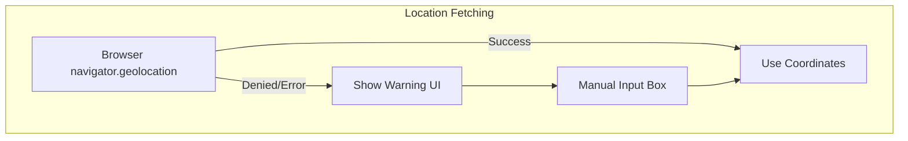

```mermaid
flowchart TD
    subgraph Location Fetching
        A[Browser navigator.geolocation] -->|Success| B[Use Coordinates]
        A -->|Denied/Error| C[Show Warning UI]
        C --> D[Manual Input Box]
        D --> B
    end
```

User confirmed: "ช้ navigator.geolocation" and "ok" for fallback.
