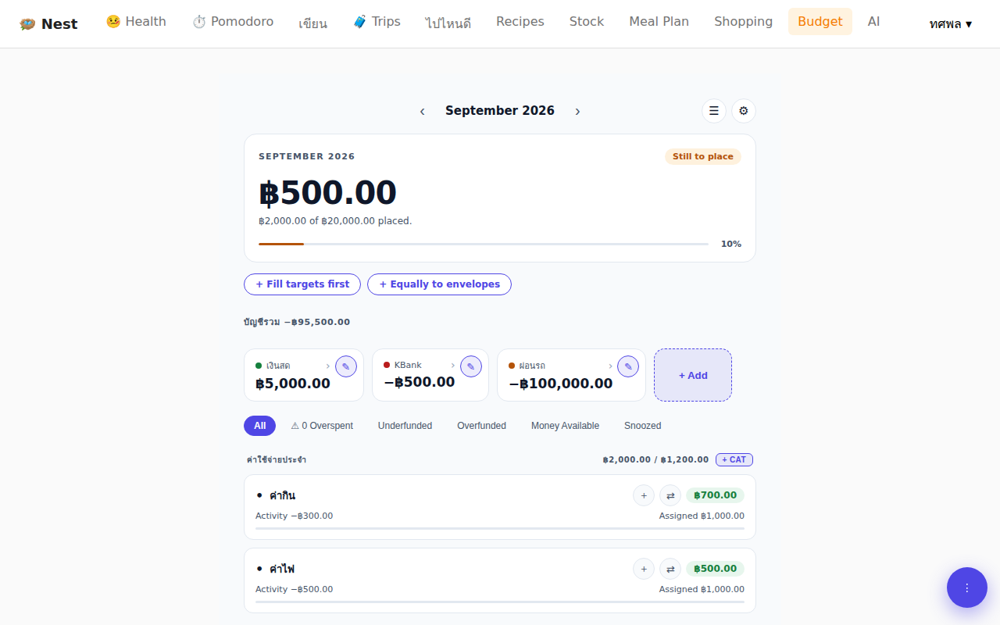
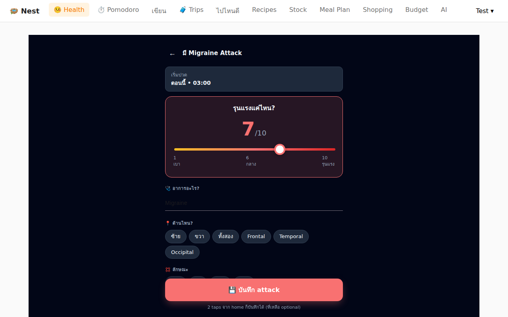
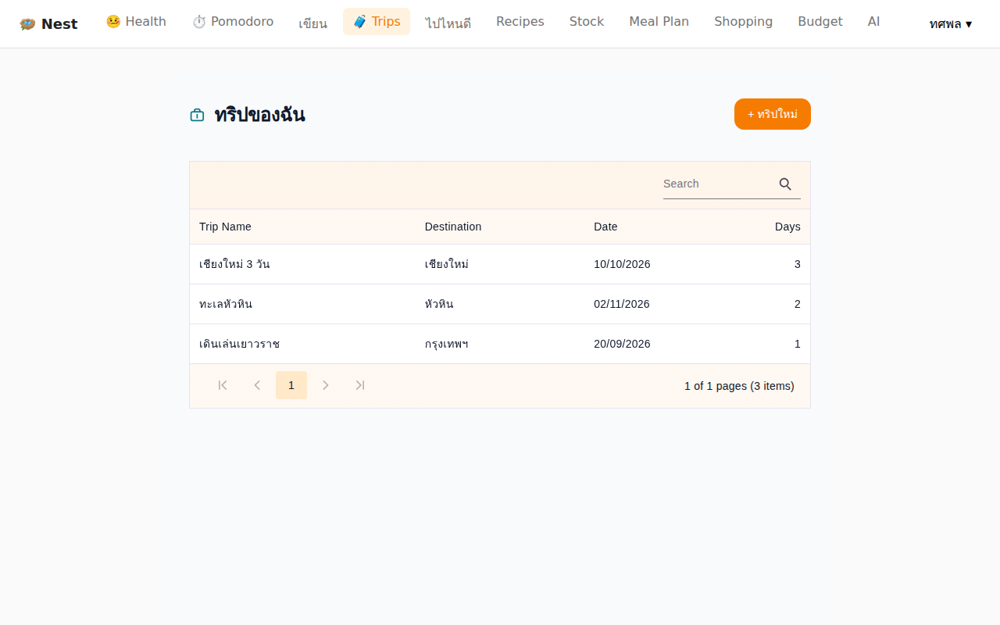
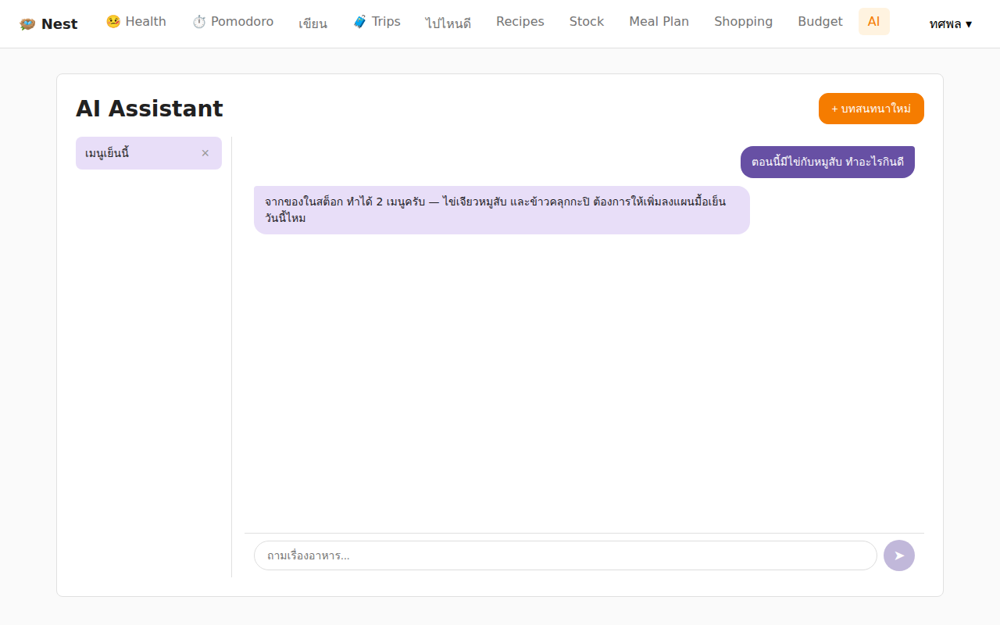
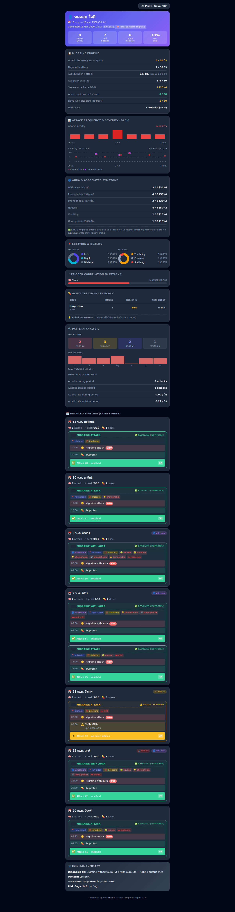
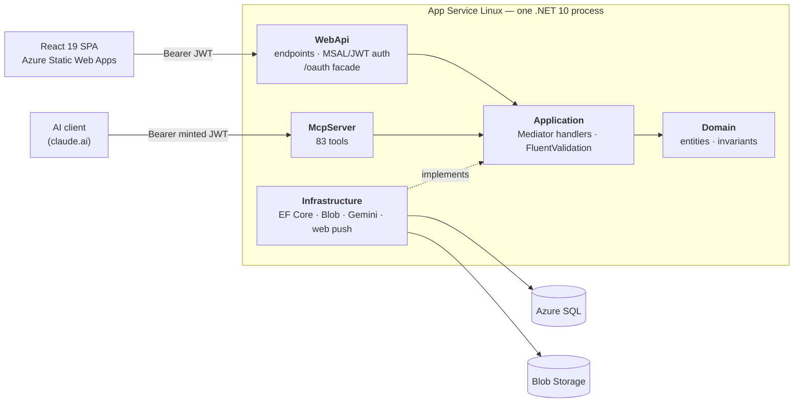
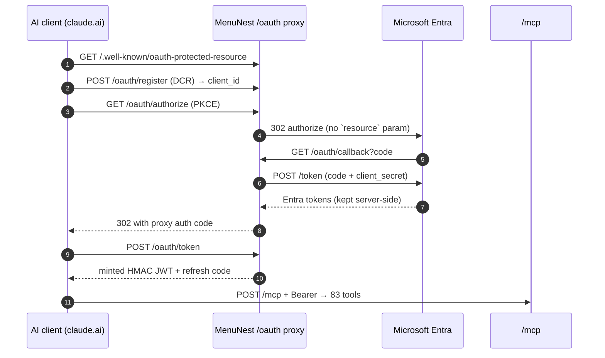

# MenuNest

A household web app in daily production use: migraine tracking that produces an anonymous clinical report a doctor opens from a QR code, zero-based envelope budgeting, meal planning against real pantry stock, and weather-aware trip planning.

.NET 10 Clean Architecture and React 19 — plus an MCP server that exposes all 83 of the app's operations behind a hand-rolled OAuth 2.1 proxy, so an AI client drives the same handlers the SPA does.


**The UI is in Thai**, because this is not a portfolio exercise dressed up as a product — it is the app my household actually uses every day, and Thai is the language we use it in. What follows is in English; the screenshots are not.



*Zero-based budgeting. Every baht in the accounts is either assigned to an envelope or sitting in Ready to Assign — a number that is derived on every read, never stored.*

---

## What it does

**Health — migraine tracking.** An attack is logged in two taps from the home screen; severity, aura, location, quality, associated symptoms and triggers are all optional refinements on top of that. Medication is gated server-side, not by the UI: a drug is *active in effect*, *takeable*, or *blocked* by its daily-dose cap and its still-active window, so the API is the guard even when the client is stale. A follow-up web push fires 30 minutes later and can be answered **from the lock screen without opening the app** — the service worker POSTs the response itself.

**The doctor report.** A date-bounded, HMAC-signed share token renders an anonymous report: attack frequency and severity over the window, ICHD-3 criteria fit, trigger correlation, and per-drug relief rate and average onset. The database stores only the token's SHA-256 hash, so a database leak yields no working link.

**Budget — zero-based envelopes.** Ready to Assign is `sum(non-credit accounts) − sum(every envelope's available)`, computed on read rather than persisted, so it cannot drift out of sync with the ledger. Credit accounts are deliberately outside that sum: their payment envelope already holds the money owed, and counting both would hold the same baht back twice ([menunest-203](docs/adr/menunest-203-ready-to-assign-stops-counting-credit-accounts.md)).

**Meal planning and pantry.** Recipes → weekly plan → stock check → shopping list, and back again: cooking a batch deducts the ingredients (clamped at zero, partial deductions warn rather than fail) and ticking an item as bought restocks the pantry. Stock is an append-only transaction log, not a mutable quantity field, so every movement has a cause.

**Trips.** An itinerary of ordered stops, each carrying its own weather reading. A stop can be re-timed to a target hour to arrive when the temperature is bearable, and the rest of the day cascades — but the new schedule is *proposed and confirmed*, never applied silently, because the traveller has to stay in control of their own day ([ADR-112](docs/adr/112-weather-based-retiming-scope-view-and-assist.md)).

**Writing, Pomodoro, Discover.** Timed writing entries are corrected over MCP by the writer's own AI client; words-per-minute and errors-per-100-words are derived server-side from elapsed time and hit/miss counts rather than trusted as tool inputs ([ADR-175](docs/adr/175-writingtools-exposes-four-mcp-tools-and-entry-creation-is-never-one.md)). Discover is a map-forward screen with an *armed* capture mode, because on a map a tap already means "select" and overloading it silently is how you lose the user's pin.

**MCP server.** The whole domain as 83 tools, behind an OAuth 2.1 authorization-server facade that had to be written by hand because Entra ID and claude.ai cannot agree on one parameter — [detailed below](#the-mcp-server).

---

## Screenshots

Every screenshot on this page is rendered by [`frontend/e2e/screenshots.spec.ts`](frontend/e2e/screenshots.spec.ts) against mocked API routes — the data in them is fabricated, and no real record appears here.



*Quick-log, in the dark theme it is actually used in — because the reason you are opening this screen is that light hurts.*



*Trips. Each row opens an itinerary of ordered, weather-checked stops.*



*The in-app Gemini assistant, answering "I have eggs and minced pork — what can I make?" from live stock. It can write, too, but only after an explicit confirmation.*

<details>
<summary><b>The doctor report</b> — the anonymous page a clinician opens from the QR code (long; click to expand)</summary>

*Frequency and severity charts, aura and associated-symptom breakdown, location and quality distributions, trigger correlation, per-drug treatment efficacy, a per-day timeline of every attack and dose, and a clinical summary — with no name, no account and no identifier anywhere on the page.*



</details>

---

## Architecture



Dependencies point inward. `Domain` references nothing; `Application` references only `Domain`; `Infrastructure` implements `Application`'s interfaces rather than being called by it. The two hosts — the REST API and the MCP server — are peers that both enter through the same `Mediator` handlers, which is why a feature does not have to be written twice.

Per-feature sequence diagrams for every flow above (auth and user provisioning, cook-batch stock deduction, the 0-tap follow-up push, SAS photo upload, the doctor-report token, the Gemini tool loop) are in **[docs/architecture.md](docs/architecture.md)**.

---

## The MCP server

83 tools across 8 classes — Trip 26, Budget 24, Shopping 10, MealPlan 7, Recipe 5, Writing 4, Ingredient 4, Stock 3 — let an AI client drive the domain. Not a read-only bridge: it creates recipes, plans meals, re-times stops and pays credit cards. The standing rule is [menunest-213](docs/adr/menunest-213-every-function-this-feature-adds-is-reachable-over-mcp.md): every function a feature adds is reachable over MCP, decided when the feature is designed rather than retrofitted.

### The OAuth 2.1 proxy, and why it exists

Entra ID v2 rejects the RFC 8707 `resource` parameter that claude.ai mandates on the authorization request, returning `AADSTS500011`. There is no configuration that reconciles the two. So `MenuNest.WebApi` hosts its own OAuth 2.1 Authorization-Server facade at `/oauth/*`: it advertises discovery documents and dynamic client registration, absorbs the `resource` parameter, runs a clean `resource`-free authorization-code flow against Entra server-side, keeps the Entra tokens server-side where the client never sees them, and mints its own short HMAC JWT scoped to `/mcp` ([ADR-003](docs/adr/003-mcp-oauth-proxy.md), [ADR-004](docs/adr/004-oauth-proxy-signin-authority-common.md)).



### What a tool looks like

```csharp
[McpServerTool, Description("Add a recipe to a meal slot on a specific date")]
public async Task<MealPlanEntryDto> create_meal_plan_entry(
    [Description("Date for the meal")] DateOnly date,
    [Description("Meal slot: Breakfast, Lunch, or Dinner")] MealSlot mealSlot,
    [Description("Recipe ID")] Guid recipeId,
    [Description("Optional notes")] string? notes,
    CancellationToken ct)
    => await mediator.Send(new CreateMealPlanEntryCommand(date, mealSlot, recipeId, notes), ct);
```

Two things in that method are load-bearing. The `[Description]` annotations *are* the tool schema — the parameter documentation an AI reads is the same text a C# caller reads, so it cannot drift. And the body is a single `mediator.Send`: the tool calls the identical handler the SPA's `POST /api/meal-plan` calls, so validation, authorization and business rules apply once, in one place, and a tool cannot become a back door around them.

Source: [`backend/src/MenuNest.McpServer/Tools/`](backend/src/MenuNest.McpServer/Tools/) · handshake detail in [docs/architecture.md](docs/architecture.md) §13.

---

## Engineering practice

Unusual for a personal project, and all of it one click away:

- **1,043 backend tests** across four projects — Application 874, McpServer 80, WebApi 65, Infrastructure integration 24. Application handler tests run against a real SQLite-backed `DbContext` that applies the production EF configurations, so unique indexes and FK behaviour that the in-memory provider silently ignores are actually exercised.
- **61 frontend vitest files** and **37 Playwright e2e specs**.
- **[216 ADRs](docs/adr/)** — every design decision recorded with the alternatives that were rejected and why. The interesting ones are the reversals.
- **[56 design specs](docs/superpowers/specs/)**, written before the implementation they describe.
- **[Postmortems](docs/postmortems/)**, including one on a budgeting bug this project shipped to itself.
- **CI** — four GitHub Actions workflows. `ci.yml` builds and tests the backend and typechecks and builds the frontend on every push and PR; `playwright.yml` runs the e2e suite on the same triggers; the other two deploy the API to App Service and the SPA to Static Web Apps from `main`.
- **A pre-commit hook** that runs the full backend build and test suite plus the frontend typecheck and build, on every commit. It is slow, and it is not bypassed.

---

## Running it

```bash
# Backend  → https://localhost:5001/scalar
cd backend && dotnet run --project src/MenuNest.WebApi

# Frontend → http://localhost:5173
cd frontend && npm install && npm run dev
```

Prerequisites, the external accounts you need and first-run setup: **[docs/development.md](docs/development.md)**
Azure topology and every configuration setting: **[docs/deployment.md](docs/deployment.md)**

---

## Status

Actively developed, and in daily use by one household.

**There is no live demo link, and that is deliberate.** The production instance holds real medical records and real bank balances for real people. There is no version of a public demo that does not mean either exposing that data or seeding a parallel account with fabricated records into the production database. The screenshots above are rendered from mocked API responses instead; the code is all here to read.

External pull requests are not accepted — this is a family project, not an open-source one.

**License:** private / unpublished.
