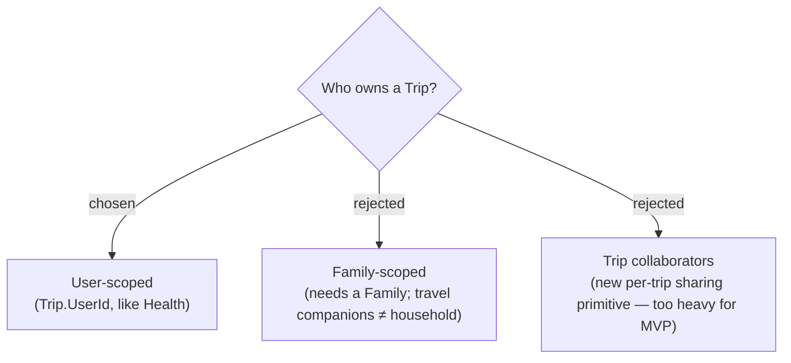

# ADR-005: A Trip is user-scoped, not family-scoped

**Date:** 2026-06-29
**Status:** Accepted (reaffirmed 2026-06-29 against the Map-Forward handoff)

> **Reconciliation (2026-06-29).** The "Trip Planner — Map-Forward" design handoff
> proposes the opposite — a **family-scoped** trip under `FamilyRequiredRoute`,
> mirroring Budget, with expense-splitting between "travellers." The owner
> reviewed that conflict and **reaffirmed user-scoped**: a Trip stays owned by one
> User, routed under `ProtectedRoute` (like Health), so a family-less user can
> still plan trips. The handoff's traveller / expense-split model is deferred to
> Phase 2 together with the whole expense feature (see ADR-009), so the
> family-vs-user tension does not bite in the MVP.

## Context

MenuNest already has two ownership models: **family-scoped** (Recipe, Stock,
MealPlan, Shopping, Budget — keyed by `FamilyId`) and **user-scoped** (Health:
Drug, Symptom, Episode — keyed by `UserId`). The new travel/trip-planning product
line needs to pick one. Travel companions are frequently a different set of people
than the household that shares recipes and budget, and a user with no Family must
still be able to plan a trip.

## Decision

A **Trip** and everything it owns (saved places, itinerary, expenses) is
**user-scoped** — keyed by `Trip.UserId`, resolved via
`UserProvisioner.GetOrProvisionCurrentAsync` (no family required), exactly like the
Health module. Sharing a trip with travel companions is explicitly **out of scope
for the MVP** and deferred to a future per-trip collaborator model.

## Consequences

**Positive:** No `RequireFamilyAsync` gate; family-less users can plan trips.
Mirrors the proven Health ownership pattern, so query-scoping and auth reuse an
existing shape. Simplest possible MVP.

**Negative:** Multi-person trip collaboration (a real travel use case) will need a
new sharing primitive later — the per-trip collaborator model rejected here. Until
then, a shared trip means one owner who hand-relays the plan.
