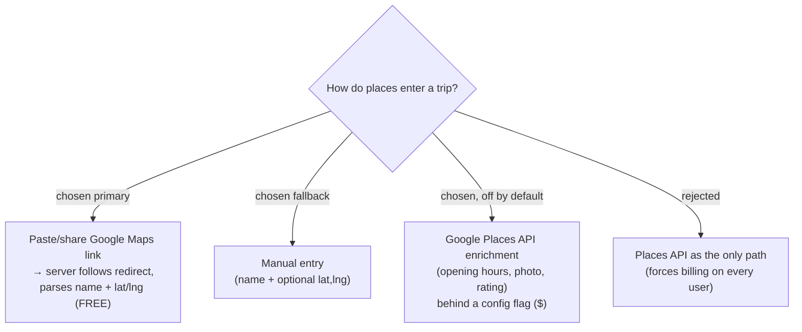

# ADR-006: Locations ingest via free link-resolve by default, with optional paid Places enrichment

**Date:** 2026-06-29
**Status:** Superseded by ADR-007

> **Superseded.** This ADR was written before the `google-maps-platform` agent
> skill was consulted. That skill surfaced two facts that invalidate the core
> decision here: (1) a free **Maps Demo Key** removes the billing barrier to using
> Google Maps Platform APIs during development, and (2) Google ToS requires place
> data (names, coordinates, hours, ratings) to originate from a live Maps Platform
> API — scraping the share-link redirect for coordinates is non-compliant. The
> location-ingestion strategy is now defined by **ADR-007**. Kept for history.

## Context

The headline feature is turning a Google Maps location into a saved **Place**. Two
mechanisms exist, with opposite trade-offs:

- **Link-resolve (free):** Google Maps "Share" produces a short link
  (`maps.app.goo.gl/…`) that 302-redirects to a long URL embedding `@<lat>,<lng>`
  and the place name. The server follows the redirect and parses those out — no API
  key, no billing. It is effectively **scraping**: fragile if Google changes the URL
  shape, and it yields only name + coordinates (no opening hours, photo, or rating).
- **Google Places API (paid):** robust, structured data including opening hours
  (which feeds "best time to visit"), photos, and ratings — but requires Maps
  Platform **billing** and is charged per request. The owner runs on a personal
  Pay-As-You-Go subscription and wants costs contained.

## Decision

Support **both**, layered so the free path is the default and the paid path is opt-in:

1. **Primary (free, always on):** paste/share a Google Maps link → server resolves
   name + lat/lng by following the redirect and parsing the URL.
2. **Fallback (free, always on):** manual entry of a place name and optional
   coordinates, for when resolution fails or the user has no link.
3. **Enrichment (paid, off by default):** a Google Places lookup that fills opening
   hours / photo / rating, gated behind a config flag (e.g.
   `GoogleMaps__PlacesApiKey` present → enabled). Off in MVP; the trip still works
   fully without it.

A single `IPlaceResolver` abstraction in Infrastructure hides which path produced a
Place, so the Application layer is agnostic and the paid path can be switched on
later without touching handlers.

## Consequences

**Positive:** Zero Google billing for the MVP. Honors the user's explicit "paste a
shared link" request. The `IPlaceResolver` seam means turning on Places enrichment
later is a config + adapter change, not a redesign.

**Negative:** Link-resolve is unofficial and can break when Google changes its URL
format — needs a graceful "couldn't read that link, enter details manually"
fallback (covered by path 2) and should be treated as best-effort. Without the paid
path, "best time to visit" is user-entered, not sourced from real opening hours.
