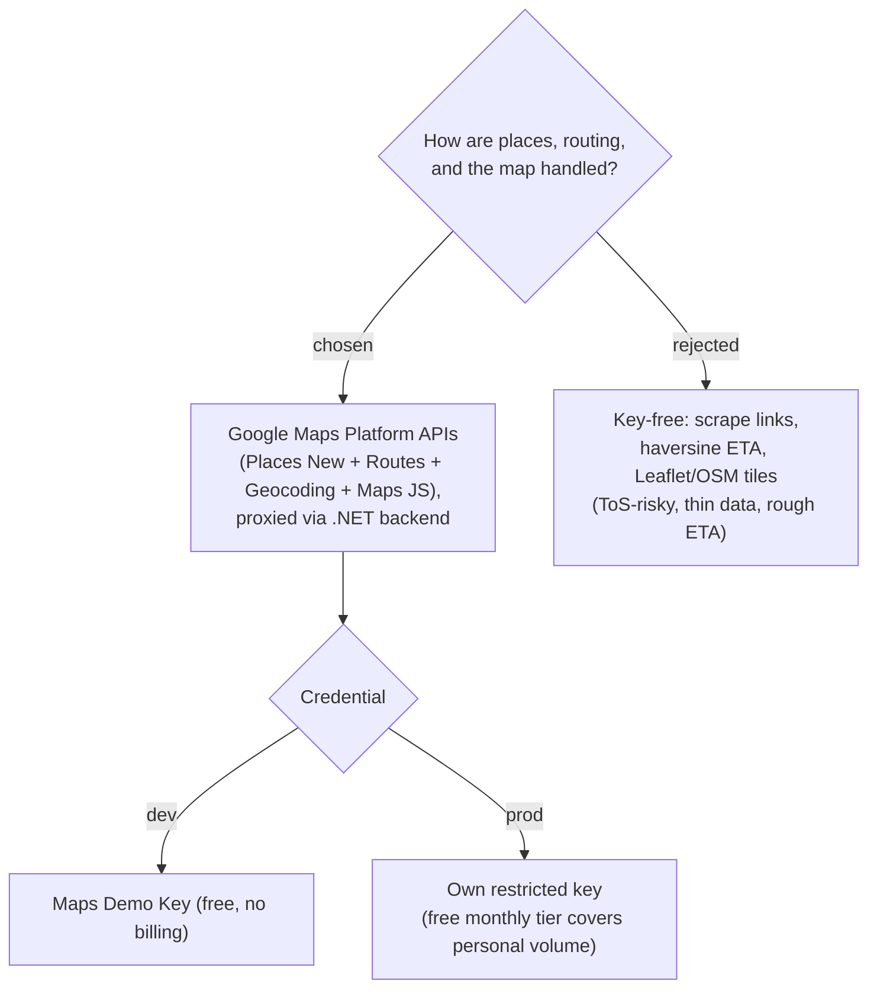

# ADR-007: The Trip module is built on Google Maps Platform, proxied through the .NET backend

**Date:** 2026-06-29
**Status:** Accepted
**Supersedes:** ADR-006

## Context

The Trip module needs: turning a place into a saved location, computing travel time
between stops, knowing opening hours ("best time to visit"), and showing a map. The
`google-maps-platform` agent skill (installed at `~/.claude/skills/`) established
three things that decide the approach:

1. **A free Maps Demo Key** exists for prototyping — no billing account, no Cloud
   project — covering Maps JavaScript API, **Places API (New)**, **Routes API**, and
   **Geocoding API**. It is not for production and has a daily reset limit, but it
   removes the cost barrier that originally pushed us toward scraping (ADR-006).
2. **ToS forbids LLM-sourced / scraped place data.** Place names, coordinates,
   opening hours, and ratings must come from a live Maps Platform API. Only
   **`place_id`** may be stored indefinitely; other content has caching limits.
3. **Legacy APIs are disabled** for new projects: use **Places API (New)** (not
   legacy Autocomplete/PlacesService), **Routes API** `computeRoutes` /
   `computeRouteMatrix` (not Directions/Distance Matrix), and the **Geocoding REST
   API** (not the JS Geocoder class). Google REST endpoints lack CORS, so calls must
   be **proxied server-side** (Critical Failure CF1).

## Decision

Build the Trip module on **Google Maps Platform**, with all REST calls routed
through the **`MenuNest.WebApi` / Infrastructure backend as a proxy** (the API key
never reaches the browser):

- **Places API (New)** — autocomplete entry (with **session tokens** to bundle
  autocomplete + details into one billable session) and Place Details. Persist the
  **`place_id`** as the durable reference; store name/coords/address/hours as a
  cached snapshot, refreshed within ToS limits.
- **Paste a Google Maps link** stays as an entry UX, but is resolved *through* the
  API: the backend extracts a reference (text/coords) from the URL and calls Places
  Text Search / Geocoding to obtain the authoritative `place_id` + details. It never
  trusts scraped coordinates as the stored truth.
- **Routes API** (`computeRoutes`, `computeRouteMatrix`) — travel time / ETA between
  consecutive itinerary stops.
- **Maps JavaScript API** via **`@vis.gl/react-google-maps`** + `AdvancedMarkerElement`
  (with a `mapId` / `DEMO_MAP_ID`) — in-app map display.
- **Geocoding API** — address ↔ coordinates where needed.
- **Credentials:** **Demo Key** for local/dev (free); a user-provisioned **restricted
  key** for production, stored as backend config, never hardcoded.
- **Compliance:** carry the `gmp_git_agentskills_v1` attribution ID on map surfaces,
  surface the cost notice + key-restriction guidance, and run the skill's
  `compliance-review` before finalizing Maps code.

## Consequences

**Positive:** Rich, accurate, ToS-compliant data (real opening hours feed "best time
to visit"; real ETAs feed travel-time). Free during development via the Demo Key.
The backend-proxy pattern matches MenuNest's existing "API mediates external
services" shape (Gemini, Blob SAS) and keeps the key server-side.

**Negative:** Production requires the user to provision and restrict their own key
and accept usage may bill against Google Cloud (a low-volume personal trip planner
should sit inside the free monthly tier, but this is now a real operational step).
An `IPlaceResolver` / routing-service seam plus snapshot-refresh logic must respect
Maps caching limits. Hard dependency on a Google credential — there is no offline /
key-less mode (the rejected key-free path).
