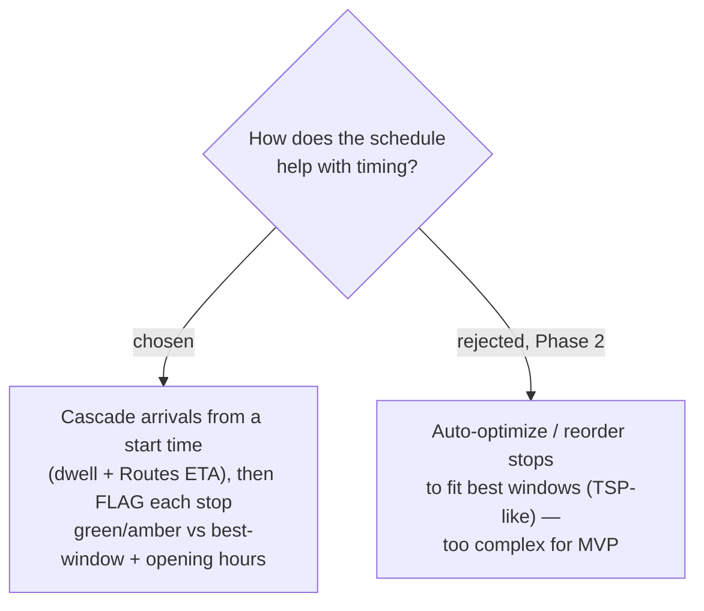

# ADR-008: The day schedule cascades arrival times and flags timing — it does not auto-optimize the order

**Date:** 2026-06-29
**Status:** Accepted

## Context

The user wants three timing inputs to work together: a **dwell** per stop (how many
minutes to stay), the **travel time to the next stop**, and a per-place **"best time
of day"** window — all "เพื่อคำนวน" (for calculation). The open question was whether
the app should *passively flag* timing problems or *actively reorder* stops to an
optimal schedule.

## Decision

For the MVP the schedule is a **forward cascade plus flagging**, not an optimizer:

1. Each **Day** has a start time. The first **Stop**'s arrival = the start time.
2. For each Stop: `departure = arrival + dwell`; the **Leg** travel time to the next
   stop comes from the **Routes API** (ADR-007); `next.arrival = departure + leg`.
3. Each Stop is **flagged** by comparing its computed arrival/visit window against
   (a) the place's user-entered **best-time-of-day** window and (b) the **opening
   hours** from Places API:
   - **green** — arrives within the best window and while open;
   - **amber** — arrives outside the best window, or before opening / after closing,
     or the day overflows. The amber note suggests a fix (e.g. "arriving 3h before
     the good window — move later in the day?") but the user reorders manually.

**Auto-optimization** (reordering stops to satisfy windows / minimise travel) is
explicitly **deferred to Phase 2**.

## Consequences

**Positive:** Deterministic, explainable, and cheap to build — the cascade is simple
arithmetic over an ordered list, and flagging is a per-stop comparison. The user
keeps full control of order. Matches the owner's "ship the core, defer complex
extras" pattern.

**Negative:** With many stops and tight windows the user does the reordering by hand;
the app only points at problems. A true itinerary optimizer (the rejected path) is a
materially harder feature carried as Phase 2. Re-cascading on every edit means the
Routes ETA for a Leg should be cached per (origin place_id, dest place_id, travel
mode) so reordering doesn't re-bill the Routes API on every drag.
