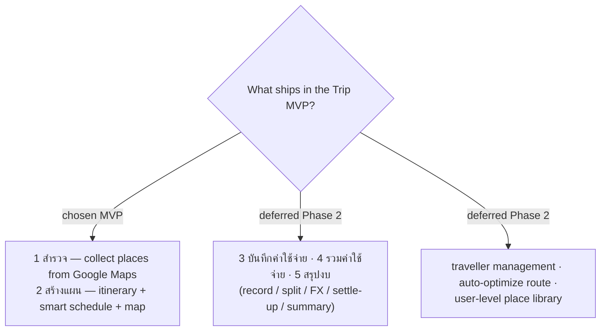

# ADR-009: The Trip MVP is "collect places + itinerary + map" — all expense features are Phase 2

**Date:** 2026-06-29
**Status:** Accepted

## Context

The Map-Forward handoff specifies five user goals: (1) collect places, (2) build a
time-aware itinerary, (3) log expenses, (4) sum expenses, (5) trip cost summary —
and the expense half is rich: multi-currency with FX conversion, per-person
splitting, and a greedy minimal-transfer **settle-up** ("ใครติดใคร"). That is a
Splitwise-class feature on top of the planner.

The owner consistently scopes by cutting nice-to-have complexity into a later phase,
and chose here to **focus the MVP on planning + map** and skip expenses entirely for
now.

## Decision

The Trip MVP delivers goals **1 and 2 only**:

- **สำรวจ** — capture places from Google Maps into a per-trip Places library
  (resolved server-side, ToS-compliant — ADR-007).
- **สร้างแผนการเดินทาง** — a per-day itinerary with the schedule cascade (dwell +
  Routes API travel time), manual best-time windows + opening-hours flagging
  (ADR-008), drag-to-reorder, and the **Map-Forward** UI (ADR-010).

**Deferred to Phase 2 (explicitly out of MVP):** all expense logging, multi-currency
+ FX, per-person split, settle-up, and the trip cost summary (goals 3–5); the
traveller/`TripMember` model that splitting needs; route auto-optimization (ADR-008);
and a user-level cross-trip place library (ADR — places stay trip-scoped).

## Consequences

**Positive:** A dramatically smaller, shippable MVP centred on the genuinely novel
value (map-forward, time-aware planning). No FX rates, no split math, no settle-up
algorithm, no traveller entity to build or test now. Keeps the user-scoped model
(ADR-005) frictionless — no family required.

**Negative:** The headline "trip total cost / ใครติดใคร" payoff the handoff sells is
not in the first release. The data model should still leave clean seams (a Trip can
gain expenses and travellers later) so Phase 2 is additive, not a rework. Mock
surfaces that show a budget/expense figure (e.g. the day-timeline mock) are
illustrative only and are not built in the MVP.
