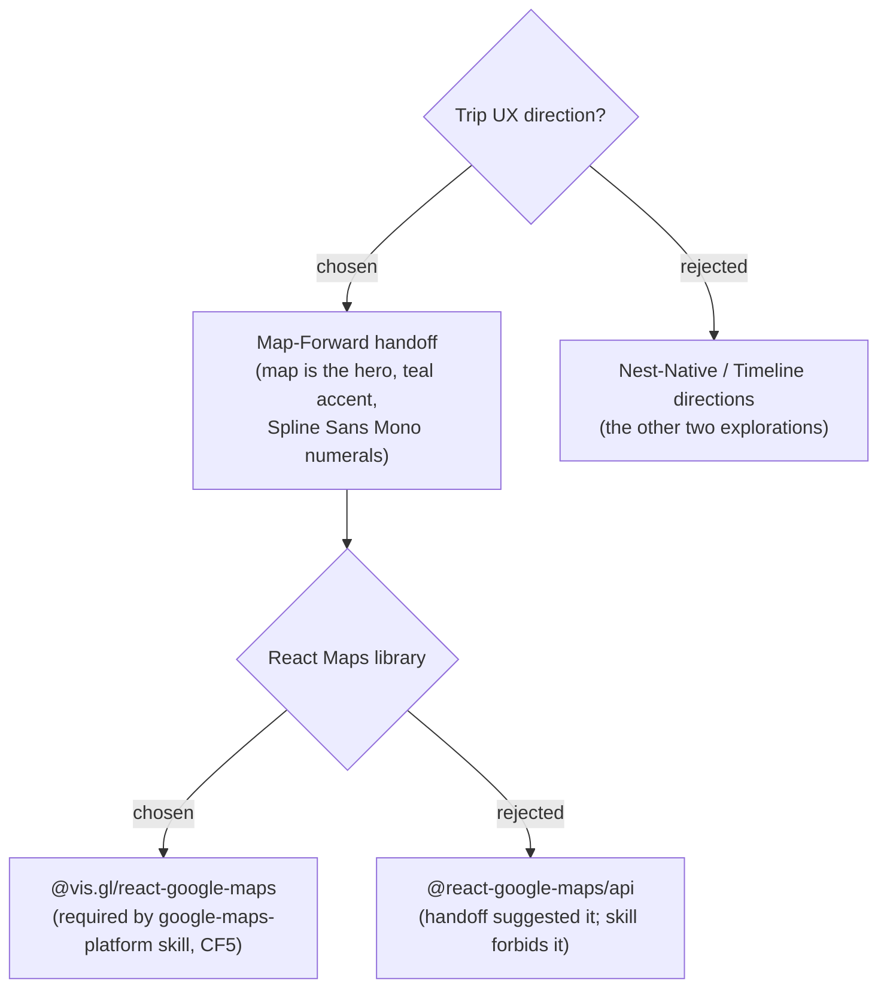

# ADR-010: Adopt the "Map-Forward" design handoff as the Trip UX source of truth, with the Maps-library override

**Date:** 2026-06-29
**Status:** Accepted

## Context

The owner supplied a high-fidelity handoff bundle ("Trip Planner — Map-Forward")
and directed that the Trip module follow it: a **map-forward** layout where the map
is the hero, a **teal** Trips accent (`#0e8f9e`) layered over MenuNest's orange
house theme, **Spline Sans Mono** for times/coords, and detailed screens for capture,
the Places library, the Smart-Schedule itinerary, and the stop editor. The handoff's
`README.md` is self-described as implementable on its own, with the `.dc.html`
prototypes as the visual source of truth.

The handoff makes two implementation suggestions that collide with authoritative
project rules:

- It names **`@react-google-maps/api`** for the interactive map. The installed
  `google-maps-platform` skill (Critical Failure **CF5**) mandates
  **`@vis.gl/react-google-maps`** and forbids `@react-google-maps/api`.
- It mentions the **Distance Matrix** API for travel time; that legacy API is
  disabled for new projects (use the **Routes API** — ADR-007).

The handoff itself states the repo's own guidelines win on conflict.

## Decision

Adopt the **Map-Forward** handoff as the authoritative UX/visual spec for the Trip
module — its tokens, layouts, copy (Thai, lifted verbatim), and the four core
screens (Add Place, Places library, Smart-Schedule itinerary, Stop editor) — built
inside the existing React/Syncfusion frontend per `docs/frontend-guidelines.md`
(Syncfusion-first; the interactive street map is the one allowed third-party UI).

Where the handoff conflicts with authoritative rules, the rules win:

- Interactive map uses **`@vis.gl/react-google-maps`** + `AdvancedMarkerElement` +
  `mapId`/`DEMO_MAP_ID`, **not** `@react-google-maps/api`.
- Travel time uses the **Routes API**, not Distance Matrix.
- Crowd-by-hour "popular times" is **manual data for v1** (not in Places API).
- Scope follows **ADR-005 (user-scoped)**, overriding the handoff's family-scoped
  routing; expenses follow **ADR-009 (deferred)**.

The teal Trips accent lives in page-level CSS; orange remains the global Syncfusion
primary (flagged in the handoff as the safe default).

## Consequences

**Positive:** A pixel-faithful target exists, removing UI guesswork. Following the
skill's library rule avoids the legacy-API runtime failures CF5 exists to prevent.
The teal-scoped accent keeps the app's global theme intact.

**Negative:** Code cannot be lifted from the `.dc.html` prototypes (they use an
`<x-dc>` prototyping runtime and `@react-google-maps/api`); every screen is a
re-implementation. The prototype's expense/traveller screens are visually complete
but out of MVP scope (ADR-009), so parts of the handoff are deliberately not built
yet — a future reader should not treat the whole prototype as the MVP checklist.
