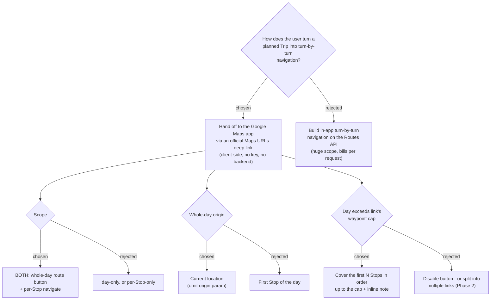

# ADR-011: A Trip's day route and individual Stops hand off to Google Maps via a client-side deep link

**Date:** 2026-06-30
**Status:** Accepted
**Relates to:** ADR-007 (Google Maps Platform adoption), ADR-010 (Map-Forward handoff)

## Context

A Trip holds an ordered **Itinerary** of **Stops** (ADR-005, CONTEXT.md). The user
wants to act on that plan in the field: open the day's route — or a single Stop — in
**Google Maps** for real turn-by-turn navigation ("ควรมีปุ่มกด แล้วเปิด navigate บน
google map"). Building navigation in-app on the Routes API is out of scope and would
bill per request; the natural, free, universally-trusted target is the Google Maps
app the user already has.

Every Stop already carries the data a deep link needs — `googlePlaceId` (nullable),
`lat`, `lng`, `name` — returned by the existing `getItinerary` + `listTripPlaces`
queries. A deep link is a plain `https://www.google.com/maps/...` URL opened in the
browser; it is **not** a Maps Platform REST call, so it needs **no API key and no
backend proxy** (the ADR-007 proxy rule does not apply), and using `place_id` in such
a link is the use Google explicitly encourages — fully ToS-compliant.

Google's **Maps URLs** documentation fixes the constraints we must design around:

- Directions URL: `…/maps/dir/?api=1&destination=…&waypoints=A|B&travelmode=…`.
  `origin` is optional — **omitting it makes Google Maps use the device's current
  location**.
- `destination_place_id` / `waypoint_place_ids` are supported **only alongside** the
  matching text `destination` / `waypoints` parameter.
- `travelmode` is a **single value for the whole URL** (`driving`/`walking`/`transit`/…),
  so a multi-leg day route cannot mix per-Leg modes.
- Waypoint cap: **3 on mobile browsers, 9 otherwise.** With a current-location origin
  every Stop becomes a waypoint except the last (the destination), so a full-day link
  fits a day of **≤ 4 Stops on mobile / ≤ 10 on desktop**.

## Decision

Add a **navigation hand-off** to the Trip itinerary, built entirely in the React
frontend.

1. **Scope — both surfaces.** A **whole-day route** button and a **per-Stop** navigate
   action. (Rejected: day-only or per-Stop-only — the user wanted both.)
2. **Whole-day origin — current location.** Omit the `origin` param; the day's Stops
   become ordered `waypoints` and the last Stop is the `destination`, so Maps routes
   the traveller from where they are through the day in order. (Rejected: first Stop as
   origin — costs a waypoint slot but the traveller is rarely standing on Stop 1.)
3. **Whole-day travel mode — the Trip's `defaultTravelMode`** mapped to Google's value
   (`Drive`→driving, `Walk`→walking, `Transit`→transit). A per-Stop link uses **that
   Stop's `travelModeToReach`** (its Leg mode). Because the whole-day link carries only
   **one** `travelmode`, a day whose Legs use **more than one** mode is shown with an
   inline note steering the user to the per-Stop buttons (which carry the correct
   per-Leg mode) for the differing Legs. (Rejected: last-used leg mode / no mode.)
4. **Overflow — truncate-and-note, with a conservative cap.** When a day exceeds the
   platform's waypoint cap, the whole-day link covers the **first N Stops in order**
   (N = cap + 1) and an inline note points the user at the per-Stop buttons for the
   rest. The cap is **conservative: 3 waypoints (→ 4 Stops) whenever the surface is
   plausibly mobile, 9 (→ 10 Stops) on desktop.** The client cannot tell whether the
   link will open the native Maps app (cap 3) or a browser tab (cap 3 on mobile / 9
   otherwise), and Google **silently drops** waypoints past the cap — so we err toward
   over-truncating (which merely shows the note) rather than losing Stops unseen. Mobile
   detection includes an explicit **iPad** check (`platform === 'MacIntel' &&
   maxTouchPoints > 1`), since iPadOS reports a desktop UA but may open the mobile app.
   (Rejected: assume 9 on mobile — risks silent loss; disable the button on long days —
   loses the feature; split into morning/afternoon links — deferred to Phase 2.)
5. **Placement — in the dark day-summary bar.** The whole-day button is a teal pill
   right-aligned in the existing `.day-summary` bar (which already summarises the day);
   the per-Stop action is a small teal icon button inside each `.stop-card`, a **sibling
   of** the clickable `.stop-body` (never nested — button-in-button is invalid and would
   fire the stop editor), mirroring the existing `.stop-reorder` column. (Rejected: a
   full-width CTA below the list, or a floating button over the map.) Confirmed against
   the mock at `docs/mocks/trip-nav-button-mock.html`.

**Launch mode:** both links append **`dir_action=navigate`** so Google Maps starts
turn-by-turn immediately (falls back to a route preview when the device is far from the
origin), matching the "open navigate" intent.

**Point encoding:** every point sends the text param as `"lat,lng"` (exact, and a safe
fallback if a `place_id` is stale). The **whole-day route uses `lat,lng` only** — no
`waypoint_place_ids` — because that list must align index-for-index with `waypoints`
(one missing slot misroutes every later point) and place_ids can push the URL past
Google's **2048-char** limit. A **per-Stop** link adds `destination_place_id` when the
Place has a `googlePlaceId` (single point, alignment trivial). `origin_place_id` is
never used (origin is omitted).

**Usable-point rules:** a point is usable only when its coordinates are finite and not
`(0,0)`; consecutive duplicate Stops collapse to one (to save a scarce waypoint slot)
while non-consecutive revisits are preserved. The whole-day button shows whenever
**≥ 1** usable point exists (a single-Stop day is a valid one-leg navigation) and is
hidden at 0. A per-Stop button is disabled when its Place has no usable coordinates.
Route order is built from the same sequence-sorted `scheduled` array the UI renders
(reusing `useDayRoute`), so on-screen order equals navigation order.

## Consequences

**Positive:** Zero backend, no API key, no Maps Platform billing for this feature — a
pure client-side link. Real turn-by-turn navigation in the app users already trust.
ToS-compliant by construction (`place_id` deep-linking is the sanctioned use). Reuses
data already on screen.

**Negative:** The hand-off inherits Google's constraints: a single travel mode per
multi-leg route, and a waypoint cap that truncates long days (mitigated by the note +
per-Stop buttons; full coverage of long days is Phase 2 splitting). Behaviour depends
on the device — whether the link opens the native app vs a browser tab, and current-
location origin requires the user to grant Maps its location permission (handled by
Google, not us). A day with a Stop missing both `place_id` and usable coordinates
cannot be linked and must degrade gracefully.
