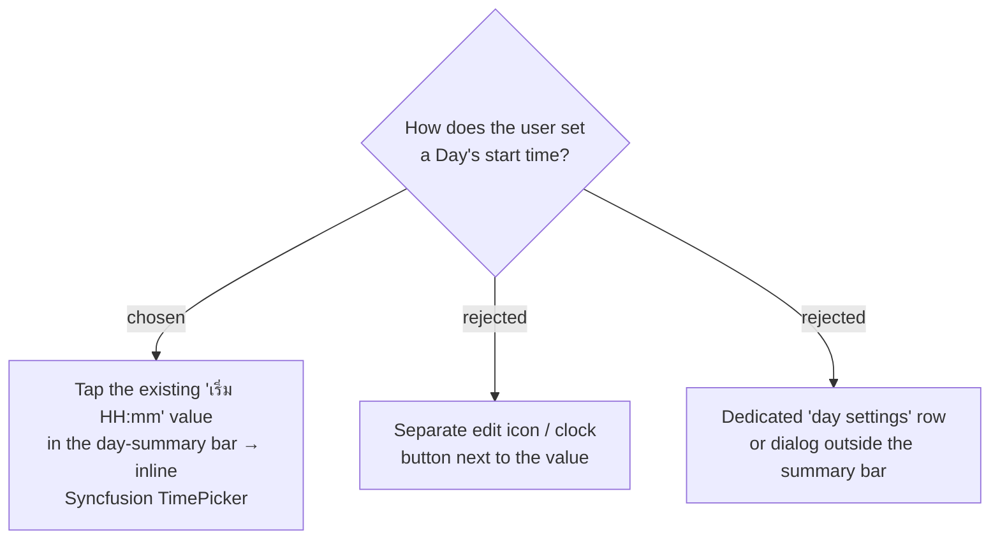

# ADR-012: Editing a Day's start time is an inline tap-to-edit on the summary bar, not a separate control

**Date:** 2026-06-30
**Status:** Accepted

## Context

The day-summary bar (`ItineraryTab`) renders `เริ่ม HH:mm` as read-only text. The first
**Stop**'s arrival equals the **Day**'s start time and the whole **Smart Schedule**
cascades forward from it (ADR-008), so the start time is a first-class input — yet the
SPA never exposed a way to change it, leaving every Day stuck at the domain default
`09:00` (`ItineraryDay.Create`). The backend command, the PATCH
`/api/trips/{tripId}/days/{dayId}` endpoint, and the RTK `useSetDayStartTimeMutation`
(invalidates `TripItinerary`) already exist; only the control is missing.

## Decision

Make the existing `เริ่ม HH:mm` value itself the affordance: tapping it opens an inline
Syncfusion `TimePicker` (`format="HH:mm"`, `step={15}` — the same component and
`hms↔Date` conventions as `BestTimeBar`). The displayed value and the editor are the
same surface; no new element is added to the bar. Commit timing is decided separately
(ADR-013).

## Consequences

**Positive:** Smallest possible change to a bar that is already slated for the
Map-Forward redesign (ADR-010) — nothing new to lay out, and the redesign restyles one
value rather than relocating a separate control. Reuses `BestTimeBar`'s `TimePicker`
pattern. Editing affects only the **active Day** (each `ItineraryDay` owns its own
`DayStartTime`), matching the data model.

**Negative:** A plain value is a weak affordance — users may not discover it is tappable
without a hover/active cue, so the mockup must give it a visible "editable" treatment.
The summary bar gains its first interactive element, so it now needs pending/error
feedback it did not have before. Making a bare Syncfusion `TimePicker` read as plain
text on tap requires deliberate props (`editable={false}`, `openOnFocus`,
`clearButton={false}`) and chrome-neutralizing CSS — see the design spec §4.2/§4.4.
