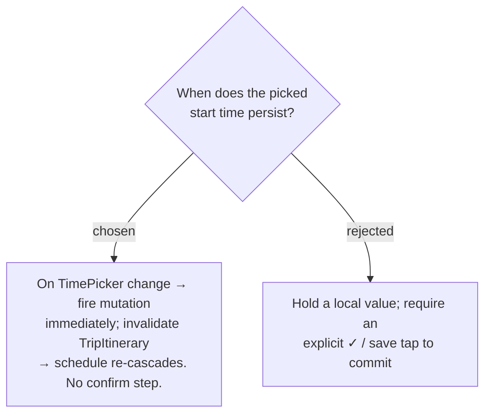

# ADR-013: The day-start TimePicker commits on change, with an optimistic value and inline error

**Date:** 2026-06-30
**Status:** Accepted

## Context

ADR-012 makes the start time an inline tap-to-edit on the summary bar. The remaining
question is commit timing: persist the moment a time is picked, or stage it behind an
explicit confirm. The codebase already sets a save-on-change precedent — `BestTimeBar`'s
`TimePicker` raises `onChange` and the value flows straight out. The `setDayStartTime`
mutation invalidates `TripItinerary`, which refetches `getItinerary` and re-runs
`computeSchedule` (ADR-008).

## Decision

Commit on change. The `TimePicker`'s `onChange` fires `useSetDayStartTimeMutation` with
the new `HH:mm:ss`, with no intermediate confirm control. Because the schedule visibly
re-cascades on success, the bar shows the picked value optimistically and surfaces a
failure through the tab's existing `actionError` / `.trips-field-error` line, reverting
the displayed value on error. A 15-minute step (matching `BestTimeBar`) keeps mis-pick
risk low without a confirm gate.

## Consequences

**Positive:** Matches the "tap → pick → done" flow chosen in ADR-012 and the existing
`BestTimeBar` interaction; adds no extra control to a bar headed for redesign. The
re-cascade is immediate, obvious confirmation that the change took.

**Negative:** A mis-pick persists without a guard; recovery is to re-pick (cheap, since
the value stays editable). Each pick is one PATCH + one itinerary refetch — fine at
human pick rate, not debounced.
