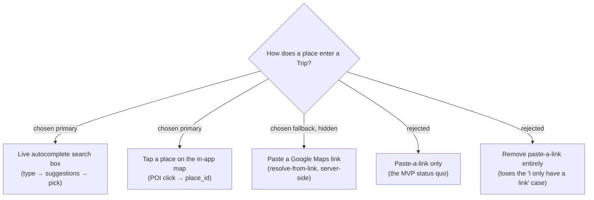

# ADR-014: Places are captured by live search and map-tap, with paste-a-link kept as a hidden fallback

**Date:** 2026-07-03
**Status:** Accepted
**Relates to:** ADR-007 (Google Maps Platform adoption), ADR-006 (superseded link-resolve), CONTEXT.md (Capture)

## Context

The Trip MVP shipped **Capture** with a single entry path: paste a Google Maps
share link into the "เพิ่มสถานที่" sheet, which the backend resolves server-side
(ADR-007, `resolve-place`). In practice that is friction — the user has to leave
the app, find the place in Google Maps, copy its share link, come back, and paste.
The owner asked for the entry to feel **"like Google"**: type a name and get live
suggestions, and also add a place by **tapping it on the map** already shown in the
app ("พิมแล้วขึ้น suggest สด และสามารถกดเพิ่มจากสถานที่ที่กดบนแมพด้วย").

Both new paths converge on the same downstream flow the paste path already uses:
obtain a Google **`place_id`** → fetch a detail snapshot (name, coordinates,
address, opening hours, price level) → preview → user picks a **category** →
persist via the existing `addTripPlace` command. Only the *acquisition* of the
`place_id` differs.

The paste-a-link path still has a genuine niche — a friend shares a `maps.app.goo.gl`
link and the user has a URL, not a name to type — and its code (link unfurl + SSRF
guard + Text Search) already exists and works. Removing it would delete working
capability for no gain.

## Decision

**Capture** now has **three** entry paths, ranked:

1. **Primary — live autocomplete search.** A search box in the add-place sheet:
   as the user types, Google Places suggestions appear live; selecting one fetches
   the detail snapshot and shows the preview. This is the default, front-and-centre
   entry.
2. **Primary — tap-on-map.** Tapping a labelled place (POI) on the in-app Trip map
   yields its `place_id` from the map click event and opens the same preview,
   pre-filled. (The exact tap behaviour — POI-only vs. arbitrary point — is
   ADR-016.)
3. **Fallback — paste a Google Maps link, kept but hidden.** The existing
   server-side resolve-from-link path stays, tucked behind a disclosure ("อื่นๆ /
   วางลิงก์") rather than shown by default. No UI is deleted; the resolver, its
   endpoint, and tests are untouched.

The glossary term **Capture** is updated to name all three paths (search and
map-tap are the MVP-primary; paste-link is the secondary fallback). Share-from-Maps
(PWA share target) and the bookmarklet remain Phase 2.

## Consequences

**Positive:** The headline friction of the MVP capture flow is removed — the entry
now matches the mental model of "search a place like on Google Maps." Two low-effort
paths (search, tap) reuse the entire downstream flow (`addTripPlace`) unchanged.
Keeping paste-link as a hidden fallback preserves a working niche path and all its
tests at zero cost.

**Negative:** The add-place sheet gains UI states (empty search, loading
suggestions, no results, selected-preview) and a disclosure for the fallback, so it
is more than the current two-control form. Two acquisition paths now feed the same
preview, so that preview/save code must be path-agnostic. The map surface gains an
interaction (tap-to-add) that must not collide with the existing pan/zoom and
marker-click behaviour.
