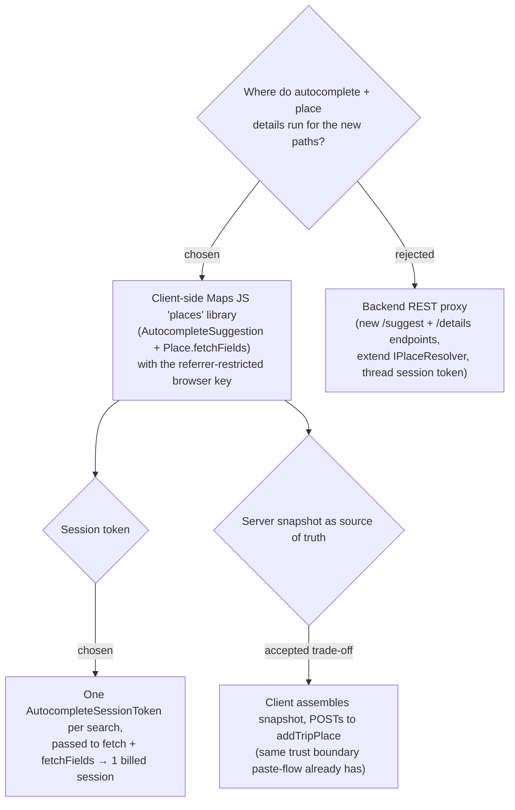

# ADR-015: Autocomplete and place-detail fetch run client-side via the Maps JS browser key, not a backend proxy

**Date:** 2026-07-03
**Status:** Accepted
**Relates to:** ADR-007 (Google Maps Platform adoption, CF1 proxy rule), ADR-014 (entry paths), ADR-011 (client-side deep link precedent)

## Context

ADR-014 adds two client-driven entry paths (live search, map-tap). Both need to
turn user input into a Google `place_id` + a detail snapshot. There are two ways to
reach the Places API (New):

- **Backend proxy (REST).** New `MenuNest.WebApi` endpoints call the Places REST
  API with the **server** `ApiKey`, matching ADR-007's CF1 rule that "Google REST
  endpoints lack CORS, so calls must be proxied server-side." This is why
  `resolve-place` is server-side.
- **Client-side Maps JS library.** The Places `places` JS library
  (`AutocompleteSuggestion.fetchAutocompleteSuggestions` + `Place.fetchFields`) runs
  **in the browser** with the **browser** key. It is the SDK, not a REST call, so
  the CORS/CF1 concern does not apply, and it manages Places **session tokens**
  internally.

Two facts decide it. First, **tap-on-map is inherently client-side**: a POI click
event on the Maps JS map is what yields the `place_id` — there is no server-side
equivalent of "the user tapped this pin." Autocomplete pairs naturally with it via
the same `places` library and shares the session-token machinery. Second, the app
**already ships a referrer-restricted browser key** to the SPA and uses it for the
in-app map (`VITE_GOOGLE_MAPS_BROWSER_KEY`, `TripMap.tsx`), and ADR-011 already
established that client-side Google interactions that don't expose the *server* key
are consistent with ADR-007 — the proxy rule protects the server key and works
around CORS, neither of which is at stake here.

The CF1 proxy rule is not violated: it governs the **server** key and REST
endpoints. Using the **browser** key from the JS SDK is the sanctioned client-side
pattern — the same pattern the map already uses.

## Decision

Run autocomplete **and** place-detail fetch **client-side** via the Maps JS
`places` library with the existing browser key. No new backend endpoint is added
for the search/tap paths.

- **Autocomplete:** `AutocompleteSuggestion.fetchAutocompleteSuggestions({ input,
  sessionToken, … })` drives the live suggestion list.
- **Details:** on selection (search) or POI tap (map), `Place.fetchFields({ fields,
  sessionToken })` returns the snapshot (id, displayName, location, formattedAddress,
  priceLevel, regularOpeningHours) mapped to the existing `ResolvedPlaceDto` shape.
- **Session tokens:** one `AutocompleteSessionToken` per search session, passed to
  the autocomplete calls and the follow-up `fetchFields`, so Google bills the whole
  search-then-detail interaction as **one session**. A map-tap has no autocomplete
  phase, so its `fetchFields` is a standalone detail call.
- **Persist:** the client assembles the snapshot and POSTs it to the existing
  `addTripPlace` command — unchanged. The server does not re-fetch or validate the
  snapshot.
- **Key scope:** the browser key must have **Places API (New)** enabled in addition
  to Maps JavaScript, and stay referrer-restricted. Dev uses the free Demo Key.

## Consequences

**Positive:** Lowest latency (no per-keystroke round-trip through our API), least
code (no new endpoints, no `IPlaceResolver` extension, no server-side session-token
threading), and correct session-token billing handled by the SDK. Consistent with
how the map already loads Google JS. Tap-on-map is naturally expressible. The server
`ApiKey` is never exposed.

**Negative:** The **server is no longer the source of truth** for the snapshot on
these paths — the client sends place data straight to `addTripPlace`. This is the
**same trust boundary the paste flow already has** (the resolved DTO is echoed from
the browser to `addTripPlace` today), so it is not a new exposure, but it does mean
place integrity is not server-validated. The browser key now needs Places API (New)
enabled and correctly restricted, or autocomplete fails in production while the map
still works — a subtle mis-provisioning to watch for. A hard dependency on the Maps
JS SDK loading before search/tap can function.
