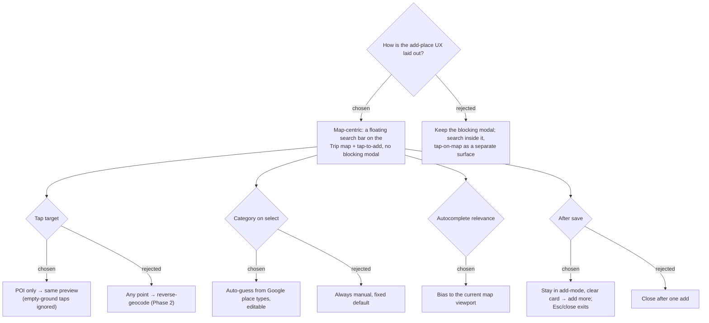

# ADR-016: Add-place is a map-centric surface — a search bar over the map, tap-to-add, and a preview card

**Date:** 2026-07-03
**Status:** Accepted
**Relates to:** ADR-014 (entry paths), ADR-015 (client-side), ADR-010 (Map-Forward), ADR-011 (map surface precedent)
**Mock:** `docs/mocks/trip-add-place-search-mock.html` (confirmed)

## Context

ADR-014 gives Capture two primary paths (live search, map-tap) and ADR-015 puts
them client-side on the Maps JS SDK. The remaining question is the **surface**: the
current add-place UI is a blocking Syncfusion `Dialog` over the left column, but the
Trip detail already renders a persistent map (desktop right pane; a map/list toggle
on mobile — `TripDetailPage.tsx`). Two paths that both operate on a map do not fit a
blocking modal that hides that map. The owner asked for the entry to feel "like
Google," and confirmed a map-centric layout over the mock at
`docs/mocks/trip-add-place-search-mock.html`.

## Decision

Make add-place a **map-centric mode** on the existing Trip map, not a modal.

1. **Surface — search bar over the map + tap-to-add.** Pressing "+ เพิ่มสถานที่" arms
   **add-mode**: a floating search bar appears at the top of the map, live suggestions
   drop beneath it, and the map becomes tap-enabled. On mobile, arming add-mode
   switches the places view to the map. The blocking modal is removed. (Rejected:
   keep the modal with search inside it and tap-on-map as a disjoint second surface —
   two surfaces for one action, and it hides the map the tap path needs.)
2. **Tap target — POI only, into the same preview.** Tapping a labelled place (POI)
   uses the map click event's `place_id` and opens the **same** preview the search
   path opens. Taps on empty ground (no `place_id`) are ignored (optionally a subtle
   hint). Reverse-geocoding arbitrary points is Phase 2. (Rejected: reverse-geocode
   any tapped point — adds a Geocoding call and "what place is this?" ambiguity.)
3. **Preview — a floating card / bottom sheet.** On select or POI tap, a **temporary
   teal pin** drops and a preview card shows the name, address, an **auto-guessed but
   editable category**, and **[ยกเลิก] [+ เพิ่มลงทริป]**. The card floats bottom-centre
   on desktop and is a bottom sheet on mobile.
4. **Category — auto-guessed from Google place types, editable.** A lookup maps Google
   `types` to a MenuNest category (`restaurant`→Eat, `cafe`→Cafe, `lodging`→Stay,
   `tourist_attraction`/`museum`/`place_of_worship`→See, `store`/`shopping_mall`→Shop,
   else Other); the preview shows it pre-filled with a "เดาจาก Google" badge, and the
   category dropdown stays editable. (Rejected: always manual with a fixed default.)
5. **Autocomplete relevance — bias to the current map viewport.** Suggestions are
   biased to the map's current bounds (`locationBias`), so typing "central" in a
   Chiang Mai view surfaces Chiang Mai results, matching the Google mental model.
6. **After save — stay in add-mode.** A successful add clears the card and search
   input and keeps add-mode armed, so the user can add several places in a row (the
   "สำรวจ / collect places" phase). The newly added place appears in the list/map.
   **Esc or the close control** exits add-mode. (Rejected: close after a single add —
   forces a re-arm per place.)
7. **Category glyphs — colour dot + Thai label, not emoji.** The category control uses
   the per-category colour (from `TripMap.tsx` `CAT_COLOR`) as a dot plus the Thai
   label, consistent with the no-emoji-chrome preference. (The shipped `CATS` emoji in
   the old sheet are superseded on this surface.)

## Consequences

**Positive:** The entry matches "search a place like Google," unifies both paths on
one surface (the map already on screen), and removes a modal. Viewport bias and
auto-category cut friction. Stay-in-add-mode fits bulk collection. The confirmed mock
is the single source of truth for the build.

**Negative:** Add-mode is a new stateful interaction layered on `TripMap` — it must
coexist with pan/zoom, existing place markers, and the itinerary route without a tap
colliding with marker-click. The old `AddPlaceSheet` dialog is replaced (its
paste-resolve logic moves behind the search bar's "วางลิงก์" fallback, not deleted).
Mobile must force the map view when add-mode arms. Auto-category is a heuristic — it
will sometimes guess wrong, so the control must stay obviously editable.
