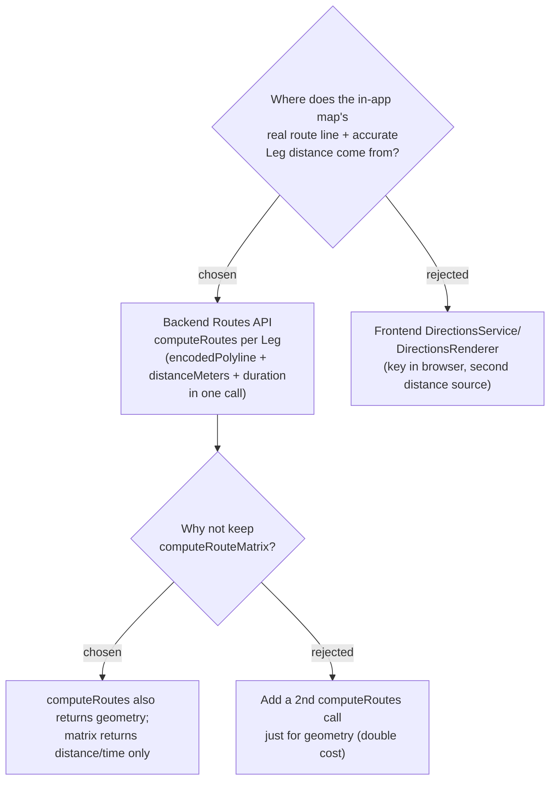

# ADR-016: Leg geometry and distance come from Routes API `computeRoutes` on the backend, replacing `computeRouteMatrix`

**Date:** 2026-07-03
**Status:** Accepted
**Relates to:** ADR-007 (Google Maps Platform adoption), ADR-010 (Map-Forward handoff), ADR-011 (navigate hand-off)

## Context

The in-app **map** draws the day's route as a `geodesic: true` straight line
through the Stops (`TripMap.tsx`), and each **Leg**'s distance/time comes from the
backend `IRouteService`. Two user-visible defects trace to this:

1. **The line does not follow roads.** `computeRouteMatrix` (the current call)
   returns only `duration` + `distanceMeters` — **no geometry** — so there is no
   road path to draw; the frontend falls back to a straight line by design.
2. **The distance is not the real road distance.** Confirmed via debug-mantra:
   the production Google Cloud project has **billing disabled**, so every
   `computeRouteMatrix` call returns **403 `BILLING_DISABLED`**, and
   `GoogleRouteService` silently falls back to `HaversineRouteService`
   (straight-line × 1.3 ÷ mode speed). The displayed "31.8 km / 48 min" is that
   Haversine estimate — 40 km/h exactly — not a routed distance.

CONTEXT.md defines a **Leg** as travel time "from the Google **Routes API**, not
an estimate," and ADR-007 sanctions **`computeRoutes` / `computeRouteMatrix`**.
Getting road-accurate geometry *and* distance in one place is the cleanest path
back to that contract.

The alternative — a frontend `DirectionsService`/`DirectionsRenderer` — would put
routing in the browser (contra ADR-007's key-server-side, backend-proxy rule) and
create a **second** distance source that could drift from the backend Leg times
the itinerary list and `useDayRoute` already share.

## Decision

Compute each **Leg** on the backend with Routes API **`computeRoutes`** instead of
`computeRouteMatrix`:

- Request a field mask of `routes.duration`, `routes.distanceMeters`, and
  **`routes.polyline.encodedPolyline`** so one call yields travel time, road
  distance, and the **road-accurate geometry** to draw.
- The encoded polyline flows to the frontend as part of the **Leg** contract; the
  map decodes it (Maps JS `geometry` library) and draws the real route path in
  place of the straight `geodesic` line. Distance/time stay a **single source of
  truth** shared by the map and the itinerary list.
- `computeRouteMatrix` is retired for this module; the `IRouteService` seam and its
  12-hour per-leg cache are preserved (the cached value now also carries geometry).

This ADR covers only *where geometry and distance come from*. The **honest-fallback
behaviour** when Routes API is unavailable (billing off / any failure) is a separate
decision (see the follow-on ADR). Enabling Google Cloud billing is an operational
step outside this code change; until it is done, the honest fallback path applies.

## Consequences

**Positive:** The map line follows real roads and the Leg distance is the real
routed distance — both defects fixed by one backend change. Key stays server-side
(ADR-007). One source of truth for distance/time. `computeRoutes` is already the
ADR-007-sanctioned, non-legacy endpoint.

**Negative:** `computeRoutes` is a per-route call, so a day with mixed per-Leg
travel modes is resolved as one call per Leg (same shape as today's per-pair matrix
calls; see the follow-on ADR on batching). The itinerary payload grows by one
encoded-polyline string per Leg. The feature is only truly fixed once Google Cloud
billing is restored; without it the honest-fallback path (follow-on ADR) governs.
