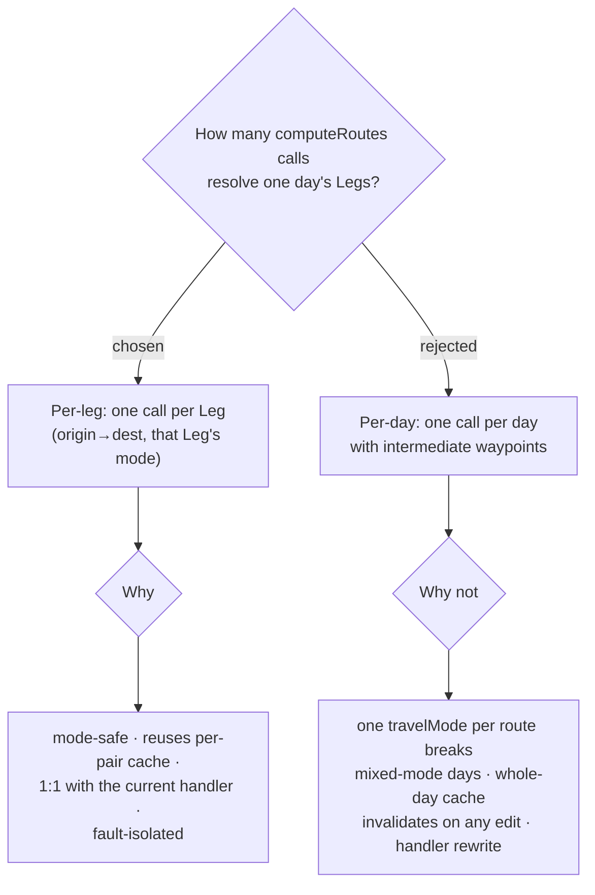

# ADR-017: Legs are resolved one Routes API call per Leg, not one call per day

**Date:** 2026-07-03
**Status:** Accepted
**Relates to:** ADR-016 (computeRoutes for geometry + distance), ADR-011 (single travel mode per Maps link)

## Context

ADR-016 moves Leg resolution to Routes API `computeRoutes`. That leaves *how many
calls per day*: one call per Leg (**per-leg**), or one call per day with the
Stops as intermediate waypoints (**per-day**).

Two facts decide it:

- **`computeRoutes` takes one `travelMode` per route.** A **Leg** carries its own
  `travelModeToReach` (CONTEXT.md), and a day routinely mixes modes — drive between
  towns, walk within one (e.g. the Chanthaburi day: drive to the waterfall, walk the
  footbridge to the cathedral). A single per-day call would force one mode on every
  Leg, mis-routing the odd ones — the same single-mode constraint ADR-011 hit for the
  navigate hand-off. A per-day design must therefore *detect* mixed-mode days and fall
  back to per-leg anyway, i.e. carry two code paths.
- **The existing cache is per-pair.** `GoogleRouteService` keys the 12-hour cache on
  `origin→dest→mode`, and `GetItineraryHandler` already resolves every Leg
  concurrently. Per-leg is a 1:1 swap that preserves both. Per-day needs a whole-day
  cache key that any edit — reorder, add/remove a Stop — invalidates wholesale; for a
  planner (edited often) that means *more* cold calls in practice, not fewer.

The per-leg vs per-day trade-off was walked through interactively with the user at
`docs/problem-description/2026-07-03-per-leg-vs-per-day-walkthrough.html`.

## Decision

Resolve **one `computeRoutes` call per Leg**, keeping the current concurrent
per-Leg resolution in `GetItineraryHandler` and the per-`origin→dest→mode` 12-hour
cache. Each Leg is requested with **its own** `travelModeToReach`, so a mixed-mode
day is correct by construction.

Cost is not a factor at this scale: `computeRoutes` (Essentials tier, no
traffic-aware routing) gives 10,000 free calls/month, and the 12-hour cache makes
steady-state resolution ~0 calls — a personal planner never approaches the cap
(see ADR-016). **Constraint:** do **not** enable traffic-aware routing, which would
move the call to the Pro tier; static duration is sufficient for planning.

Per-day batching for **single-mode** days is explicitly deferred to Phase 2 as a
cold-cache latency optimisation, not adopted now.

## Consequences

**Positive:** Each Leg's distance/time/geometry matches its real travel mode. The
handler and cache are essentially unchanged (low-risk swap). A per-Leg polyline maps
one-to-one onto the itinerary rows and map segments — single source of truth, no
whole-day polyline to split back apart. A single Leg's Google failure degrades only
that Leg (fault isolation), not the whole day.

**Negative:** A cold-cache day costs N calls (N = Leg count) instead of one — bounded
by the free tier and absorbed by the cache, but real for a first view of a long day.
The Phase-2 single-mode batching optimisation is left on the table.
