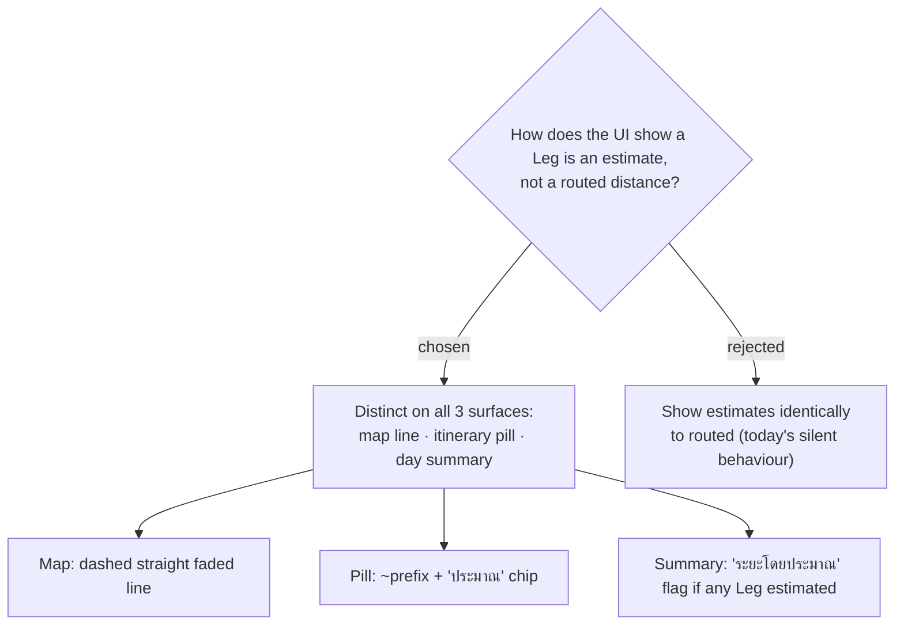

# ADR-019: An `Estimated` Leg is visually distinct — dashed straight line, "ประมาณ" badge, and a day-summary flag

**Date:** 2026-07-03
**Status:** Accepted
**Relates to:** ADR-018 (RouteSource on the Leg), ADR-010 (Map-Forward handoff / teal accent)
**Mock:** `docs/mocks/route-estimate-treatment-mock.html` (confirmed with the owner)

## Context

ADR-018 gives each Leg a `RouteSource {Routed, Estimated}`. The point of that flag
is honesty **to the user**: an `Estimated` Leg (Haversine straight-line ×1.3) must
not read as a routed distance. The current UI shows both identically — a straight
`geodesic` polyline and a plain "48 นาที · 31.8 กม." — which is exactly the silent
lie ADR-018 exists to end. Three surfaces render Leg data: the map polyline
(`TripMap`), the itinerary pill (`TravelLeg`), and the day summary (`useDayRoute`
→ map day card / `.day-summary`).

## Decision

Render an `Estimated` Leg differently on **all three** surfaces (confirmed against
the mock):

1. **Map polyline (per Leg).** `Routed` → the decoded `encodedPolyline`, drawn
   **solid** teal (`#0e8f9e`, current weight) so it follows the road. `Estimated`
   → a **straight, dashed, faded** teal line (dash `3 9`, opacity ~0.5) between the
   two Stops — visibly "we're guessing this segment." (The polyline becomes per-Leg
   segments rather than one path through all Stops, per ADR-017.)
2. **Itinerary pill (`TravelLeg`).** `Routed` → unchanged. `Estimated` → a `~`
   prefix on both time and distance (`~6 นาที · ~0.3 กม.`) plus a small amber
   **"ประมาณ"** chip. The chip is text (no emoji), per the project's no-emoji rule.
3. **Day summary.** When **any** Leg in the day is `Estimated`, prefix the total
   distance with `~` and show a **"ระยะโดยประมาณ"** flag on the dark summary bar.
   An all-`Routed` day shows no flag.

The existing 🚗/🚶/🚃 mode emoji in the pill are **left as-is** — pre-existing debt
tracked separately, explicitly out of this change's scope.

## Consequences

**Positive:** The estimate is self-evidently an estimate on every surface the user
looks at — the billing-off state (all Legs `Estimated`, whole map dashed, summary
flagged) reads as an honest degraded mode, not a bug report ("ระยะไม่ตรง"). Uses the
existing teal language; the amber chip is the only new token, reserved for "not
exact."

**Negative:** `TripMap` must render N per-Leg polylines with per-Leg styling instead
of one path; `TravelLeg` and `useDayRoute` gain conditional formatting keyed on
`RouteSource`. Three components change rather than one. The mock must stay the source
of truth if the treatment is revised.
