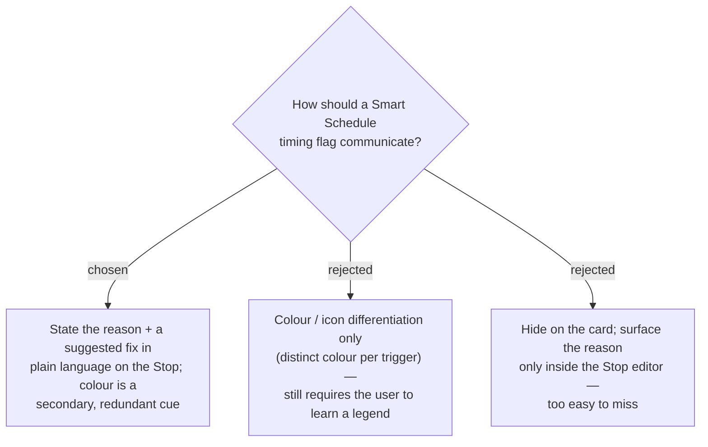

# ADR-019: A timing flag states its reason and a suggested fix in words — color is only a secondary cue

**Date:** 2026-07-03
**Status:** Accepted

## Context

The Smart Schedule flags each Stop against its best-time window and opening hours
(ADR-008). ADR-008 already intended the amber state to carry a fix suggestion —
*"arriving 3h before the good window — move later in the day?"* — but the shipped
MVP reduced the flag to an **orange colour + a tiny `⚠ ช่วงดี 12:00–13:00` chip**.
End users see the orange and do not know what it means or what to do about it. The
flag today also collapses **three distinct triggers** into one orange:

1. arrival lands **outside the place's best-time window**;
2. the place is **closed at arrival** (opening-hours snapshot);
3. the day **overflows past midnight**.

## Decision

A timing flag's primary job is to **communicate meaning and next action in words**,
not to rely on colour recognition:

- Each flagged Stop shows, in plain Thai, **what the problem is** and **a concrete
  suggested fix** (e.g. "ไปถึงก่อนช่วงแนะนำ ~3 ชม. — ลองเลื่อนไปช่วงบ่าย" or
  "ร้านยังไม่เปิด (เปิด 10:00)").
- **Colour becomes a secondary, redundant cue**, never the sole carrier of meaning
  — so the flag is understandable to a first-time user and to anyone who cannot rely
  on colour alone.

Rejected: colour/icon differentiation as the primary channel (still forces the user
to learn a legend), and surfacing the reason only inside the Stop editor (too easy to
miss on the itinerary at a glance).

## Consequences

**Positive:** Self-explanatory at first glance; delivers ADR-008's original intent;
does not depend on colour perception. **Negative:** More text per card, so wording
must stay terse and the layout must absorb a reason line without crowding the
timeline — resolved in follow-up ADRs (severity tiers, placement, icon system).
