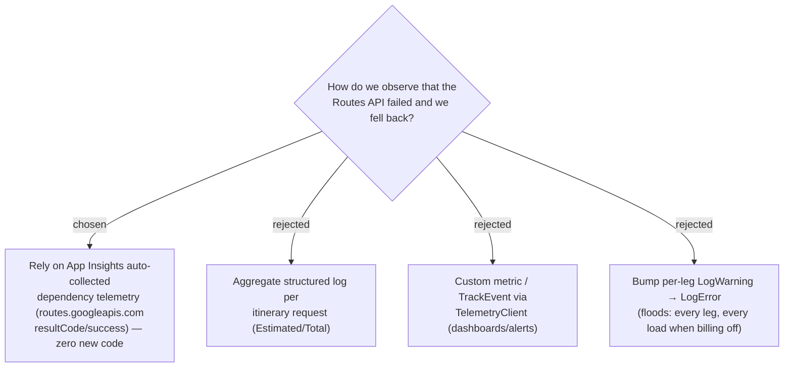

# ADR-020: Route-fallback observability relies on App Insights' auto-collected dependency telemetry — no bespoke logging or metric

**Date:** 2026-07-03
**Status:** Accepted
**Relates to:** ADR-018 (RouteSource), ADR-016 (computeRoutes)



## Context

The fallback is silent today (the `LogWarning` in `GoogleRouteService` never reached
App Insights traces). "Make it observable" was the third robustness ask. But the
debug-mantra investigation established a decisive fact: App Insights **already**
auto-captures every outbound `routes.googleapis.com` call in the `dependencies`
table with its `resultCode`/`success` — that telemetry is exactly what pinpointed
the `403 BILLING_DISABLED` root cause without any code in the app.

A key constraint shapes the choice: with billing off, **every Leg of every page load
fails**, so any per-leg log at Error level would flood App Insights (and cost). The
value of a bespoke signal is marginal when the dependency table already shows both
*that* Routes API is failing and *why* (the result code).

## Decision

Add **no bespoke logging, metric, or `TelemetryClient` dependency** for fallback
observability. Rely on the **existing auto-collected dependency telemetry**:

```kusto
dependencies
| where target has 'routes.googleapis.com'
| summarize calls=count() by resultCode, success, bin(timestamp, 1d)
```

This shows fallback frequency and cause for free. The per-leg `LogWarning` in
`GoogleRouteService` stays as-is (local, uncaptured, harmless — not a flood since it
never reached App Insights). The user-facing honesty signal is carried by
`RouteSource` + the UI treatment (ADR-018/019), which is the surface that actually
matters to a personal-app user.

The richer options — an aggregate per-request log, or a custom metric/`TrackEvent`
for dashboards and alerting — are **deliberately cut** as complexity that outweighs
value at this scale, not deferred with intent to build.

## Consequences

**Positive:** Zero code, zero new dependency, zero flood risk. The signal that
already solved the real incident is the signal we keep. Fallback rate and cause are
one Kusto query away.

**Negative:** No first-class "estimated legs served" business metric, and no
alerting — diagnosis stays pull (run the query) rather than push. If fallback
volume ever needs a dashboard or an alert, the cut options (aggregate log / custom
metric) are the documented next step.
