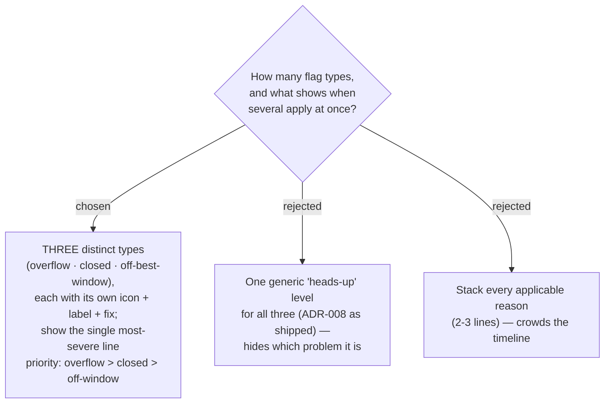

# ADR-020: Three distinct timing-flag types, one most-severe reason shown per Stop

**Date:** 2026-07-03
**Status:** Accepted

## Context

Following ADR-019 (flags speak in words), the three triggers the Smart Schedule
already computes — day **overflow** past midnight, place **closed** at arrival, and
arrival **outside the best-time window** — differ in kind. The user chose to treat
all three as **distinct**, each carrying its own icon, label, and suggested fix,
rather than a single generic level or a hard/soft two-tier split. A single Stop can
trip more than one at once (arriving at 02:00 is overflow **and** closed **and**
off-window; the most common pair is closed **and** off-window), so a rule is needed
for what to surface.

## Decision

1. **Three named flag types**, each with its own icon, label, and fix wording:
   - **overflow** — the day runs past midnight to reach this Stop;
   - **closed** — the place is shut at the computed arrival (opening-hours snapshot);
   - **off-window** — arrival falls outside the place's user-set best-time window.
2. **One line per Stop.** When several apply, show only the **single most-severe**,
   by priority **overflow > closed > off-window**. Rationale: overflow means the
   day's structure is broken (an earlier Stop must be trimmed) so a "opens 10:00"
   hint would mislead; a closed place is a harder blocker than a merely
   non-ideal arrival time. Stacking every reason was rejected as timeline clutter.
3. The **suggested fix stays a text hint, not an action button** — the user reorders
   manually; the app never auto-optimizes (ADR-008).

## Consequences

**Positive:** Each flag is specific and actionable; the card stays to one reason
line; the precedence is deterministic and testable. **Negative:** A lower-priority
reason is hidden while a higher one stands (e.g. off-window is suppressed under
closed) — acceptable because fixing the shown blocker usually resolves or re-surfaces
the rest on the next re-cascade. The `flag` model in
[useSchedule.ts](../../frontend/src/pages/trips/hooks/useSchedule.ts) must change
from a `'green' | 'amber'` boolean-ish to a typed reason (`ok` + the three types)
so the card can render the right line.
