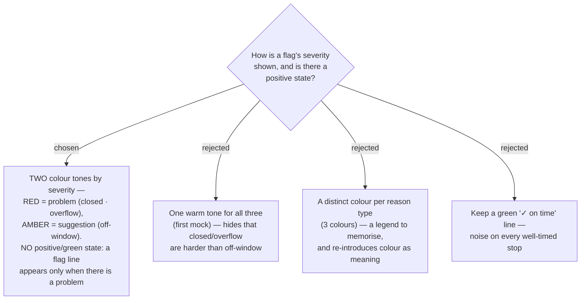

# ADR-021: Timing-flag severity is shown in two colour tones (red = problem, amber = suggestion); there is no positive state

**Date:** 2026-07-03
**Status:** Accepted

## Context

ADR-020 established three distinct flag *reasons* (closed · off-window · overflow),
each with its own icon and wording. Reviewing the mock
([trip-timing-flag-redesign-mock.html](../mocks/trip-timing-flag-redesign-mock.html)),
the owner found that a single warm tone made a hard blocker (place **closed**) look
no more urgent than a soft nudge (**off-window**). The three reasons split cleanly by
how much they cost the traveller: **closed** and **overflow** mean the plan does not
work as-is; **off-window** means it works but is not ideal.

## Decision

Severity is a **second, orthogonal channel** layered on the three reasons of ADR-020:

1. **Two severity tones (colour):**
   - **problem — red** (`--bad #b42318` on `--bad-bg #fdeceb`): **closed** and
     **overflow**. The whole card tints red (card, left rail, reason line).
   - **suggestion — amber** (existing `--warn` / `--warn-bg`): **off-window**.
2. **Reason + fix wording (icon + words)** stays the primary meaning channel per
   ADR-019 — colour only ranks urgency, it never carries the meaning alone.
3. **No positive/green state.** A flag line appears **only when there is a problem**;
   a well-timed Stop shows nothing beyond its dwell chip. This retires the shipped
   green `✓ ช่วงดี` chip entirely.
4. The reason line is a full-width inset banner **below the dwell chips, inside the
   Stop body** — icon + bold reason + a muted suggested-fix clause on one line
   (wraps if long).
5. The standalone **`+1วัน` overnight chip is retired.** A midnight-crossing day is
   communicated solely by the red **overflow** reason line — no duplicate badge. To
   avoid repeating a day-level message on every post-midnight Stop, the overflow flag
   fires **once, on the first Stop whose arrival crosses midnight** (`arrival >= 1440`);
   later post-midnight Stops do not repeat it (they may still show closed/off-window).
   A day that only *departs* past midnight (every Stop reached before midnight) shows
   no overflow flag — the late finish is already visible as the day-end time.

This composes with ADR-020's precedence: when several apply, the single most-severe
line shows, ranked **overflow > closed > off-window** — i.e. red outranks amber, and
within red, overflow outranks closed.

## Consequences

**Positive:** A red card reads as "must fix" at a glance while amber reads as "worth
adjusting"; dropping the positive state removes noise so colour on the timeline always
means *something needs attention*. **Negative:** introduces a **new red token pair**
to `trips-tokens.css` (the trip palette had only teal/amber/green), which must be
checked for contrast and for harmony with the calm map-forward look (ADR-010). The
`.stop-card.warn` styling must generalise to a `warn` (amber) vs `bad` (red) variant,
and the flag model must expose severity, not just a reason.
