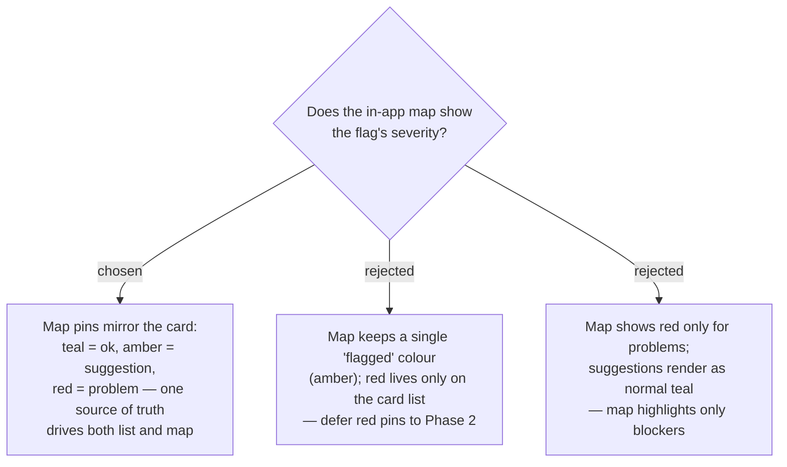

# ADR-022: Map route-pins reflect the flag's severity (teal = ok · amber = suggestion · red = problem)

**Date:** 2026-07-03
**Status:** Accepted

## Context

The itinerary map already colours pins by the timing flag, but through a **binary**
path that throws away everything but "amber": `useDayRoute` sets
`amber: s.flag === 'amber'`
([useDayRoute.ts:66](../../frontend/src/pages/trips/hooks/useDayRoute.ts)) into a
`RouteStop.amber: boolean` (line 20), and `TripMap` applies
`route-pin${r.amber ? ' amber' : ''}`
([TripMap.tsx:126](../../frontend/src/pages/trips/components/TripMap.tsx)). The CSS
has only a teal default dot and a `.route-pin.amber` variant
([trips-tokens.css:264,280-283](../../frontend/src/pages/trips/trips-tokens.css)) —
**no red**. ADR-021 introduces a red "problem" severity, forcing a decision on the
map layer: the flag→pin pipeline `useSchedule → useDayRoute → TripMap` currently
discards severity at `useDayRoute.ts:66`.

## Decision

The map **mirrors the card's severity** — the same single-most-severe flag
(ADR-020) drives both surfaces:

- **teal** — no flag (well-timed);
- **amber** — a *suggestion* (off-window);
- **red** — a *problem* (closed / overflow).

So a stop the plan can't honour (red) is spottable at a glance on the map, not only
in the list. Rejected: keeping the map amber-only (list and map would disagree on
severity), and red-only-on-map (a real "suggestion" flag would vanish from the map).

The map **callout text stays time + name** — the Thai reason/fix wording is a
*card-list* affordance, not shown on pins (keeps callouts compact; the pin colour is
the map's severity signal). Tapping a pin still routes the user to the stop.

**Accessibility reconciliation with ADR-019.** Colour alone must not carry meaning.
Two mitigations keep the map compliant without crowding the callout: (a) each flagged
marker gets an **accessible name** (`aria-label`) stating the stop, its reason, and
severity, so assistive tech and colour-blind users get the meaning in words; and (b)
the **itinerary list remains the authoritative worded surface** — the map is a
parallel view of the same Stops, never the sole surface. The pin hue is thus a
secondary at-a-glance cue, satisfying ADR-019.

## Consequences

**Positive:** One severity model, two consistent surfaces. **Negative:** the map path
is no longer isolated — `RouteStop.amber: boolean` becomes a severity value
([useDayRoute.ts:20,66](../../frontend/src/pages/trips/hooks/useDayRoute.ts)),
`TripMap.tsx:126` branches the modifier class per severity, and
`trips-tokens.css` gains `.route-pin.problem .route-dot` / `.route-callout` red rules
alongside the existing `.amber` (reusing the `--bad` token from ADR-021). This widens
the change beyond the stop card, but all consumers already read the one
`useSchedule` flag, so there is a single place to get the model right.
