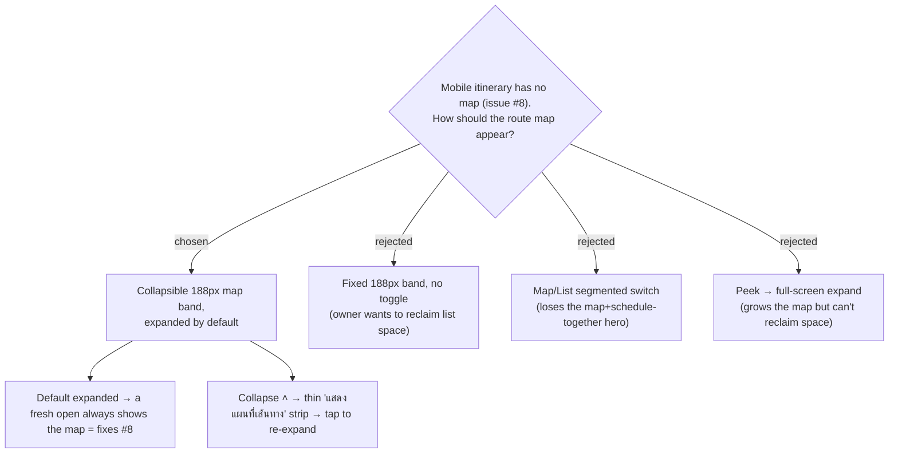

# ADR-026: The mobile/tablet itinerary shows a collapsible route-map band, expanded by default

**Date:** 2026-07-04
**Status:** Accepted
**Relates to:** ADR-010 (Map-Forward handoff / map is the hero), ADR-022 (map pins reflect flag severity), GitHub issue #8
**Mock:** `docs/mocks/trip-itinerary-map-toggle-mock.html` (confirmed with the owner)

## Context

GitHub issue #8 ("บนมือถือไม่แสดงแผนที่"): on mobile/tablet the **Itinerary** tab — which is
both the *default* tab (`tripsSlice.initialState.activeTab = 'itinerary'`) and the
Map-Forward *hero* screen (F3) — renders **no map at all**. The route map exists only in
the desktop split's right pane (`TripDetailPage` `isDesktop` branch); `ItineraryTab` does
not import `TripMap`. A user opening a trip link on a phone lands on a mapless screen.
ADR-010 makes the map the hero, and the F3 hero screen specifies a 188px route-map band
on the mobile itinerary, below the day tabs and above the dark day-summary bar.

The owner asked for a **toggle** rather than a permanently-fixed band, and — after
reviewing an interactive mock of three toggle interpretations — chose the collapsible band.

## Decision

On mobile/tablet, the **Itinerary** view shows the active **Day**'s route as a **~188px map
band** (numbered pins + per-leg polylines — the same `TripMap` route mode the desktop right
pane already uses), positioned **below the day tabs and above the day-summary bar** per F3.

- The band is **expanded by default**, so a fresh open always shows the map — this is what
  fixes #8.
- A **collapse control** pins the band to a thin, tappable **"แสดงแผนที่เส้นทาง" strip** to
  reclaim vertical space for the stop list; tapping the strip re-expands the band.

Rejected alternatives (all reviewed in the mock):
- **Fixed 188px band, no toggle** — the owner explicitly wants to reclaim list space.
- **Map/List segmented switch** (mirroring the Places tab) — shows only one surface at a
  time, discarding the "map + schedule together" hero, and risks defaulting to the list
  (which re-hides the map and reopens #8).
- **Peek → full-screen expand** — grows the map but cannot reclaim list space, and the
  full-screen state occludes the schedule.

## Consequences

**Positive:** Fixes #8 with the smallest change that honors Map-Forward; the map and the
Smart Schedule are visible together on open; power users can collapse the band for a
list-dense view.

**Negative:** Introduces one UI-state bit for the collapsed/expanded state, and a **map
resize concern** — Google Maps must re-measure when the band shows/hides or tiles can
render grey/misaligned (behaviour of `@vis.gl/react-google-maps`'s internal `ResizeObserver`
must be verified during planning). A new `.trip-map` height variant for the band must not
disturb the desktop (`height: 100%`) or the mobile places→map (`50vh`) sizings.
