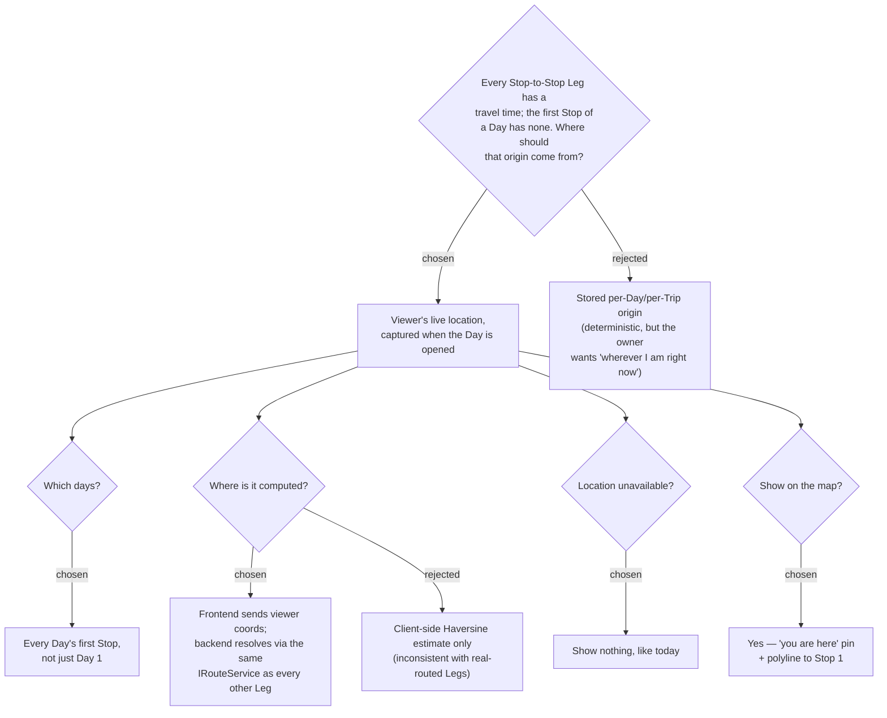

# ADR-027: The Approach leg into a Day's first Stop uses the viewer's live location, resolved server-side

**Date:** 2026-07-05
**Status:** Accepted
**Relates to:** ADR-007 (Google Maps Platform adoption), ADR-008 (Smart Schedule cascade), ADR-011 (Navigate hand-off uses current location), ADR-017/018 (per-leg route resolution + honest fallback), ADR-024 (Estimated leg UI treatment), GitHub issue #4

## Context

Issue #4 ("ควรมีจุดเริ่มต้นของทริป เพื่อคำนวนระยะทางแรก"): the Smart Schedule shows a
travel time/distance on every **Leg** between consecutive **Stops**, but the first
Stop of a Day has none — `GetItineraryHandler` only resolves legs for
`li = 1..dayStops.Count`, and `Stop.cs`'s own doc comment states "Sequence 0 has no
leg." `useSchedule.ts`'s cascade seeds `cursor = dayStartTime` with no travel time
added for the first arrival, and `useDayRoute.ts` explicitly drops a null
`legToReach` from the total-distance sum.

The obvious candidate origin — a stored address on the Trip or Day — was considered
and rejected by the owner in favor of the viewer's live location at the moment they
open the Day, matching the mental model already used by ADR-011's Navigate hand-off
(which also omits a fixed origin in favor of current position). Unlike ADR-011,
this is not a one-off deep-link action: it feeds the Smart Schedule's persistent
arrival cascade and the day's total-distance figure, so it is **resolved server-side
per request**, the same way every other Leg is, rather than a client-only estimate.

## Decision

Introduce the **Approach leg**: the travel segment from the viewer's live location
to a Day's first Stop, resolved fresh on every itinerary fetch.

1. **Origin — live geolocation, not a stored point.** The owner explicitly chose
   "location at the time the app is opened" over a stored per-Day/per-Trip origin,
   accepting that the Smart Schedule's arrival cascade and total-distance figure
   become viewer- and moment-dependent rather than a fixed planning artifact.
   (Rejected: stored origin — deterministic, but not what was asked for.)
2. **Scope — every Day's first Stop**, not just the Trip's opening day. No
   special-casing Day 1 vs. Day 2+; whichever Day is being viewed gets an Approach
   leg into its first Stop from the viewer's current position.
3. **Computed server-side from viewer-supplied coordinates.** The frontend reads
   `navigator.geolocation` and sends the coordinates with the itinerary request; the
   backend resolves the Approach leg through the same `IRouteService` every
   Stop-to-Stop Leg uses, inheriting the existing honest Routed/Estimated fallback
   (ADR-017/018/024). (Rejected: a client-only Haversine estimate — would make this
   one leg permanently look like a rough guess while every other Leg on the same
   screen shows real routed time.)
4. **Location unavailable → show nothing.** Permission denied, no browser support,
   or a failed/timed-out geolocation read all fall back to today's behavior: no
   Approach leg, first Stop's arrival is just the Day's start time. No error banner;
   consistent with how the schedule already renders through other kinds of missing
   data.
5. **Map shows it too.** The itinerary map (`useDayRoute.ts`) gains a distinct
   "you are here" pin (not numbered like Stops) connected to Stop 1 by a polyline,
   using the same Routed/Estimated line styling as other segments.

## Consequences

**Positive:** Directly closes the gap in issue #4 — every Stop now has an incoming
travel figure, and the day's total distance/time is complete.

**Negative:** The itinerary is no longer a purely deterministic planning artifact —
the same Day can show a different first arrival time and total distance depending on
who's viewing it and where they are. `GetItinerary` becomes a request with
viewer-supplied, non-cached-per-trip input (optional lat/lng query params); a request
without them behaves exactly as today. The Approach leg is never persisted on the
`Stop` entity — it exists only in the response DTO for the request that computed it.
