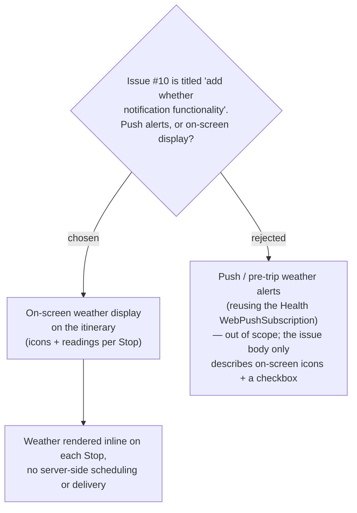

# ADR-028: Trip weather is a display-only feature — no push notifications

**Date:** 2026-07-05
**Status:** Accepted
**Relates to:** GitHub issue #10

## Context

GitHub issue #10 is titled "add whether notification functionality". The word
**"notification" is a typo for "weather"**, and the "notification" reading is
misleading: the issue **body** describes purely **on-screen** behaviour — weather
icons shown against itinerary stops plus a checkbox to choose what to display. It
never asks for alerts, reminders, or any message pushed to the user ahead of a trip.

MenuNest already contains a **`WebPushSubscription`** entity in the **Health** module,
so a push-notification interpretation is *technically* reachable — we could register
subscriptions and fire pre-trip weather warnings. Reading "notification" literally
would pull the feature in that direction, expanding it into scheduling, delivery, and
subscription-lifecycle concerns that the issue body does not call for.

## Decision

Trip weather is a **display-only** feature. Weather is rendered **inline on the trip
itinerary** (icons + readings per Stop) and nowhere else. There are **no push
notifications, no pre-trip alerts, and no background/scheduled delivery** of any kind.

The existing **`WebPushSubscription`** entity in the Health module is **intentionally
left untouched** — this feature neither reads from nor writes to it. Weather is fetched
and shown when the user views the itinerary, on demand.

Rejected: **push / pre-trip weather alerts** reusing the Health `WebPushSubscription`.
It is out of scope — the issue body only describes on-screen icons and a display
checkbox, and pre-trip alerting would add scheduling and delivery machinery the owner
did not ask for.

## Consequences

**Positive:** The smallest interpretation that satisfies the issue body. No subscription
lifecycle, no scheduler, no delivery guarantees to build or operate; the Health module's
push infrastructure stays isolated from Trips. Weather is a read-time UI concern only,
which keeps the surface area of the feature small and the failure modes local to a page
render.

**Negative:** Users are not warned about weather unless they open the itinerary — there
is no proactive heads-up before or during a trip. If proactive weather alerts are wanted
later, they are a separate, future decision that would revisit the `WebPushSubscription`
path deliberately rather than by accident of the issue title.
