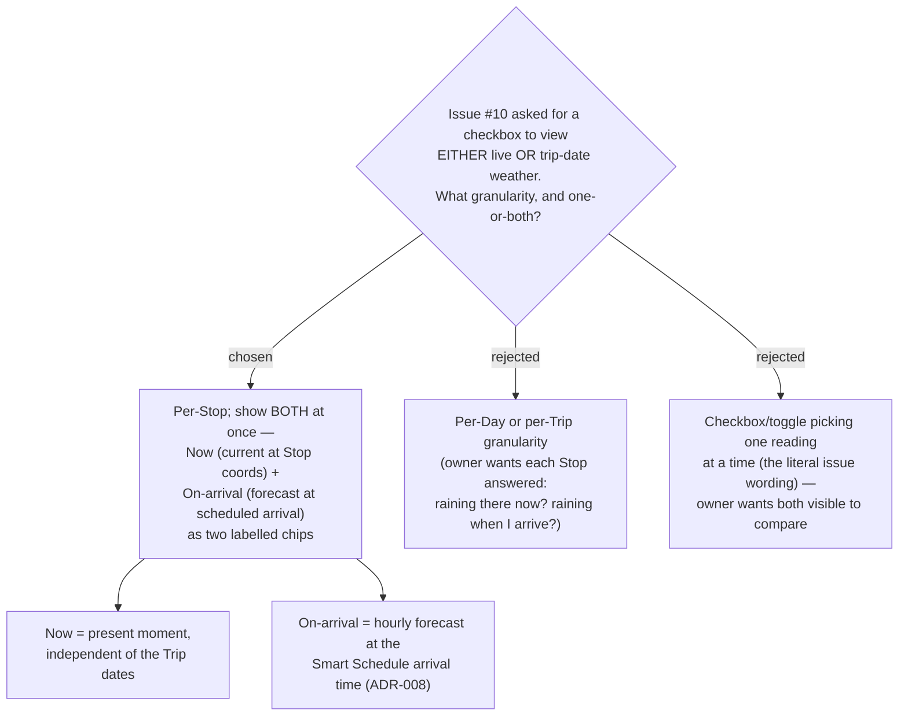

# ADR-029: Weather shows per-Stop as two simultaneous readings (Now + On-arrival), not a live/trip toggle

**Date:** 2026-07-05
**Status:** Accepted
**Relates to:** GitHub issue #10, ADR-008 (Smart Schedule → arrival times), ADR-026 (mobile itinerary UI / stop card)
**Mock:** `docs/mocks/trip-weather-mock.html` (confirmed with the owner)

## Context

GitHub issue #10 asked for weather on the itinerary with a **checkbox** to view *either*
the live conditions *or* the conditions on the trip date. In grilling the feature with the
owner (2026-07-05) two things sharpened. First, the useful **unit** is the **Stop**, not the
Day or the Trip: a traveller's real question is asked of one place — *is it raining there
right now, and will it be raining when I get there?* Second, those are **two different
questions with two different answers**, and the value is in seeing them **side by side** to
compare — a toggle that shows one at a time hides exactly the comparison the owner wants.

Each Stop already carries what both readings need: `TripPlace.Lat`/`Lng` for coordinates,
and a scheduled arrival time. Arrival is **not** stored on the Stop — it is computed
client-side by the Smart Schedule cascade (`hooks/useSchedule.ts`, ADR-008), which returns
`scheduled[]` with an `.arrival` `"HH:MM"` per stop; combined with the owning
`ItineraryDay.date` this yields the concrete arrival instant used for the forecast.

## Decision

Weather is displayed **per Stop**, and every Stop shows **both** readings **at the same
time** — no checkbox, no toggle (this supersedes the issue's "pick one" wording):

- **Now** — current conditions at the Stop coordinates at the **real present moment**,
  independent of the Trip's dates. (A trip planned for next month still shows what the
  weather is doing at that place today.)
- **On-arrival** — the **hourly forecast** at the Stop coordinates for that Stop's
  **scheduled arrival time**, where arrival comes from the Smart Schedule cascade
  (ADR-008), computed client-side by `useSchedule`.

Both render as **two labelled chips** in the stop card's chips row (`.stop-chips` in
`components/ItineraryStopCard.tsx`), each chip being **icon + temperature (°C) + rain
probability (%)**, matching `docs/mocks/trip-weather-mock.html`.

Rejected alternatives:

- **Per-Day or per-Trip granularity** — too coarse; the owner wants each individual Stop
  answered ("is it raining *there* now, and will it rain when I *arrive*"), which only a
  per-Stop reading gives.
- **A checkbox/toggle that picks one reading at a time** (the literal issue wording) — the
  owner wants **both** visible together to compare "now" against "on-arrival"; a toggle
  discards that comparison and adds an interaction for no benefit.

## Consequences

**Positive:** The stop card answers the traveller's actual question at a glance, with the
now-vs-arrival comparison always visible. Reusing the existing `.stop-chips` row and the
`useSchedule` arrival keeps the UI and data flow consistent with the current itinerary
(ADR-026, ADR-008) — no new schedule computation and no new card layout.

**Negative:** Two readings per Stop means **two provider lookups per Stop** (current +
forecast), raising call volume and making batching, caching, and an honest fallback more
important — these are settled in the sibling ADRs (029 provider/proxy, 030 no-data
fallback, 031 chip presentation, 032 batch endpoint). "On-arrival" is only meaningful
inside the forecast horizon; a scheduled arrival in the past or beyond the horizon has no
answer and must degrade honestly rather than show a stale or fabricated value (ADR-031).
Because arrival is derived client-side, editing the schedule shifts the arrival instant and
therefore the on-arrival reading — the forecast must be re-fetched when the schedule
changes.
