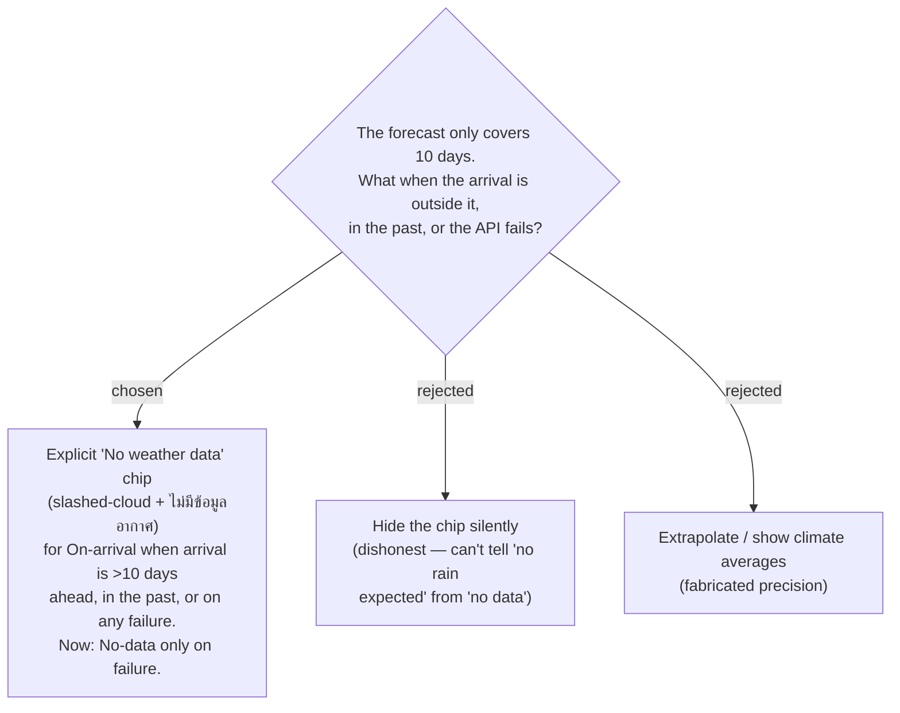

# ADR-030: Beyond the 10-day forecast horizon (or past/failure), a Stop shows an honest "no weather data" state

**Date:** 2026-07-05
**Status:** Accepted
**Relates to:** ADR-018 (honest fallback route source — same honesty ethos), ADR-029 (Google Weather API provider)

## Context

ADR-029 builds Trip weather on the **Google Weather API** (`currentConditions:lookup` for
"Now", `forecast/hours:lookup` for "On-arrival"), proxied through the backend per ADR-007.
That forecast has a hard **10-day horizon**: verified live, `hours=241` and `days=11` both
return **HTTP 400 `INVALID_ARGUMENT`**, while `hours<=240` (10 days) / `days<=10` return 200.

The per-Stop **On-arrival** reading is keyed to the Stop's scheduled arrival time (computed
client-side by the Smart Schedule cascade, `useSchedule`, against the `ItineraryDay.Date`).
That timestamp can legitimately fall **outside** the horizon: a long trip or a trip planned
far in advance puts arrivals **more than 10 days ahead**, and viewing a trip whose dates
have already passed puts arrivals **in the past** — the forecast covers neither. Independently,
the provider can simply **fail**: network error, quota, or a missing key (in which case DI
wires the no-op `IWeatherService` fallback). **"Now"** has no horizon constraint — it reads
present conditions at the Stop coordinates — so it is unavailable only when the call fails.

We need a single, honest way to represent "we cannot know" that a user can never mistake
for a real reading.

## Decision

When the On-arrival forecast is unavailable — the arrival is **more than 10 days ahead**, is
**in the past**, or the provider **fails** (error response, or the no-op fallback is active) —
the Stop renders an explicit **"No weather data" chip**: the slashed-cloud icon plus the Thai
text **ไม่มีข้อมูลอากาศ**. It is never hidden, blanked, or collapsed to an empty slot.
**"Now"** shows the same No-data chip **only on failure** (it is never horizon-limited).

The out-of-horizon / past checks are evaluated client-side against the real present moment
(arrival vs. now, within a 0–10-day window); provider failures surface from the backend batch
call. Both paths funnel to the identical chip.

This mirrors the **honesty ethos of ADR-018**: a Leg openly labels its route source as
**Estimated** rather than passing a Haversine fallback off as a real Routed result. Likewise,
a Stop says "no data" rather than fabricating a forecast.

## Consequences

**Positive:** The user can always distinguish **"clear weather"** from **"we don't know"** —
no silent gaps, no invented precision. One consistent chip covers every unavailable case, and
it matches the fallback-honesty pattern already established for routing (ADR-018) and the no-op
`IWeatherService` fallback (ADR-029), so the app never lies about data it does not have.

**Negative:** Far-future trips (arrivals >10 days out) and already-past trips will show the
No-data chip on **most or all** Stops — the On-arrival value is only meaningful inside the
0–10-day window, which some users may find sparse. Because the horizon is measured against the
live client clock, a Stop can **flip** from data to No-data (or back) as its arrival crosses
the 10-day boundary; the horizon check must be re-evaluated on read, not cached with the
reading.
