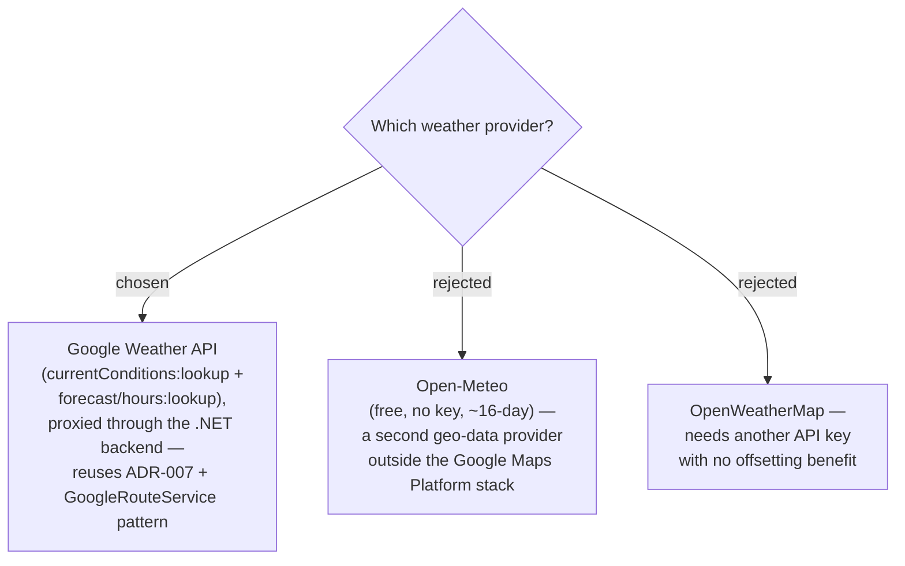

# ADR-030: Trip weather uses the Google Weather API, extending the Google Maps Platform adoption

**Date:** 2026-07-05
**Status:** Accepted
**Relates to:** ADR-007 (Google Maps Platform + backend proxy), GitHub issue #10

## Context

GitHub issue #10 asks for on-screen weather on the trip itinerary (display-only; see ADR-029
for the presentation and ADR-031 for the fallback behaviour). Each Stop shows both current
conditions and the forecast for its scheduled arrival, so we need one provider that serves
**both** current-conditions and an hourly forecast at arbitrary lat/lng coordinates.

MenuNest already commits to **Google Maps Platform**, proxied through the .NET backend
(ADR-007). The Trip module resolves places and routes through Google via server-side calls
that carry the server-only API key — `GoogleRouteService` in `MenuNest.Infrastructure/Maps`
is the reference shape (HttpClient + `X-Goog-Api-Key` header, `IMemoryCache`, no-op fallback
when the key is absent). Google Maps Platform now includes a **Weather API** at
`https://weather.googleapis.com/v1` with `currentConditions:lookup` and
`forecast/hours:lookup` endpoints, so weather can ride the exact same credential, proxy, and
service-seam pattern we already run — no new vendor relationship, no second key.

**Billing is now enabled:** the deployed backend key returns HTTP 200 on both Routes and
Weather (verified live). ADR-007 governs place **data** — only `place_id` may be stored
indefinitely, other content has caching limits. Weather is **ephemeral** and is never
persisted (see ADR-033), so the ADR-007 storage rule does not bind it; but the same
backend-proxy + own-key approach ADR-007 established does apply.

## Decision

Use the **Google Weather API** as the trip weather provider, extending ADR-007:

- **Endpoints:** `currentConditions:lookup` (the "Now" reading) and `forecast/hours:lookup`
  (the "on-arrival" reading) on `https://weather.googleapis.com/v1`.
- **Proxied server-side**, identical to the ADR-007 pattern and `GoogleRouteService`: the
  SPA never sees the key, the backend calls Google with the server key, and Google REST has
  no CORS so a direct browser call is not an option anyway.
- **Same credential:** the existing `GoogleMaps:ApiKey` (`GoogleMapsOptions`, deployed as
  `GoogleMaps__ApiKey`) — no new configuration key.

Rejected alternatives:

- **Open-Meteo** (free, no key, ~16-day forecast) — technically capable and cost-free, but
  it introduces a **second geo-data provider** outside the Google Maps Platform stack that
  ADR-007 deliberately standardised on, splitting the credential, caching, and compliance
  story for no functional gain.
- **OpenWeatherMap** — requires yet **another API key** to provision, restrict, and bill,
  with no offsetting benefit over the Google Weather API we already have a working,
  billed key for.

## Consequences

**Positive:** Weather reuses the ADR-007 credential, backend-proxy, and
`GoogleRouteService` service-seam pattern (HttpClient + `IMemoryCache` + no-op fallback),
so there is one geo-data vendor, one key to restrict, and one compliance posture. Both the
current-conditions and hourly-forecast needs are met by a single provider, and the key is
already live at HTTP 200.

**Negative:** Weather now shares MenuNest's hard dependency on the Google credential and its
billing — a personal-volume trip planner should sit within the free tier, but weather calls
add to Google Cloud usage. The Google Weather API also caps the forecast at **10 days /
240 hours** ahead (`days<=10` / `hours<=240`; `days=11` and `hours=241` both return HTTP 400
`INVALID_ARGUMENT`, verified), which constrains the on-arrival reading and is handled by the
honest "No weather data" fallback in ADR-031.
