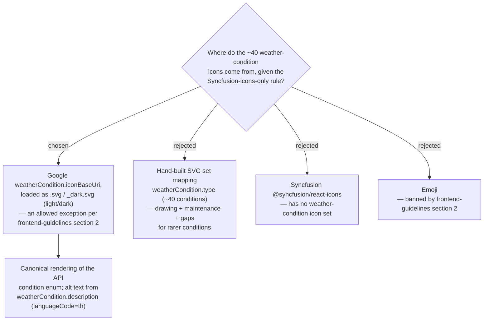

# ADR-031: Weather-condition icons come from Google iconBaseUri SVGs — an allowed exception to the Syncfusion-only icon rule

**Date:** 2026-07-05
**Status:** Accepted
**Relates to:** frontend-guidelines section 2 (Icons — Syncfusion icons, never emoji), ADR-029 (Google Weather API via the backend proxy), GitHub issue #10
**Mock:** `docs/mocks/trip-weather-mock.html` (confirmed with the owner)

## Context

The Trip Weather feature (issue #10, provider decided in ADR-029) renders a per-Stop
weather chip whose leading element is a condition icon — sun, cloud, rain, thunderstorm,
and so on. Google's Weather API classifies conditions into roughly **40**
`weatherCondition.type` values, so any icon strategy must cover that whole enum, including
the rarer conditions, and must look right in both light and dark themes.

MenuNest's `frontend-guidelines` **section 2** states the rule plainly: *icons are
Syncfusion icons, never emoji*. That rule assumes Syncfusion ships an icon for the concept.
For weather it does not — `@syncfusion/react-icons` has **no weather-condition icon set** —
so the icon must come from somewhere else, and the decision is which "somewhere else"
respects the spirit of the rule.

The Google Weather API already hands us the answer: each condition carries a
`weatherCondition.iconBaseUri` (e.g. `https://maps.gstatic.com/weather/v1/cloudy`). Appending
`.svg` yields the light-theme icon and `_dark.svg` the dark-theme variant — both verified to
return HTTP 200 across the condition set. These are the canonical, provider-maintained
depictions of the exact enum value the same response reports, and they are **SVG, not emoji**.

## Decision

Render each weather chip's condition icon from **Google's `weatherCondition.iconBaseUri`**,
appending **`.svg`** for light theme and **`_dark.svg`** for dark theme. This is an
**allowed, documented exception** to `frontend-guidelines` section 2, on the same footing
as the existing `@vis.gl/react-google-maps` map exception (Syncfusion has no interactive
map either): the exception is scoped to *weather-condition icons* only, because Syncfusion
has no equivalent icon set and the assets are SVG rather than emoji.

- The chip content is `[icon] + temperature (°C) + rain probability (%)`.
- **Alt text** comes from `weatherCondition.description`, requested with `languageCode=th`
  so the accessible label matches the Thai UI.
- The icon URL is derived on the frontend from the `iconBaseUri` returned by the backend
  batch response (ADR-029 / ADR-032); the enum-to-icon mapping is Google's, not ours.

Rejected alternatives:
- **Hand-built SVG set** mapping the ~40 `weatherCondition.type` values — a real drawing and
  maintenance burden, and it would leave gaps for the rarer conditions the API can still return.
- **Syncfusion `@syncfusion/react-icons`** — has no weather-condition icon set, so it cannot
  satisfy the requirement at all.
- **Emoji** — explicitly banned by `frontend-guidelines` section 2.

## Consequences

**Positive:** Zero icon assets to author or maintain; complete, correct coverage of the whole
condition enum because the icon is chosen by the same provider that classified the condition;
first-class light/dark variants; Thai-localized alt text for accessibility. The exception is
narrow and precedented, so it does not erode the Syncfusion-only rule elsewhere.

**Negative:** The chip depends on an **external asset load from `maps.gstatic.com`**, so icon
rendering is subject to that host's availability and adds a cross-origin image request per
distinct condition (mitigated by browser caching, since conditions repeat across Stops). If
Google renames or retires an `iconBaseUri`, the icon could 404 — the chip's text (temperature
and rain probability) still renders, and the honest "No weather data" fallback (ADR-030)
covers the case where the weather lookup itself fails.
