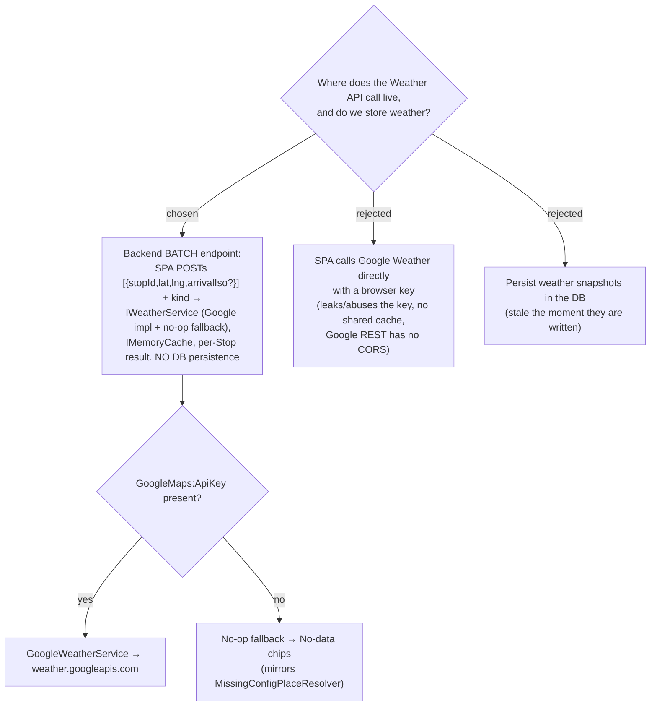

# ADR-032: Weather is fetched through a backend batch endpoint (IWeatherService, Google impl + no-op fallback); nothing is persisted

**Date:** 2026-07-05
**Status:** Accepted
**Relates to:** ADR-007 (Google Maps Platform + backend proxy), ADR-029 (Google Weather API provider)

## Context

The Trip itinerary needs two weather readings per Stop ("Now" and "On-arrival"; see
ADR-029 for the provider and ADR-030 for the honest fallback). This ADR decides *where*
the Google Weather call is made and *whether* the result is stored.

Three constraints, all inherited from the existing Trip module, force the shape:

1. **The Google key must never reach the browser.** ADR-007 established that all Google
   Maps Platform REST calls are proxied through the `MenuNest.WebApi` / Infrastructure
   backend; the Weather API (`currentConditions:lookup`, `forecast/hours:lookup` on
   `weather.googleapis.com/v1`) is the same platform and the same key
   (`GoogleMaps__ApiKey`), so it must be proxied the same way.
2. **Google REST endpoints lack CORS**, so a browser `fetch` to `weather.googleapis.com`
   cannot work regardless of the key question — the same Critical Failure that motivated
   the proxy in ADR-007.
3. **Weather is ephemeral.** A reading is only true for a few minutes ("Now") or a
   forecast hour; any value written to the DB is stale the moment it lands and would have
   to be invalidated on every read, buying nothing over an in-memory cache.

The itinerary renders many Stops at once, so a per-Stop round-trip would fan out into
many parallel requests; the readings are wanted together.

## Decision

Fetch weather through a **backend batch endpoint**. The SPA POSTs a list of points
`[{ stopId, lat, lng, arrivalIso? }]` plus the reading **kind** (`Now` or `OnArrival`);
the backend resolves every point and returns a **per-Stop** result keyed by `stopId`.

- **Seam in Application.** An `IWeatherService` abstraction lives in
  `MenuNest.Application/Abstractions`, alongside `IRouteService` / `IPlaceResolver`.
- **Google impl in Infrastructure/Maps**, mirroring `GoogleRouteService`: `HttpClient`
  with the `X-Goog-Api-Key` and `X-Goog-Maps-Solution-ID` (`gmp_git_agentskills_v1`)
  headers (**no** `X-Goog-FieldMask` — unlike Routes, the Weather API returns the full
  document without one, and a wrong mask 400s), results cached in **`IMemoryCache`**, and
  graceful degradation to No-data on any provider failure (per ADR-030).
- **No-op fallback when the key is absent.** When `GoogleMaps:ApiKey` config is missing,
  DI wires a no-op `IWeatherService` — the exact shape of `MissingConfigPlaceResolver` —
  so the endpoint returns No-data chips instead of throwing at composition time.
- **CQRS use-case.** The batch read is a query use-case under
  `MenuNest.Application/UseCases/Trips/<Name>/` (Query + Handler + Validator, DTOs in
  `TripDtos.cs`), exposed by a `MenuNest.WebApi` endpoint. It calls `IWeatherService`.
- **Nothing is persisted.** No entity, no migration, no table. The **`IMemoryCache`** is
  the only store; entries expire on their own and the DB never sees a weather value.

**Rejected — SPA calls Google Weather directly with a browser key.** Leaks/abuses the
server key, gives every client its own uncoordinated request volume with no shared cache,
and is blocked outright by the missing CORS on Google REST (constraint 2).

**Rejected — persist weather snapshots in the DB.** Stale the moment they are written
(constraint 3); adds an entity + migration + invalidation logic for a value an in-memory
cache already serves better.

## Consequences

**Positive:** Matches the ADR-007 backend-proxy shape and reuses the `GoogleRouteService`
pattern wholesale (X-Goog headers, `IMemoryCache`, no-op fallback), so the code is
familiar and the key stays server-side. One batched POST covers a whole day's Stops
instead of N round-trips, and a single server-side cache is shared across all clients.
No schema change and no migration — nothing to apply to the prod DB.

**Negative:** Weather never survives a process restart or cache eviction (acceptable — it
is ephemeral and cheap to re-fetch). The batch DTO couples the request to the client's
Smart Schedule output (`arrivalIso` originates from `useSchedule`), so the endpoint
contract must tolerate a missing/late `arrivalIso` and return a No-data reading rather
than error. Cache TTLs must be chosen per kind ("Now" short, "On-arrival" longer) so a
stale "Now" is not served for too long.
