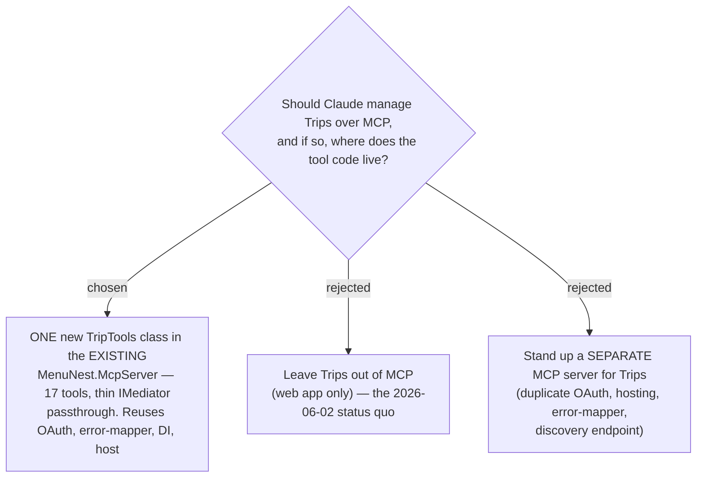

# ADR-034: The Trip Planner domain is exposed through the existing MCP server (extends the meal-planning-only scope)

**Date:** 2026-07-10
**Status:** Accepted
**Relates to:** ADR-001 (MCP auth via Entra ID OAuth), ADR-005 (Trip is user-scoped), the [MenuNest MCP Server design spec](../superpowers/specs/2026-06-02-menunest-mcp-server-design.md) (which scoped MCP to meal-planning only), GitHub issue [#10 follow-on / trip-over-MCP]

## Context

The MCP server (`MenuNest.McpServer`, 49 tools) was deliberately scoped to the
**meal-planning domain only** (Recipes, Ingredients, MealPlan, Stock, ShoppingLists,
Budget) in the 2026-06-02 design spec; Trips were left out. The Trip Planner has since
grown a complete backend surface — 17 CQRS use cases already driven by `TripsController`
over HTTP (trips CRUD, places CRUD, `resolve-place`, itinerary read, stop
add/update/remove/reorder, day-start, weather batch). This ADR records the decision to
let Claude drive that surface conversationally.

## Decision

Add **one** `TripTools` class to the **existing** `MenuNest.McpServer`, exposing all
**17** Trip use cases as MCP tools, each a thin passthrough to `IMediator` — identical in
shape to `RecipeTools` / `BudgetTools`. Registration is a single new
`.WithTools<Tools.TripTools>()` line in `McpServerRegistration.cs`.

Verified against the code, the extension is almost entirely free of new plumbing:

- **Auth** — trips are **user-scoped** (ADR-005): every handler resolves identity via
  `IUserProvisioner.GetOrProvisionCurrentAsync` and scopes by `UserId`, with **no**
  `RequireFamilyAsync` gate. So trip tools work for a user with no Family, using the same
  Entra ID OAuth already wired for `/mcp` (ADR-001) — no auth change.
- **Error mapping** — `McpToolErrorMapper` is a **global** `AddCallToolFilter` in
  `McpServerRegistration.cs`, keyed off the tool name, wrapping *every* tool. A new
  `TripTools` class inherits `DomainException` / `ValidationException` → clean tool-error
  mapping with zero per-tool code.
- **No schema change** — the `Trip` / `ItineraryDay` / `Stop` / `TripPlace` tables already
  exist (migration `20260629104508_TripsInitial`); nothing new is persisted, so **no EF
  migration** and no manual prod-DB step.
- **DI** — `TripTools(IMediator mediator)` resolves through the existing registration, the
  same primary-constructor pattern the other tool classes and `TripsController` use.

**Rejected — leave Trips out of MCP.** The whole backend surface already exists; excluding
it is an arbitrary asymmetry with the meal domain and blocks the requested capability.

**Rejected — a separate MCP server for Trips.** Would duplicate the OAuth discovery
endpoint, the JwtBearer wiring, the error-mapper filter, and the App Service hosting for no
benefit — the tools call the same `IMediator` in the same process.

## Consequences

**Positive:** One small presentation-layer class unlocks the entire Trip domain over MCP;
it reuses auth, error handling, DI, and hosting wholesale, and needs no migration. Enum and
Guid parameters render as strings automatically (see the design spec), so trip enums
(`PlaceCategory`, `TravelMode`, `WeatherReadingKind`) are ergonomic for Claude.

**Negative:** The 2026-06-02 spec's "meal-planning domain only" scope line is now
superseded for Trips (a forward-note is added there). The `get_stop_weather` tool inherits
a batch contract designed for the SPA — the caller must assemble points (coords via
`list_trip_places`, arrival times computed from `get_itinerary`), which is more work for
Claude than a single "weather for my trip" call; see the design spec's weather section.
