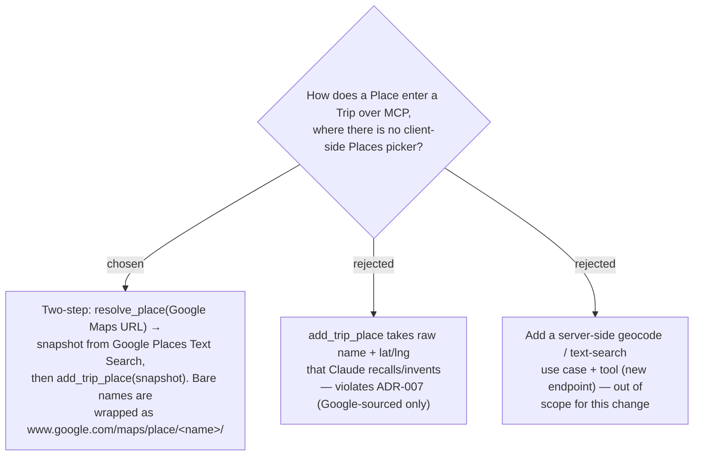

# ADR-035: Over MCP a place is captured via resolve_place → add_trip_place; Claude never invents coordinates

**Date:** 2026-07-10
**Status:** Accepted
**Relates to:** ADR-007 (Google Maps Platform adoption — place data always sourced live from Google, never scraped/invented), ADR-014 (add-place entry paths; "paste a link" as the server-side fallback), ADR-015 (client-side autocomplete & place details), ADR-034 (Trips exposed via MCP)

## Context

In the web app, **Capture** (ADR-014, ADR-015) uses a **client-side** Google Places picker
(autocomplete / map-tap) to obtain a `place_id` + snapshot; the backend has **no**
text-search or geocode use case. Over MCP, Claude has no picker. The only backend-supported
way to turn a place into an authoritative snapshot is `resolve_place`, which unfurls a
**Google Maps URL** server-side, extracts the place name from the `/place/<name>/` segment,
and runs a **Google Places Text Search** to return `place_id` + coordinates + address
(ADR-007's SSRF-guarded proxy). `AddTripPlaceCommand` requires non-null `Lat`/`Lng`.

## Decision

MCP place capture is a **two-step conversational flow**: `resolve_place(url)` → snapshot,
then `add_trip_place(...)` populated from that snapshot. **Claude never supplies coordinates
or a `place_id` it made up** — both always originate from Google via `resolve_place`,
upholding ADR-007's "authoritative place data, never scraped/invented" invariant.

- **Free-text names are reachable** by having Claude wrap a bare name in a synthetic
  `https://www.google.com/maps/place/<url-encoded name + city>/` URL. `www.google.com` is on
  the resolver's host allow-list, so the validator passes; the resolver extracts `<name>` and
  runs Text Search (confirmed by the resolver's unit tests). This is the ergonomic path — the
  user need not paste a share link. **Caveat:** in production the live GET must return a URL
  that still contains a `/place/<name>/` segment; if Google rewrites it away, extraction
  fails and the tool returns an honest "enter the place manually" error.
- **Category is chosen by Claude/user, not resolved.** `GooglePlaceResolver` hardcodes
  `PlaceCategory.Other`, so `add_trip_place` must have Claude pick the real category
  (`Stay`/`Eat`/`See`/`Cafe`/`Shop`) or every captured place lands as `Other`. The tool's
  description makes this explicit.
- **Best-time, fee note, and notes** are not settable at capture (`AddTripPlaceCommand` has
  no params for them); they are set afterward via `update_trip_place`, which is also exposed.
- **`PhotoUrl` is always null** from resolve (the field mask omits photos) — a dead field in
  the capture pipeline, kept only for shape parity with the HTTP path.

**Rejected — raw name + lat/lng from Claude.** Would let Claude fabricate coordinates from
memory, directly violating ADR-007 and losing the `place_id` needed for opening hours and
attribution.

**Rejected — a server-side geocode/text-search tool.** A cleaner "add by name" would need a
new Application use case + endpoint; out of scope for exposing the *existing* surface. The
URL-wrapper bridge covers the free-text case well enough for now.

## Consequences

**Positive:** Faithful to ADR-007 — every stored coordinate and `place_id` comes from
Google. Reuses `resolve_place` as-is; no new geocode endpoint. Free-text capture still works
via the URL wrapper.

**Negative:** Capture is two tool calls, not one, and depends on the `/place/<name>/`
extraction surviving the production redirect (honest failure if not). Every captured place
needs an explicit category or defaults to `Other`. A future "add place by name" ergonomic
improvement would require the rejected server-side text-search use case (Phase 2).
