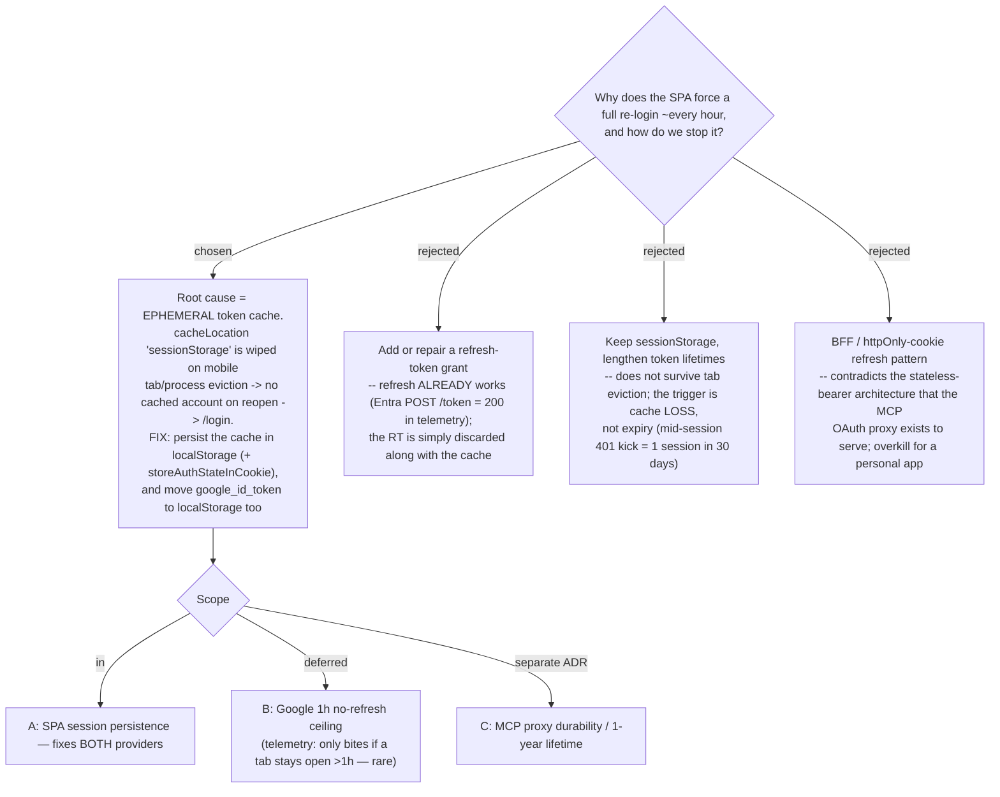

# ADR-036: The ~1h re-login is an ephemeral token cache (sessionStorage), not a broken refresh token — fix by persisting the cache in localStorage

**Date:** 2026-07-11
**Status:** Accepted
**Relates to:** ADR-001..004 (Entra/Google sign-in + MCP OAuth proxy). Root cause confirmed via App Insights (debug-mantra), not hypothesised.

## Context

Users reported a full `/login` re-login "every ~1 hour", on **both** Google and Microsoft
sign-in. The cause was **verified against App Insights** (workspace-based; see CLAUDE.md),
not guessed:

- The mid-session `401 -> handleAuthFailure -> /login?reauth=expired` bounce fired **once in
  30 days**. Classifying every browser session: `login-first (not-persisted)` = 38,
  `login-only` = 22, `no-login` = 5, `app-then-login (mid-session kick)` = **1**.
- MSAL silent renewal, when it ran, **succeeded** — every browser `POST login.microsoftonline.com/.../token`
  dependency returned **200**. Refresh is not broken.
- The dominant clients are **mobile** (Samsung Internet / Chrome on Android). Mobile browsers
  routinely evict background tabs / kill the process on lock, which **destroys sessionStorage**.

So the user's "re-login" is almost entirely *open-app-and-there-is-no-session*, not
*kicked-out-mid-session-at-token-expiry*. `cacheLocation: 'sessionStorage'`
(msalConfig.ts) scopes the whole MSAL cache — account **and** refresh token — to the tab; a
mobile tab eviction wipes it, so the next open finds no account and `ProtectedRoute` sends the
user to `/login` (no `reauth` marker). The Google `google_id_token` lives in `sessionStorage`
too, so it dies the same way. This is **provider-agnostic**, which is exactly why the symptom
is identical for Google and Microsoft. `sessionStorage` was an undocumented MSAL default — no
prior ADR or security rationale chose it.

## Decision

Persist the browser token cache so a session survives tab/process eviction:

- **MSAL:** `cacheLocation: 'localStorage'` and `storeAuthStateInCookie: true` in `msalConfig.ts`.
  On reopen MSAL finds the cached account + refresh token and `acquireTokenSilent` renews
  silently (the path telemetry already shows returning 200) — no `/login`.
- **Google:** store `google_id_token` in `localStorage` (not `sessionStorage`) so a Google
  session likewise survives reopen within the token's life.

**Scope:** this ADR fixes **A** (session persistence) for both providers. **B** (Google has no
refresh, so it still expires at its ~1h wall if the app is *kept open* past an hour) is
**deferred** — telemetry shows that case is rare. **C** (MCP proxy durability / 1-year lifetime)
is a separate surface, recorded in its own ADR.

**Rejected — add/repair a refresh-token grant:** the refresh path is not broken; Entra `/token`
renewals return 200. The refresh token is merely thrown away with the sessionStorage cache.

**Rejected — keep sessionStorage and lengthen token lifetimes:** the trigger is cache *loss* on
eviction, not token *expiry*; a longer-lived token in a wiped cache still yields `/login`.

**Rejected — BFF / httpOnly-cookie refresh:** contradicts the stateless bearer-only API (the
architecture the MCP OAuth proxy was built around) and is disproportionate for a personal app.

## Consequences

**Positive:** the confirmed dominant cause is fixed for both providers with a two-line config
change; reuses the refresh path that already works; no backend change.

**Negative — security trade-off (accepted):** tokens (incl. the MSAL refresh token) now persist
on disk in `localStorage` until explicit sign-out, readable by any XSS for a longer window than
tab-scoped `sessionStorage`. Accepted for a personal recipes/trips/health app where the
reopen-without-re-login UX outweighs the marginal XSS delta (tokens were already XSS-readable
while a tab was open). **Google still hits its ~1h wall if a tab is kept open >1h** (deferred as
B). Existing tests / code that assume `sessionStorage` for `google_id_token` must be updated.