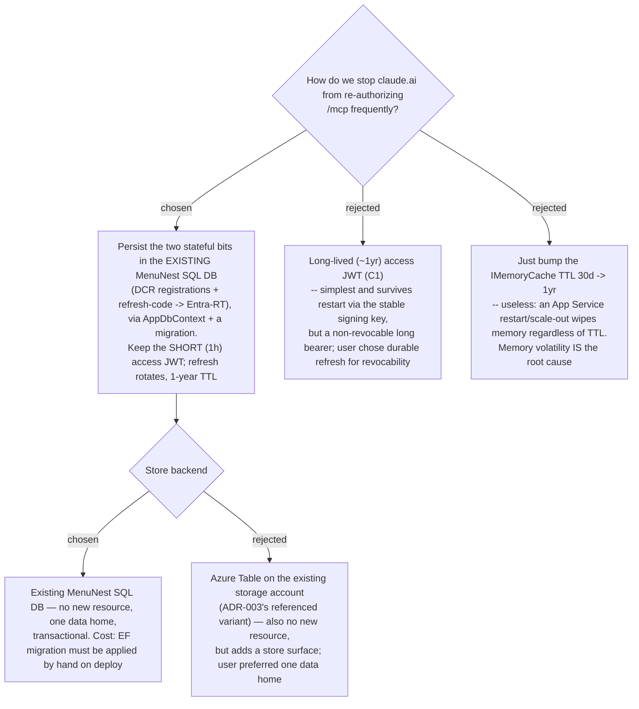

# ADR-037: MCP proxy re-auth durability — persist DCR registrations + refresh codes in the existing SQL DB (keep the 1h access JWT)

**Date:** 2026-07-11
**Status:** Accepted
**Relates to:** ADR-003 (MCP OAuth proxy; flagged IMemoryCache single-instance and named the reference's AzureTable variants as the scale-out path — this ADR takes the SQL path instead). Sibling of ADR-036 (the SPA half of the same "re-login" report).

## Context

The same "re-login every ~1h" report has a second, independent surface: the MCP OAuth proxy
(`/oauth/*` -> Entra -> app-minted JWT for `/mcp`; ADR-003). App Insights showed a steady
**~3 `POST /mcp` 401s per day** — claude.ai losing its session and re-authorizing.

The proxy already supports the `refresh_token` grant and *works* — but **all** its state lives
in `IMemoryCache` (ADR-003 called out the single-instance assumption). An App Service restart,
slot swap, or scale-out wipes the refresh codes and DCR client registrations, so claude.ai's
stored refresh token becomes `invalid_grant` and it must re-authorize. The stated goal is
**infrequent re-auth**, not literally "1 year idle." The root cause is therefore **store
volatility**, not a short lifetime — bumping the 30-day TTL to a year changes nothing, because
a restart discards the entry regardless of its TTL.

## Decision

Make the proxy's stateful data **durable in the existing `MenuNest` SQL database**:

- **Two new tables via `AppDbContext`** (e.g. `OAuthClients`, `OAuthRefreshTokens`) + an EF
  migration. No new database, server, or Azure resource — the same `menunest-sql` / `MenuNest`
  the app already uses.
- **Persist only the two bits whose loss forces re-auth:** DCR client registrations and the
  opaque refresh-code -> Entra-refresh-token mapping. TTL **1 year, rotating** (a fresh code is
  minted on each refresh, so active use is effectively continuous).
- **Keep transient state in `IMemoryCache`:** authorization codes (60s, single-use) and the
  PKCE authorize->callback flow state (10min). A restart mid-handshake is rare and self-heals
  via a client retry; persisting them buys nothing.
- **Keep the access JWT short (1h).** This preserves the standard, revocable OAuth shape —
  the reason C1 (a ~1-year non-revocable bearer) was rejected.
- **Entra refresh token at rest: rely on Azure SQL TDE.** No regression from today (the RT
  currently sits in plaintext in process memory). App-level encryption (ASP.NET Data Protection
  API) was considered and **deferred** — it adds a key-ring that, if its keys are not themselves
  durably persisted, would fail to decrypt the RT and re-introduce the very re-auth we are
  fixing; the marginal benefit is low for a single-user, Entra-auth-only DB.

**Rejected — long-lived (~1yr) access JWT (C1):** simplest and restart-proof (validated by the
stable `Jwt:SigningKey`), but a year-long non-revocable bearer; the user chose the durable-refresh
path for revocability and standard OAuth semantics.

**Rejected — bump IMemoryCache TTL to 1 year:** does not address restart/scale-out volatility,
which is the actual cause.

**Rejected — Azure Table variant (ADR-003's reference):** viable and also resource-free (the
existing storage account), but the user preferred a single data home in SQL.

## Consequences

**Positive:** survives restart, slot swap, and scale-out (a bonus fix for the multi-instance
limitation ADR-003 flagged); claude.ai keeps silently refreshing during active use, so re-auth
becomes rare; revocable (delete the row) unlike a long-lived JWT; no new Azure resource.

**Negative:** the OAuth proxy — previously DB-free (pure `IMemoryCache`) — now depends on
`AppDbContext`. The **EF migration must be applied to prod by hand** (CLAUDE.md); forgetting it
throws `Invalid object name` at runtime (the exact failure App Insights already shows for
`Trips` x18) — so the plan MUST include the `dotnet ef database update` step. A truly **idle**
connection (no refresh for longer than Entra's own refresh-token window, ~90 days) will still
eventually require re-auth — acceptable, since the goal is *infrequent*, not *never*. The Entra
RT now lives at rest in the DB (TDE-encrypted) rather than only in memory.