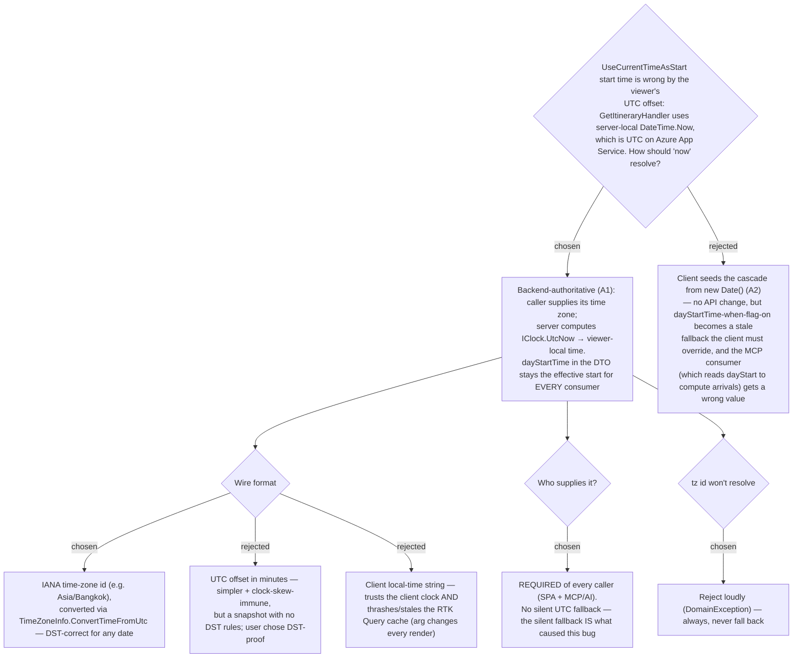

# ADR-038: "Current-time start" resolves the viewer's local now from a caller-supplied IANA time zone + the server's UTC clock (never server-local `DateTime.Now`)

**Date:** 2026-07-11
**Status:** Accepted
**Relates to:** ADR-008 (Smart Schedule cascade — this is what the start seeds), ADR-012 / ADR-013 (day-start inline edit + commit-on-change), ADR-027 (the "frontend supplies per-request input, backend resolves" pattern already used for the Approach leg's viewer lat/lng). Fixes the regression introduced with the `UseCurrentTimeAsStart` flag in commit `cdd8b4f` (#25).



## Context

Issue: with a Day flagged **Current-time start** ("ใช้เวลาปัจจุบันเสมอ", flag
`UseCurrentTimeAsStart`, added in #25), the itinerary shows a start time **7 hours
behind** the viewer's real clock in Thailand (e.g. real 21:44 → shown 14:43). The
cause is verified (debug-mantra): `GetItineraryHandler` re-seeds the start with

```csharp
var startTime = day.UseCurrentTimeAsStart ? TimeOnly.FromDateTime(DateTime.Now) : day.DayStartTime;
```

`DateTime.Now` returns the **server's** local wall-clock. On Azure App Service the
server clock is **UTC**, so `DateTime.Now` == UTC — exactly the viewer's UTC+7
offset behind. The frontend's own "ตอนนี้" button (`dateToHms(new Date())`) uses the
**browser** clock and is correct; only the persisted-flag path, which the backend
resolves, is wrong. The unit test never caught it because it asserts against the
same `TimeOnly.FromDateTime(DateTime.Now)` source — it mirrors the bug and passes on
any machine.

The backend cannot know the viewer's time zone on its own — nothing per-Trip,
per-Day, or per-User stores one. So the "now" must be resolved from information the
caller provides, the same shape ADR-027 already established for the Approach leg
(frontend sends viewer coordinates; backend resolves per request).

## Decision

1. **Backend-authoritative (A1), not client-seeded (A2).** The caller supplies its
   time zone; `GetItineraryHandler` computes the start as the viewer's local "now".
   `ItineraryDayDto.dayStartTime` therefore remains **the effective start for every
   consumer** — the SPA cascade, the day-start display, and the MCP `get_itinerary`
   tool (whose contract tells Claude to compute arrivals as `dayStart + running
   sum`). (Rejected — A2, seeding client-side from `new Date()`: needs no API
   change, but when the flag is on `dayStartTime` degrades to a stale fallback the
   client must silently override, and the MCP consumer would read that stale value
   and mis-compute every arrival.)

2. **Wire format — IANA time-zone id.** The caller sends e.g. `Asia/Bangkok`; the
   backend resolves it with `TimeZoneInfo.FindSystemTimeZoneById` and converts via
   `TimeZoneInfo.ConvertTimeFromUtc(_clock.UtcNow, tz)`. IANA ids resolve on both
   Linux and Windows on .NET 6+ (ICU). Chosen over a UTC-offset-in-minutes (simpler
   and immune to client clock skew, but a bare snapshot with no DST rules) because
   the owner wanted DST-correctness to be built in rather than a latent trap.
   (Rejected — client local-time string: trusts the client clock and, because RTK
   Query caches by argument, a per-render timestamp would either thrash the cache or
   go stale.)

3. **The time zone is REQUIRED of every caller — no silent fallback.** The SPA sends
   `Intl.DateTimeFormat().resolvedOptions().timeZone`; the MCP `get_itinerary` tool
   takes a required `timeZoneId` parameter whose description instructs the AI to pass
   the user's IANA zone. A missing value is a `400` at model binding (HTTP) / a
   required argument (MCP). The whole point is that there is **no** silent
   default-to-UTC path left — that default is precisely what produced the bug.

4. **An unresolvable tz id is rejected loudly, always.** A supplied-but-unknown id
   (typo, bad value) throws a `DomainException("Unknown time zone: <id>")`, surfaced
   as an error, rather than falling back to UTC or server-local. A correct SPA/AI
   never sends one, so a bad id is a caller bug that should fail visibly.

5. **Resolve "now" through `IClock`.** The handler injects `IClock` and uses
   `_clock.UtcNow` (the same testability seam the rest of the codebase uses), never
   `DateTime.Now`/`DateTime.UtcNow` directly. This also lets the test assert a
   deterministic converted value (fixed UTC + known zone → known local), so it can
   no longer mirror the implementation and hide a timezone regression.

## Consequences

**Positive:** the flagged start now shows the viewer's real local time; because the
conversion is anchored to `IClock.UtcNow` + an explicit zone, the **server's own
timezone becomes irrelevant to correctness** (no dependency on `WEBSITE_TIME_ZONE`).
DST is handled for any date. The DTO contract stays honest for both the SPA and MCP.
The mirror-bug test is replaced by a deterministic one.

**Negative:** `GetItineraryQuery` gains a required field and the HTTP endpoint a
required `tz` query param — a breaking change to that one request's contract (the
SPA and the MCP tool are updated in lockstep in the same change). `GetItineraryHandler`
now depends on `IClock`. No data migration and no server config change are needed.
