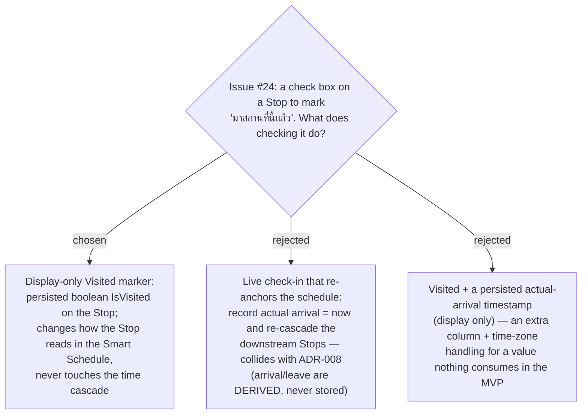

# ADR-039: A Stop's "Visited" check box is a display-only marker, not a schedule re-anchor

**Date:** 2026-07-12
**Status:** Accepted
**Relates to:** ADR-008 (Smart Schedule cascade — arrival/leave are derived, never
stored; this is the invariant the rejected alternatives would have broken), ADR-027
(Approach leg), ADR-038 (Current-time start). Implements issue #24.

## Context

Issue #24 asks for a check box on each **Stop** so the traveller can tick off "มา
สถานที่นี้แล้ว" (I have arrived at this Place) as they follow the plan. The intent,
confirmed with the owner, is a simple progress marker — *not* a live re-planning
feature.

MenuNest already owns a lot of time machinery — the **Smart Schedule** cascade
(ADR-008), **Current-time start** (ADR-038), the **Approach leg** from the viewer's
live location (ADR-027) — which makes an ambitious reading ("checking in re-anchors
the schedule to reality") tempting. That reading was rejected: ADR-008 holds that a
Stop's arrival/leave times are **derived, never stored**, and re-anchoring would
force actual times onto the Stop and re-cascade everything downstream.

## Decision

**The check box sets a display-only `Visited` state on the Stop.** It is a persisted
boolean, toggleable both ways, that changes only how the Stop *reads* in the itinerary
(e.g. dimmed / struck through, with a "มาแล้ว" affordance). It never feeds the time
cascade, the Timing flags, the Approach leg, or the Current-time start — those keep
computing from the plan exactly as before, whether or not a Stop is marked Visited.

- **Rejected — live check-in that re-anchors the schedule (B).** Recording an actual
  arrival of "now" and re-cascading the rest of the day would break the ADR-008
  invariant (derived times) and pull in time-zone/clock concerns the marker does not
  need. If real-time re-planning is ever wanted it is a separate, larger feature.
- **Rejected — Visited plus a persisted arrival timestamp (C).** Storing *when* the
  Stop was checked adds a column and time-zone handling for data nothing in the MVP
  reads back. Deferred; can be added later without changing the Visited semantics.

## Consequences

**Positive:** trivially reversible and low-risk — one boolean, no interaction with the
scheduling engine, no new time-zone surface. The ADR-008 invariant is preserved.

**Negative / deferred:** the plan does *not* adapt to reality — marking a Stop Visited
does not shorten the day, move the Approach leg to the next un-visited Stop, or silence
its Timing flag by default. Those are explicit non-goals here; any of them would be a
follow-up decision.
