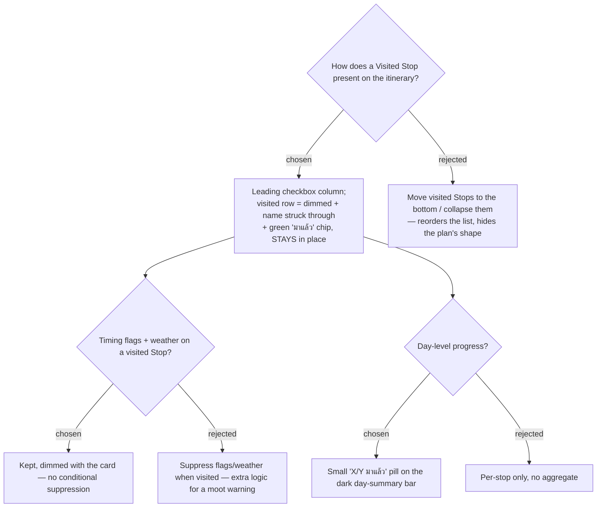

# ADR-040: Visited presents as a leading checkbox + a dimmed, struck-through row that stays in place

**Date:** 2026-07-12
**Status:** Accepted
**Relates to:** ADR-039 (Visited is display-only — this decides how that display looks),
ADR-026 (itinerary map band), ADR-021 (timing-flag severity colours it sits beside).
Confirmed against the rendered mock
[`docs/mocks/trip-stop-visited-mock.html`](../mocks/trip-stop-visited-mock.html)
(preview `docs/mocks/trip-stop-visited-preview.png`). Implements issue #24.

## Context

Issue #24's marker (ADR-039) needs a presentation on the `ItineraryStopCard`. The
card today is `[ time-rail | body(opens editor) | nav | reorder ]`. The affordance
must not collide with the body's tap-to-edit, must read as "tick off the list", and
must keep the plan legible while items are checked off. The choices were confirmed
by rendering a mock in the real teal design language and having the owner approve it.

## Decision

1. **Leading checkbox column.** A new ~40px column before the time-rail holds a native
   checkbox (teal/green `accent-color`, matching the existing `.day-start-live-toggle`
   checkbox — **not** an emoji, per the project's icon rule). It sits outside the
   `.stop-body` button so ticking never opens the editor.
2. **Visited row = dimmed + struck-through, in place.** A `visited` state on the card
   drops its opacity, strikes through the place name, and adds a green **"มาแล้ว"**
   chip in the chip row. The Stop **keeps its position** — Visited Stops are not
   reordered to the bottom or collapsed, so the day's planned shape stays intact.
   (Rejected — moving/collapsing visited Stops: churns the list and hides structure.)
3. **No suppression of Timing flags or Weather.** A visited card dims *everything*
   including its Timing flag and weather chips; there is no conditional logic to hide
   them. (Rejected — suppressing them when visited: extra branching for a warning that
   is merely moot, not wrong; dimming already de-emphasises it.)
4. **Optional day-level rollup.** A small **"X/Y มาแล้ว"** pill on the dark
   `.day-summary` bar shows how many of the day's Stops are checked. Approved as part
   of the mock. (Rejected — per-stop only: loses the at-a-glance day progress.)

## Consequences

**Positive:** the whole treatment is CSS + one boolean prop; trivially reversible.
Reuses existing tokens (`--teal`, chip vocabulary, `.day-summary`) so it reads as
native. No new icon assets.

**Negative / notes:** the row keeps full height when visited (no compaction), so a
long visited day is not shorter to scroll — acceptable for the MVP. Two new tokens are
added to `trips-tokens.css`: the green `--visited` (#15803d) for the checkbox/chip text
and its `--visited-bg` (#e7f6ec) chip background. The visited row is de-emphasised
without whole-card `opacity` (which would composite the place name below WCAG AA and
cannot be overridden per child): the name is struck through and set to an AA-passing
slate, while the checkbox and green "มาแล้ว" chip stay full-strength so the state stays
perceivable (see the design spec §5.4).
