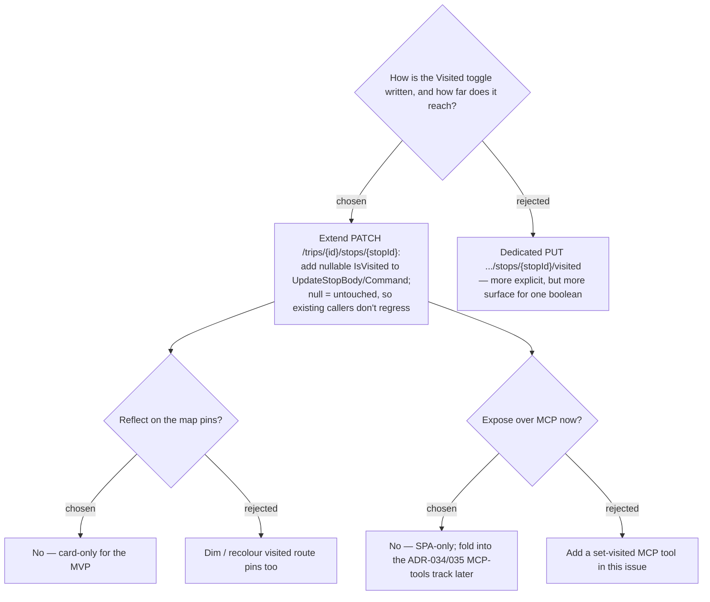

# ADR-041: Visited is written by extending the existing PATCH stop endpoint; scoped to the SPA card (no map pins, no MCP) for issue #24

**Date:** 2026-07-12
**Status:** Accepted
**Relates to:** ADR-039 (the display-only marker), ADR-040 (its presentation),
ADR-034/035 (Trip-over-MCP track this deliberately defers to). Implements issue #24.

## Context

The Visited boolean (ADR-039) needs a write path. A `PATCH /api/trips/{id}/stops/{stopId}`
endpoint already exists for Stop mutations, carrying `UpdateStopBody(int? DwellMinutes,
TravelMode? TravelModeToReach)` → `UpdateStopCommand` → `UpdateStopHandler` (which applies
each field only when present). The itinerary view also has a **map band** (ADR-026) with
numbered route pins, and there is a separate, not-yet-executed track to expose Trips over
**MCP** (ADR-034/035). Both raise "how far does Visited reach?" questions.

## Decision

1. **Extend the existing PATCH, don't add a dedicated endpoint.** Add a nullable
   `bool? IsVisited` to `UpdateStopBody` and `UpdateStopCommand`, and a `Stop.SetVisited`
   mutator that the handler calls **only when `IsVisited` is non-null** — the same
   lazy-consume shape the handler already uses for dwell/travel-mode. Because the field is
   nullable and consumed only where supplied, every existing caller (which sends only dwell
   or mode) is unaffected: no eager/global validation, no regression to unrelated stop
   edits. (Rejected — a dedicated `PUT .../stops/{stopId}/visited`: more RESTfully explicit,
   but a whole new route + command + handler for one boolean that the existing endpoint
   already models cleanly.)
2. **Card-only; the map pins do not change.** Visited is reflected on the
   `ItineraryStopCard` (ADR-040) only. Route pins on the map band keep their current
   numbered/severity styling. (Rejected — dimming/recolouring visited pins: extra map logic
   for the MVP; can be added later without touching the data model.)
3. **SPA-only; not exposed over MCP in this issue.** The MCP surface stays as-is. A
   "set visited" tool, if wanted, is added when the ADR-034/035 Trip-MCP track is executed,
   reusing the same command. (Rejected — adding an MCP tool now: couples this small SPA
   feature to a larger track that has not started.)

## Consequences

**Positive:** one new nullable field on an existing contract; the smallest possible API
change; no new route; existing callers provably unaffected. `StopDto` gains an `IsVisited`
field so the SPA can render the state on load.

**Negative / notes:** persistence needs a new `Stops.IsVisited` column (bit, default 0) via
an EF Core migration — which per the project's CLAUDE.md must be **applied to the prod DB by
hand** after merge, or the deployed API throws `Invalid object name`/column errors. The
migration + manual apply is called out in the design spec and the plan.
