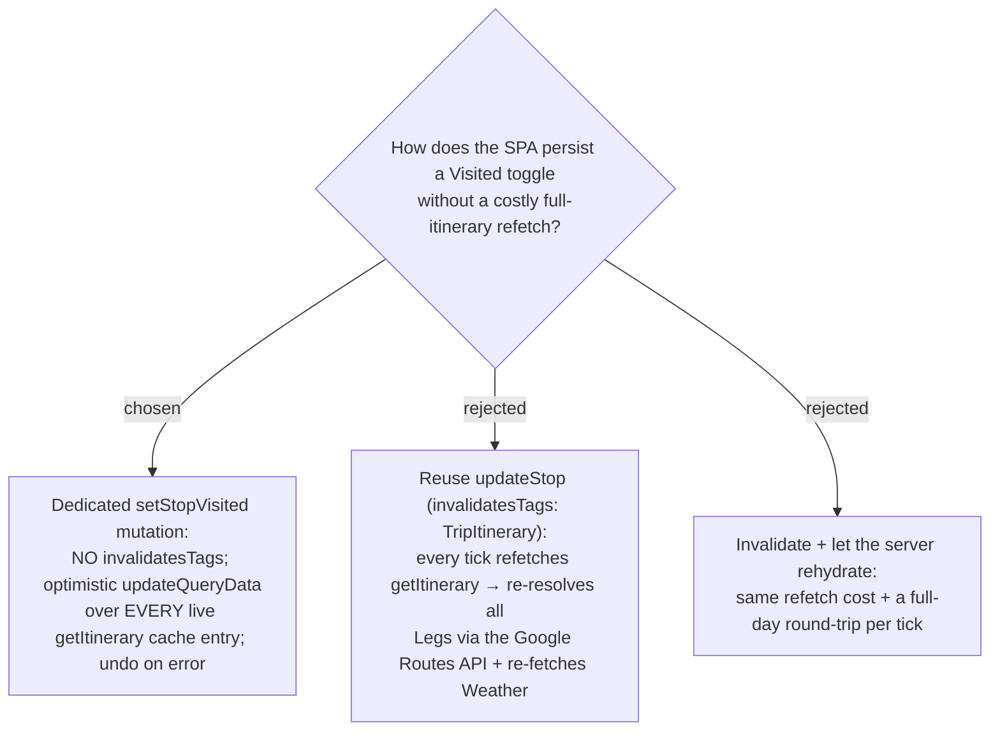

# ADR-042: The Visited toggle writes via a non-invalidating optimistic cache patch — no itinerary refetch

**Date:** 2026-07-12
**Status:** Accepted
**Relates to:** ADR-039 (Visited is display-only — nothing to recompute), ADR-041 (the
backend write path this refines on the SPA side), ADR-023 (Leg geometry/distance via the
Google Routes API — the cost this avoids), ADR-013 (the invalidate-`TripItinerary`
convention every *other* trip mutation follows). Implements issue #24.

## Context

Every existing Trip mutation in the SPA — `addStop`, `updateStop`, `removeStop`,
`reorderStops`, `setDayStartTime` (`api.ts`) — sets `invalidatesTags: [{type:'TripItinerary',
id: tripId}]`, which forces `getItinerary` to refetch. That is correct for them: they change
the schedule, so the day must be recomputed. `getItinerary` is expensive to refetch — it
re-resolves **every Leg** through the Google **Routes API** (a billed call, ADR-023) and
re-fetches **Weather**.

Visited is **display-only** (ADR-039): ticking it changes nothing the server needs to
recompute. Reusing `updateStop` (and its invalidation) would fire that whole expensive
refetch on every checkbox tick — pure waste and latency. So the Visited toggle must be the
one mutation that does **not** invalidate `TripItinerary`.

## Decision

**Add a dedicated `setStopVisited` RTK Query mutation that omits `invalidatesTags` and instead
applies an optimistic cache patch.** It hits the same backend endpoint (ADR-041) but, in
`onQueryStarted`, patches the cached itinerary in place via `api.util.updateQueryData`, then
undoes the patch if the request rejects. Because `getItinerary` is keyed by
`{tripId, tz, lat, lng}` and more than one entry can be live at once (a pre-geolocation entry
plus a post-geolocation one), the patch enumerates **all** matching entries via
`api.util.selectInvalidatedBy(state, [{type:'TripItinerary', id: tripId}])` and patches each —
not just the active one. The triggering component (`ItineraryTab`) still `await`s `.unwrap()`
and routes any failure through the existing `setActionError` inline-error channel.

- **Rejected — reuse `updateStop`:** inherits `invalidatesTags: TripItinerary`, so every tick
  refetches the whole itinerary and re-bills the Routes API + Weather for a change that
  affects nothing computed.
- **Rejected — invalidate and let the server rehydrate:** same refetch cost plus a full-day
  network round-trip before the UI settles.

## Consequences

**Positive:** a tick costs one PATCH and no Google API calls; the UI updates instantly
(optimistic) and self-corrects on error.

**Negative / notes:** this is the **first** RTK-cache-patching code in the repo
(`onQueryStarted` / `updateQueryData` / `selectInvalidatedBy` appear nowhere today), so it has
no in-repo precedent to copy and must be implemented and tested carefully — in particular the
patch must cover *all* cache entries, or a remount that reads a different-keyed entry shows a
stale state until eviction. A rare rapid multi-toggle race (a failed early request undoing to a
stale baseline) is accepted as tolerable for a low-stakes display toggle; the plan may add an
in-flight guard if desired.
