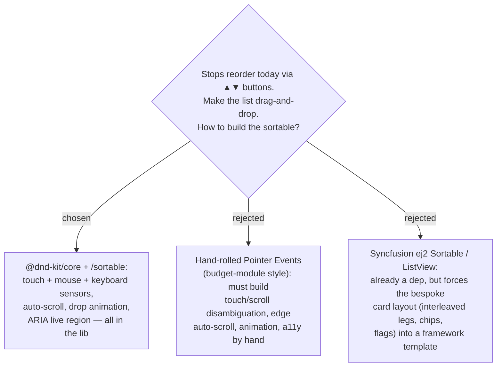

# ADR-043: Drag-to-reorder Stops uses @dnd-kit, not hand-rolled pointer events or Syncfusion

**Date:** 2026-07-12
**Status:** Accepted
**Relates to:** ADR-008 (Smart Schedule — reorder changes the derived cascade), the
existing `ReorderStops` use case (backend contract is reused unchanged). Frontend-only.

## Context

Each **Stop** in the **Itinerary** is reordered today with ▲▼ buttons
(`ItineraryStopCard`'s `.stop-reorder` column → `move(index, dir)` in `ItineraryTab`,
which swaps two ids and calls the existing `reorderStops` mutation). The owner wants to
drag a Stop directly to its new position instead of tapping the buttons repeatedly.

MenuNest is a **touch-first** app (the itinerary is the mobile/tablet hero — ADR-026).
HTML5 native drag-and-drop does **not** fire on touch, so a real solution needs
pointer-based dragging with touch/scroll disambiguation, edge auto-scroll on a scrolling
list, a reorder animation, and a keyboard/screen-reader path. The only existing
touch-gesture precedent in the repo is the budget module's hand-rolled **long-press**
(`EnvelopeCard.hooks.ts`) — a single-shot timer, *not* a sortable — so there is no
reorder pattern to reuse.

## Decision

**Add `@dnd-kit/core` + `@dnd-kit/sortable` and build the sortable stop list on it.**
The library supplies exactly the hard parts above (pointer/touch/keyboard sensors with an
activation constraint that separates a drag from a scroll, `restrictToVerticalAxis`,
auto-scroll, `SortableContext` + `useSortable` transforms, and an ARIA live region) as a
tree-shakeable, React-19-compatible dependency.

- **Rejected — hand-rolled Pointer Events (B).** For a touch app, hand-rolling an
  *accessible* sortable is the **complex** path, not the simple one: scroll-vs-drag
  disambiguation, edge auto-scroll, and keyboard a11y are each easy to get subtly wrong
  and are precisely what the library already solves. The budget long-press does not
  generalise to reordering.
- **Rejected — Syncfusion Sortable / ListView (C).** Already a dependency, but the stop
  list is bespoke markup — a `TravelLeg` rendered *between* cards, weather chips, a timing
  flag, a "มาแล้ว" checkbox, a nav link — that a ListView/Grid template would fight rather
  than host.

**Planning-time check:** confirm `@dnd-kit/*` versions are React-19 compatible and pass
the pre-commit `tsc --noEmit` + `vite build` before relying on them.

## Consequences

**Positive:** the hard, bug-prone parts of touch DnD (scroll disambiguation, auto-scroll,
keyboard/AT support) come from a maintained library; the bespoke card layout is untouched;
the backend `reorderStops` contract is reused as-is.

**Negative:** one new frontend dependency (two small packages) and its React-19 compat must
be verified during planning. A DnD interaction is hard to cover in unit tests — behaviour
will lean on manual/E2E verification.
