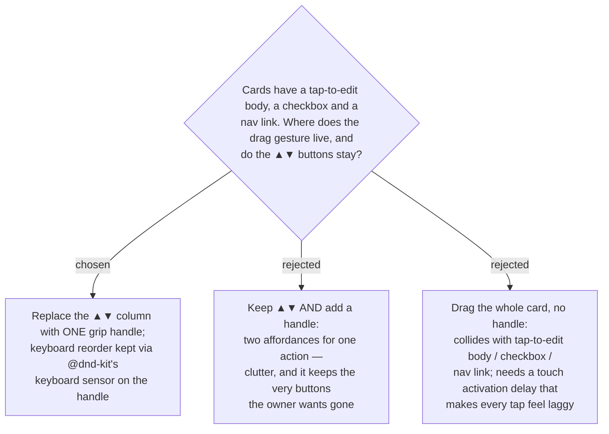

# ADR-044: A dedicated drag handle replaces the ▲▼ buttons; keyboard reorder is preserved

**Date:** 2026-07-12
**Status:** Accepted
**Relates to:** ADR-043 (reorder via @dnd-kit — the keyboard sensor cited here is that
library's), the "no emoji, use Syncfusion icons" project rule (the grip glyph must be an
SVG icon, not a character).

## Context

The owner's request is literally "I don't want to tap the buttons — let me just drag." The
`ItineraryStopCard` already carries three interactive targets: the card **body** is a
button (`onEdit`), plus a "มาแล้ว" **checkbox** and a **nav** link. Dragging the whole
card would fight all three and would need a press-and-hold activation delay on touch that
makes ordinary taps feel sluggish. A dedicated handle isolates the drag gesture from the
tap targets.

## Decision

**Remove the `.stop-reorder` ▲▼ column and put a single drag handle in its place.** The
handle is the only drag activator on the card (`@dnd-kit` `listeners`/`attributes` attach
to it). The grip is rendered as an SVG icon (per the project's no-emoji rule), not a glyph.

Keyboard and screen-reader reordering is **not** lost with the buttons: `@dnd-kit`'s
keyboard sensor makes the focused handle operable — Space/Enter to pick up, Arrow keys to
move, Space/Enter to drop, Escape to cancel — which is equivalent to the old ▲▼ semantics,
with the library's ARIA live region announcing moves.

- **Rejected — keep ▲▼ and add a handle (B).** Two affordances for one action is clutter,
  and it retains exactly the buttons the owner asked to stop using.
- **Rejected — whole-card drag (C).** Collides with the body/checkbox/nav tap targets and
  forces a laggy touch activation delay.

## Consequences

**Positive:** one clear drag target; tap-to-edit, the checkbox, and nav stay
instant; no keyboard-a11y regression despite dropping the buttons; less visual clutter.

**Negative:** discoverability rests on the grip icon reading as "draggable" — a small
learnability cost versus explicit ▲▼, mitigated by the conventional grip affordance. The
`canUp`/`canDown` props and the `move()` step-swap helper they drove are removed.
