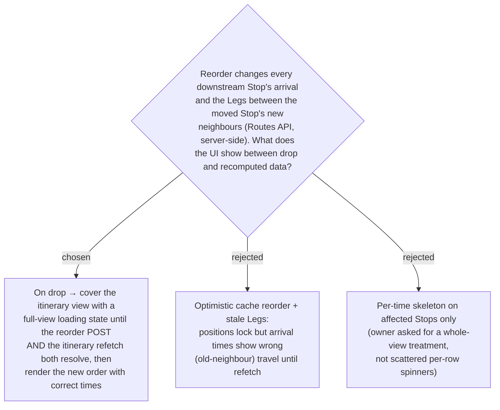

# ADR-045: On drop, reorder shows a full-view loading state and refetches — no optimistic reorder

**Date:** 2026-07-12
**Status:** Accepted
**Relates to:** ADR-008 (Smart Schedule — arrival/leave cascade), ADR-023 / ADR-017
(per-Leg travel time comes from the Routes API, server-side), ADR-042 (setStopVisited's
*non-invalidating optimistic* write — deliberately **not** reused here), ADR-043.

## Context

Reordering is not a local edit. A Stop's arrival/leave times are **derived** by the
client cascade (`useSchedule` → `computeSchedule`, ADR-008), but the cascade is fed by
each Stop's `legToReach` travel time, which comes from the Google **Routes API** and is
resolved **server-side** (ADR-023 / ADR-017). Moving a Stop changes which Stops are
adjacent, so the Legs between the moved Stop's new neighbours must be re-resolved by the
server; the client cannot recompute them. Any moment the reordered list is shown with the
old Legs, the arrival times are wrong.

`setStopVisited` (ADR-042) writes optimistically *without* invalidating because Visited is
display-only and feeds nothing. Reorder is the opposite: it feeds the whole cascade and
must round-trip. The owner asked for a **whole-view** loading treatment during that
round-trip, not stale times and not scattered per-row spinners.

## Decision

**On drop, fire the `reorderStops` mutation (which invalidates `TripItinerary`) and cover
the itinerary view with a full-view loading state until *both* the reorder POST and the
subsequent itinerary refetch resolve.** Then the view re-renders from fresh server data —
new order, server-recomputed Legs, correct cascade. No optimistic cache patch is written,
so no wrong times are ever shown.

- Because the whole view is covered the instant the drop commits, there is no snap-back to
  hide and no stale-time window to paper over.
- The loading state must persist across **both** phases: the POST `/reorder` (returns
  void) *and* the invalidation-triggered `GetItinerary` refetch. Gating it on the mutation
  alone would drop the loader too early, before the recomputed times arrive. (Exact signal
  — mutation `isLoading` combined with the itinerary query's `isFetching` — is pinned in
  the plan.)
- On error, drop the loader, surface the message (existing `actionError` path), and the
  list stays in the server's current order.

- **Rejected — optimistic reorder with stale Legs (B).** Positions would lock but arrival
  times would show old-neighbour travel until refetch — exactly the wrong-data flash the
  owner rejected.
- **Rejected — per-time skeletons (C).** The owner chose a whole-view treatment over
  scattered per-row indicators.

## Consequences

**Positive:** simplest correct behaviour — no optimistic-patch machinery, no stale-time
reconciliation, never shows a wrong time; reuses the existing full-view loading idiom
(`กำลังโหลดแผน…`).

**Negative:** every drop blanks the itinerary for the round-trip (~0.5s typical), which is
heavier than an in-place update; if the Routes API is slow the blank lasts longer. Accepted
as the owner's explicit choice and the simplest honest option.
