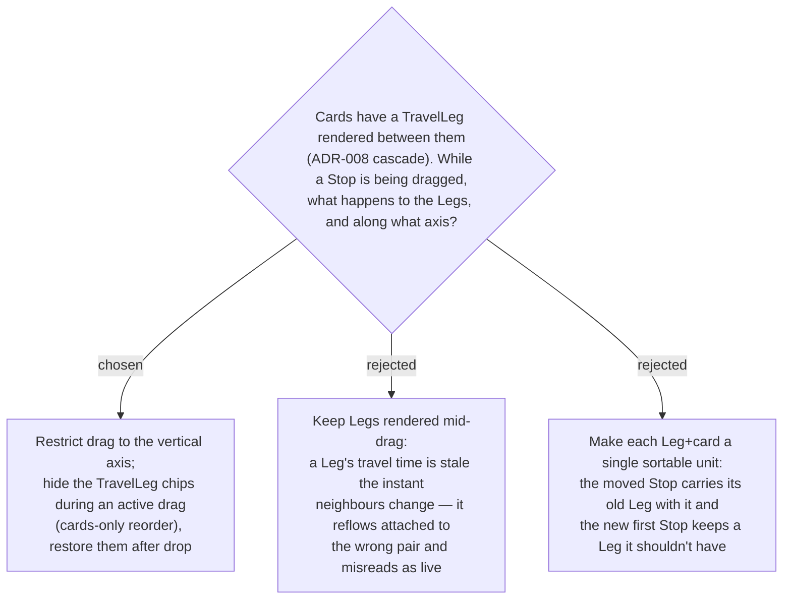

# ADR-046: Dragging is vertical-axis only, within one Day; Legs are hidden during an active drag

**Date:** 2026-07-12
**Status:** Accepted
**Relates to:** ADR-043 (@dnd-kit), ADR-045 (drop → full-view loading), the `reorderStops`
endpoint (scoped to a single `dayId`).

## Context

Between consecutive Stops the itinerary renders a **TravelLeg** (the travel time to reach
the next Stop — ADR-008). A Leg's value is only correct for a specific ordered pair of
Stops; the moment a drag changes which Stops are adjacent, every affected Leg is stale.
The `reorderStops` endpoint is scoped to one `dayId`, and only one Day is on screen at a
time (day tabs), so a drag can only reorder **within the active Day** — there is no
cross-day drag target.

## Decision

- **Vertical-axis only.** The list is a single vertical column; horizontal movement is
  meaningless, so the drag is constrained to the Y axis (`@dnd-kit` vertical-list
  strategy + axis restriction).
- **Legs are hidden during an active drag.** While a Stop is being dragged, the TravelLeg
  chips are suppressed and only the Stop cards reorder; the Legs reappear after drop, once
  the server-recomputed values arrive (ADR-045's refetch). This avoids showing a stale Leg
  reflowing between the wrong pair mid-drag.
- **Single-Day scope.** Reordering is confined to the active Day; moving a Stop to another
  Day is out of scope for this change (it would need a different, multi-day interaction).

- **Rejected — keep Legs rendered mid-drag (B).** A Leg mid-drag is attached to a pairing
  that no longer holds; it reads as a live travel time when it is stale.
- **Rejected — Leg+card as one sortable unit (C).** The dragged Stop would carry its old
  incoming Leg, and whichever Stop lands first would still show a Leg it should not have.

## Consequences

**Positive:** the drag reads cleanly (cards glide, no stale travel times flickering
between them); the interaction matches the per-Day data model and endpoint.

**Negative:** no drag-to-another-day (must remove then re-add a Stop on the other Day) —
an explicit non-goal here. Suppressing/restoring the Legs adds a small "is a drag active"
UI state on the list.
