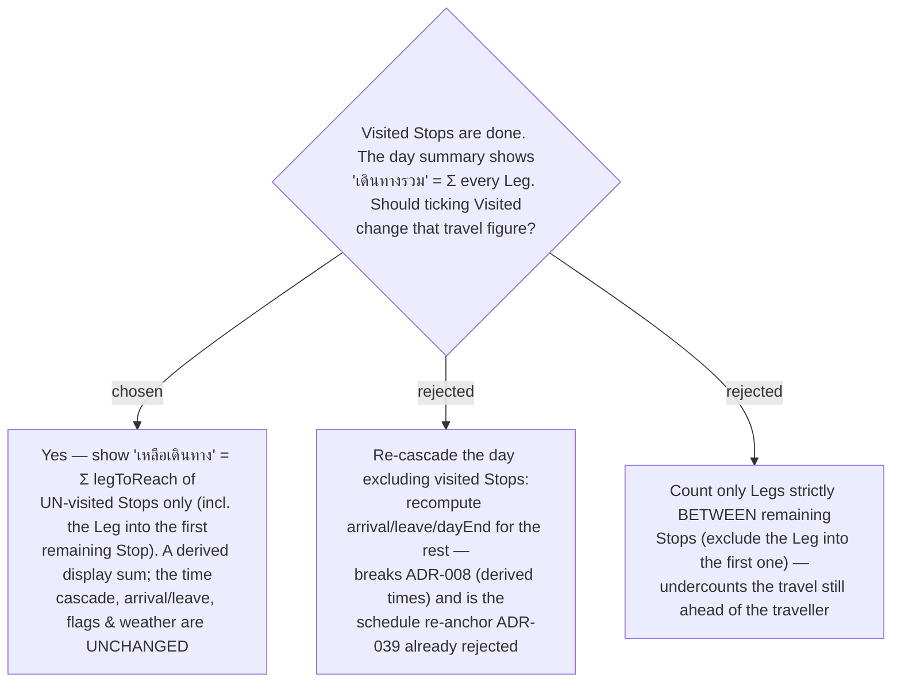

# ADR-047: Visited Stops are excluded from a new "เหลือเดินทาง" (remaining-travel) figure — a derived display value, not a schedule re-cascade

**Date:** 2026-07-12
**Status:** Accepted
**Relates to:** ADR-008 (Smart Schedule cascade — arrival/leave are DERIVED, never stored; the invariant this ADR must not break), ADR-039 (Visited is a display-only marker; this ADR implements one of the follow-ups ADR-039 explicitly deferred), ADR-046 (reorder → refetch recomputes Legs). Frontend-only. Extends issue #24.

## Context

The **Smart Schedule** day summary shows **เดินทางรวม** (total travel) =
`Σ legToReach.seconds` over **every** Stop of the day (`useSchedule` →
`totalTravelSeconds`). Once a traveller starts ticking Stops **Visited** (มาแล้ว,
issue #24), the total is no longer the number they care about — they want to know how
much travel is **left**. ADR-039 shipped Visited as display-only and explicitly deferred
"marking a Stop Visited does not shorten the day … any of them would be a follow-up
decision." This is that follow-up.

The tension is ADR-008: a Stop's **arrival/leave** are *derived* from the plan and never
stored. Anything that recomputes those times off "reality" is a re-anchor — the exact
alternative ADR-039 rejected.

## Decision

**Add a derived "เหลือเดินทาง" (remaining-travel) figure; do not re-cascade anything.**

1. **Definition.** `remainingTravelSeconds = Σ legToReach.seconds over Stops where !isVisited`.
   Equivalently `total − Σ(visited Stops' legToReach)`. This **includes** the Leg that
   leads *into* the first not-yet-visited Stop (from the last visited Stop / day start) —
   that drive is still ahead of the traveller (chosen over rejected **C**, which would
   drop it and undercount).
2. **No re-cascade.** `computeSchedule` is untouched: arrival/leave for every Stop, the
   **Timing flags**, **Weather-on-arrival**, **Approach leg**, **Current-time start**, and
   the **เสร็จ** (dayEnd) figure all keep computing from the full plan exactly as before,
   visited or not. Only the *travel* sum shown in the summary changes, and only as a
   filtered re-sum of already-computed Leg values. The ADR-008 invariant is preserved
   (chosen over rejected **B**).
3. **Zero-visited is unchanged.** When no Stop is visited, `remaining == total`; the
   summary keeps its current **เดินทางรวม** label and value — the feature is invisible
   until the first tick, so no existing behaviour regresses.
4. **A leading-Leg line** is rendered above the first remaining Stop to show the Leg into
   it ("จากจุดที่เพิ่งไป"), so the เหลือเดินทาง number is visually accounted for rather
   than a floating value (presentation detail; see ADR-048 and the design spec).

## Consequences

**Positive:** frontend-only, purely additive arithmetic over data already in the cache
(`isVisited` + `legToReach` already ship on `StopDto`). No backend, no API, no migration.
The ADR-008 derived-times invariant and every ADR-039 non-goal about the cascade still hold.

**Negative / notes:** because times are **not** recomputed, the remaining Stops keep their
original planned arrival/leave — so if a middle Stop is ticked (out of order) the remaining
list can show a time "gap" where it sat. This is intended (it is the visible consequence of
*not* re-anchoring); a true "compress the day to what's left" behaviour remains a separate,
larger feature (would revisit ADR-008).
