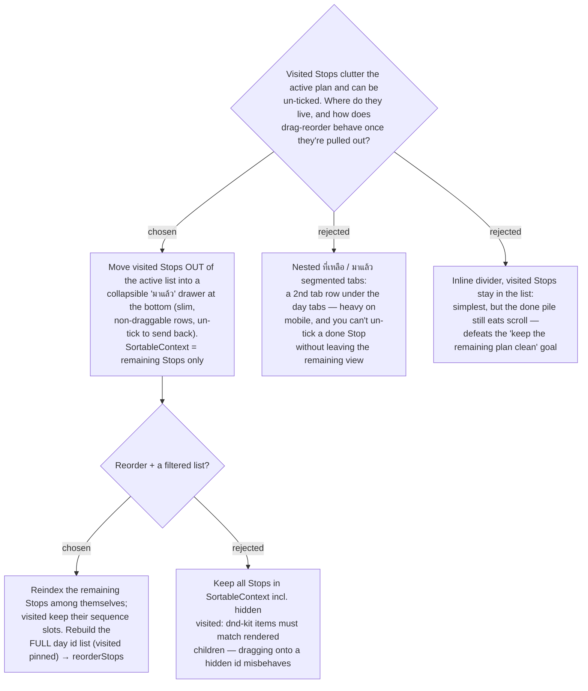

# ADR-048: Visited Stops leave the active itinerary list into a collapsible "มาแล้ว" drawer; drag-reorder is scoped to the remaining Stops

**Date:** 2026-07-12
**Status:** Accepted
**Relates to:** ADR-047 (the เหลือเดินทาง figure this presentation pairs with), ADR-040
(Visited card presentation — de-emphasise, never suppress), ADR-043/044/046 (drag-to-reorder
via @dnd-kit — the `SortableContext` this ADR filters), ADR-041 (Visited is card-only; map
pins unchanged). Frontend-only. Extends issue #24.

## Context

The active **Itinerary** list is a `@dnd-kit` `SortableContext` over
`scheduled.map(s => s.stop.id)` — **every** Stop of the day (ADR-043/046). Each card has a
drag handle; drop runs `computeReorder(full ids, active, over)` → `reorderStops` → a full
refetch (ADR-046). Visited Stops (ADR-039/040) currently stay in that list, de-emphasised in
place. The owner wants the list to show **what's left to do**, with done Stops moved aside —
but still reachable to un-tick, since Visited is toggleable both ways.

Three structural options were mocked in the real teal design language
(`docs/mocks/trip-visited-remaining-mock.html`) and compared on mobile.

## Decision

1. **Partition the day, don't recompute it.** From the single `scheduled` array (computed
   over all Stops — unchanged, ADR-008) derive two views: `remaining = !isVisited` and
   `done = isVisited`. Render `remaining` in the active `SortableContext` list; render `done`
   in a **collapsible "มาแล้ว" drawer** below the list, **collapsed by default** and **absent
   entirely when nothing is visited** (no regression to today's view).
2. **Drawer rows are slim and not draggable.** A done Stop shows a checkbox (to un-tick →
   it returns to the active list), its planned time, and struck-through name — no rail / nav
   / drag handle. It is **outside** any `SortableContext`, so `useSortable` is never called
   for it. (Rejected — nested tabs **B**: a second tab row on top of the day tabs is heavy on
   a phone and hides done Stops behind a tab switch. Rejected — inline divider **C**: the done
   pile keeps consuming scroll, which is the very thing this change removes.)
3. **Reorder is scoped to the remaining Stops; visited keep their slots.** `SortableContext`
   items = **remaining** ids only (must equal the rendered children, else dnd-kit mis-targets
   — rejected **R2**). On drop, `computeReorder` runs over the remaining ids, then the
   **full-day** ordered id list is rebuilt with each visited Stop **pinned at its original
   sequence index** and the reordered remaining Stops filling the rest; that full list is sent
   to the existing `reorderStops` (contract unchanged). Semantically: "rearrange the part of
   the day I have not done yet; what I've already done is history and stays put."
4. **Map, flags, weather, MCP: unchanged.** Consistent with ADR-041 (card-only) and ADR-040
   (never suppress) — the map band still shows all pins and the full route; a visited Stop that
   would show a Timing flag still shows it (in the drawer row's context). Dimming visited map
   pins remains Phase 2.

## Consequences

**Positive:** the active list stays focused on what's left; the feature is invisible until the
first tick; un-ticking is one tap inside the drawer; reorder keeps working with no backend
change (same `reorderStops` full-id contract). Frontend-only.

**Negative / notes:** the drawer adds one "is-open" UI state and a small second presentational
component (the slim done row). Reorder now rebuilds the full id list from two arrays rather than
mapping one — covered by a pure-helper unit test. Cross-day and drag-a-done-Stop reordering stay
out of scope (unchanged from ADR-046).
