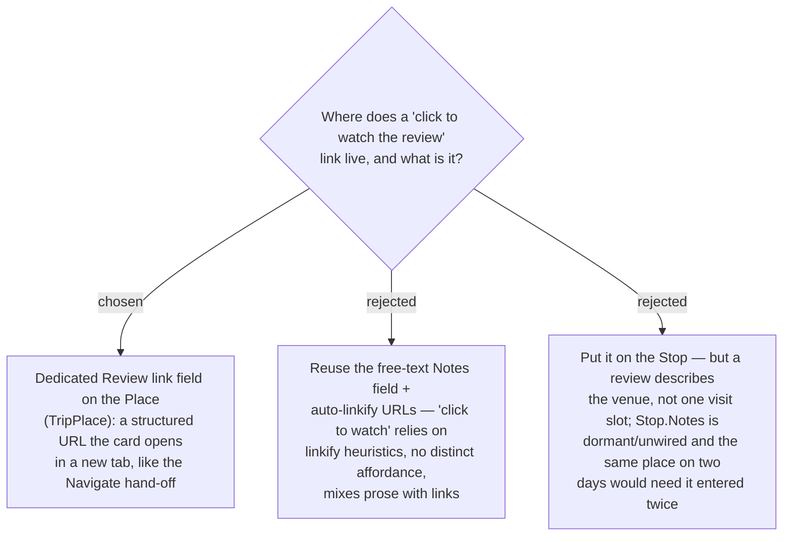

# ADR-049: A Review link is a dedicated per-Place field, not the free-text Notes and not per-Stop

**Date:** 2026-07-12
**Status:** Accepted
**Relates to:** ADR-005 (Trip is user-scoped), ADR-007 (a **Place**/TripPlace is a per-trip
snapshot anchored to a Google `place_id`), ADR-011 (**Navigate hand-off** — the click-to-open
external-link precedent), ADR-039/040/041 (**Visited** — the per-Stop display-marker + write-path
precedent). Implements the "attach a TikTok review link so the user can click to watch" request
(issue TBD — a GitHub issue must be opened before commit, per CLAUDE.md).

## Context

The owner asked to "add a note field or any field to add a related TikTok review, so the user can
click to watch the review." The codebase offers three tempting starting points:

- **`TripPlace.Notes`** — a real, persisted, client-visible free-text field (editable via
  `updateTripPlace` / `UpdateDetails`, already shipped to the card in `TripPlaceDto.notes`) that is
  simply not surfaced as an input today.
- **`Stop.Notes`** — a *dormant* per-Stop free-text column: it exists in the domain entity, EF
  config and DB (`nvarchar(2000)`), but is wired to **no** DTO, command, or mutator — zero API
  surface.
- The **Navigate hand-off** (ADR-011): the `stop-nav` anchor on the Stop card that opens Google
  Maps in a new tab (`href` + `target="_blank" rel="noopener noreferrer"`). This is the app's only
  click-to-open-external precedent, and it is a **structured link**, not linkified text.

The non-negotiable requirement is *click to watch* — a real, reliably clickable link.

## Decision

**A Review link is a dedicated, structured field on the Place (TripPlace).** It is not the
free-text Notes and not attached to the Stop.

- **Structured link, not linkified prose.** "Click to watch" demands a genuine `href` opened in a
  new tab, exactly like the Navigate hand-off — not a heuristic that hunts for URLs inside free
  text. This also gives the card a clear, distinct affordance instead of an inline substring.
- **On the Place, not the Stop.** A review describes the **venue**, not one scheduled visit. Placing
  it on `TripPlace` keeps it correct across **drag-reorder**, makes it apply to *every* Stop that
  references that Place, and reuses plumbing that already exists — `TripPlaceDto` is already on the
  Stop card and `updateTripPlace` is already the Place write-path. `Stop.Notes`, by contrast, is
  dormant with no API surface and would duplicate the link when the same venue appears on two days.

### Rejected

- **Reuse the free-text `Notes` field + auto-linkify (B).** Cheapest (the column is fully plumbed),
  but "click to watch" would depend on linkify heuristics, there is no distinct review affordance,
  and it conflates prose with links. `Notes` stays available as a *separate* future surface if the
  owner ever wants a general per-Place note.
- **Attach the link to the Stop (C).** A review is venue-scoped, not visit-scoped; `Stop.Notes` is
  dormant (no DTO/command/mutator) so it would need full new wiring anyway; and the same venue on
  two days would force the link to be entered twice.

## Consequences

**Positive:** semantically correct (venue-scoped), survives reorder, and reuses existing TripPlace
plumbing — the DTO already reaches the card and `updateTripPlace` already persists the Place — so
the new surface is small.

**Negative / deferred:** the review is **per-trip** (there is no global shared Place entity — ADR-007
snapshots per trip), so the same venue in a *different* trip re-enters its link; and the free-text
`Notes` field stays hidden (surfacing it is a separate, later decision). The concrete shape and
storage of the link(s) are decided in **ADR-050**.
