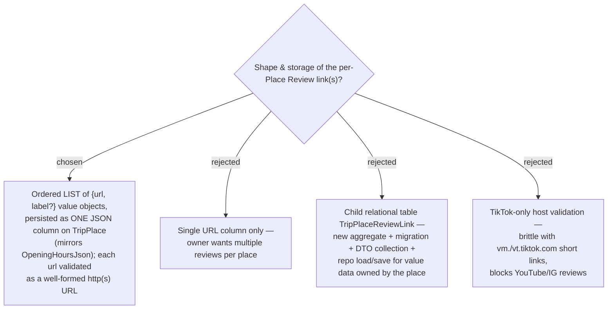

# ADR-050: Review links are an ordered JSON value-list of {url, optional label}, validated as any http(s) URL

**Date:** 2026-07-12
**Status:** Accepted
**Relates to:** ADR-049 (Review link is a dedicated per-Place field), ADR-007 (TripPlace already
stores a JSON snapshot — `OpeningHoursJson` — so a JSON column is the established pattern here).

## Context

Following ADR-049, the **Review link** is a dedicated per-**Place** field. The owner chose to
support **multiple** links per Place, each carrying an **optional label** (e.g. a creator handle or
short caption) so several reviews are distinguishable. TripPlace already persists a JSON blob today
(`OpeningHoursJson`), so the team is comfortable with JSON-column value data on this entity.

## Decision

- **Model as an ordered list of value objects** `{ url: string, label?: string }`, owned entirely
  by `TripPlace`. Order is array position (no separate sequence field). The optional **label** is
  trimmed free text; when blank the UI falls back to a generated "ดูรีวิว N".
- **Persist as a single JSON column** `ReviewLinksJson` (`nvarchar`) on `TripPlace`, mirroring the
  existing `OpeningHoursJson`. EF Core may map it either as an **owned collection via `.ToJson()`**
  or via manual (de)serialization — the implementation plan picks the mechanism; both yield one
  column and require no join.
- **Validate each `url` as a well-formed absolute `http`/`https` URL** — scheme check only, no host
  restriction. A malformed or non-http(s) entry is rejected at the domain boundary. The label has no
  format rules beyond a length bound.
- **Bounds** (set in the spec to keep the JSON small): a soft cap on the number of links per Place
  (e.g. 10) and per-field length limits (url and label). These are validation constants, not
  separate decisions.

### Rejected

- **Single URL column (B).** The owner explicitly wants several reviews per Place.
- **Child relational table `TripPlaceReviewLink` (C).** A new aggregate — EF config, migration, DTO
  collection, repository load/save, larger write-path — for value data that has no independent
  identity and nothing queries. JSON matches the `OpeningHoursJson` precedent and keeps the Place
  saving as one unit through the existing `updateTripPlace` PUT.
- **TikTok-only host validation (D).** Brittle against TikTok's own short/redirect hosts
  (`vm.tiktok.com`, `vt.tiktok.com`) and blocks legitimate YouTube/IG reviews. Any well-formed
  http(s) URL is a robust superset; the UI stays framed around TikTok regardless.

## Consequences

**Positive:** one column, no join; the Place saves atomically through the endpoint that already
exists; matches the repo's JSON-column precedent; validation is simple and robust.

**Negative / deferred:** the JSON column is not directly queryable (acceptable — nothing queries
it); ordering is implicit in array position; and any-URL validation checks **shape, not liveness**,
so a broken or non-TikTok link can still be stored (acceptable — we never verify the video exists).
