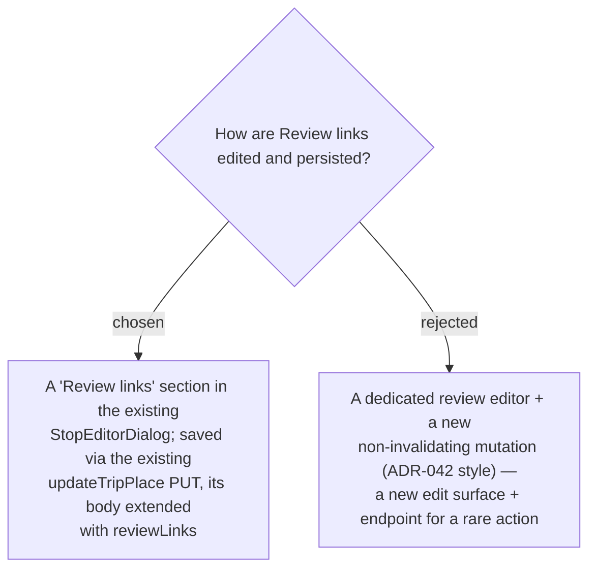

# ADR-051: Review links reuse the Stop editor and the existing updateTripPlace PUT (no new write surface)

**Date:** 2026-07-12
**Status:** Accepted
**Relates to:** ADR-049/050 (Review link model on TripPlace), ADR-042 (the Visited
*non-invalidating* optimistic write — the pattern deliberately **not** reused here and why).

## Context

Per ADR-049/050 the Review links live on `TripPlace`. TripPlace fields are already edited
**exclusively** through the `StopEditorDialog`, whose Save calls `updateTripPlace`
(`PUT /api/trips/{id}/places/{placeId}`) and `invalidatesTags: [TripPlaces, TripItinerary]` — i.e.
a save forces a full `getItinerary` refetch that re-resolves every **Leg** (Routes API) and
**Weather**. The best-time window is edited exactly this way today.

## Decision

**Review links are edited in a new "Review links" section of the `StopEditorDialog` and persisted by
extending the existing `updateTripPlace` PUT** (and the `UpdateTripPlace` command / `UpdateDetails`
domain path) with the `reviewLinks` list. No new endpoint, no new mutation, no non-invalidating
cache patch.

- The on-save `TripItinerary` invalidation (full `getItinerary` refetch) is **accepted**: review
  editing is rare and explicit — it happens behind the dialog's Save button — unlike the frequent
  one-tap **Visited** toggle that justified the non-invalidating optimistic path of ADR-042.

### Rejected

- **Dedicated review editor + non-invalidating mutation (B).** A whole new edit surface and mutation
  to avoid a refetch that only fires on an explicit, infrequent Save. Not worth the surface.

## Consequences

**Positive:** minimal new surface; consistent with how best-time and other Place fields are edited;
a single write-path (`updateTripPlace`).

**Negative / deferred:** saving *any* Place edit — including merely adding a review link — refetches
the itinerary (Legs + Weather). Acceptable given how rarely reviews are edited. If review editing
ever becomes frequent or inline (e.g. a quick "add review" on the card), a non-invalidating path
like ADR-042 can be added later without changing the data model.
