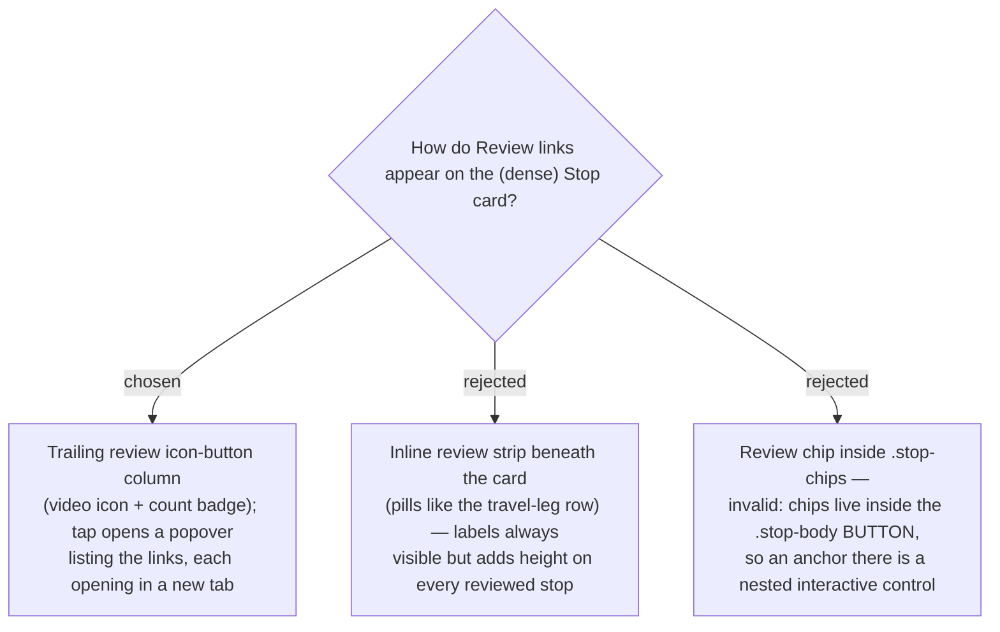

# ADR-052: Review links surface on the Stop card as a trailing icon-button + popover, not an inline strip

**Date:** 2026-07-12
**Status:** Accepted
**Relates to:** ADR-011 (**Navigate hand-off** — the trailing `.stop-nav` anchor whose
structure/placement this mirrors), ADR-043/044 (drag-handle column), ADR-049/050 (Review link
model). **Confirmed mock:** `docs/mocks/trip-stop-review-link-mock.html` (แบบที่ 2).

## Context

The Stop card is dense: `check | rail | body(button) | nav(anchor) | drag-handle`. Critically,
`.stop-body` is a `<button onClick={onEdit}>`, so **any click-to-navigate affordance must be a
sibling outside it** — exactly how `.stop-nav` (the Maps hand-off) is already structured. A mock
(`trip-stop-review-link-mock.html`) compared an always-visible strip beneath the card against a
compact trailing icon + popover; the owner chose the compact icon + popover.

## Decision

**Review links surface as a trailing icon-button column on the card**, in TikTok-ish pink, showing a
**video/play SVG icon** (a Syncfusion react-icon / custom SVG — never an emoji, per project rule)
with a **count badge when there is more than one** link. The column is rendered **only when the
place has ≥1 review link** — absent entirely otherwise.

- **Placement:** a sibling column beside `.stop-nav`, outside `.stop-body`, so it never conflicts
  with the editor-open click — matching the `.stop-nav` pattern.
- **Open behaviour:** with **exactly one** link the button opens it **directly** in a new tab (no
  popover); with **two or more** it opens a small **popover** anchored to the button, listing each
  link as `{label or "ดูรีวิว N"} · {host}`. Every link is an
  `<a target="_blank" rel="noopener noreferrer">` opening in a new browser tab (mirrors the Navigate
  hand-off). The popover closes on outside-click / Escape.

### Rejected

- **Inline strip beneath the card (B).** Labels always visible, but adds vertical height on every
  reviewed stop; the owner preferred a compact card.
- **Review chip inside `.stop-chips` (C).** Technically invalid — the chips render inside the
  `.stop-body` `<button>`, so an `<a>` there would be a nested interactive control.

## Consequences

**Positive:** the card stays compact regardless of link count; consistent with the trailing-icon
(`.stop-nav`) pattern; the affordance is absent when there are no reviews, and the count badge
signals presence at a glance.

**Negative / new surface:** links are hidden until tapped (one extra interaction to discover), and a
**popover** is needed with outside-click / Escape handling — there is no card-popover precedent
today, though `@syncfusion/react-popups` is already a dependency (the `StopEditorDialog` uses its
`Dialog`). The exact popover mechanism (Syncfusion `Popup`/`Tooltip` vs a lightweight
click-away-closed `
`) is left to the implementation plan.
