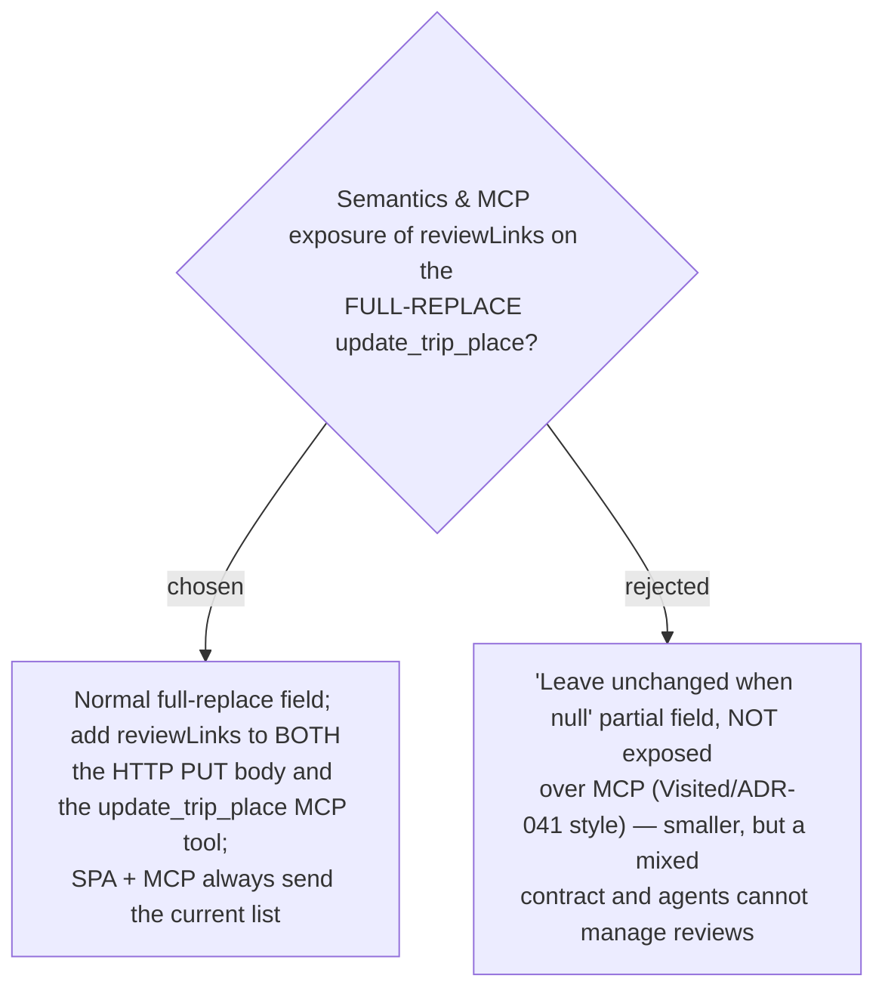

# ADR-053: reviewLinks is a full-replace field on update_trip_place, exposed over MCP

**Date:** 2026-07-12
**Status:** Accepted
**Relates to:** ADR-034/035 (Trips exposed over MCP; `update_trip_place` tool), ADR-041 (Visited
*deferred* MCP — the opposite call, and why it differs), ADR-050/051 (Review link model + reuse of
the `updateTripPlace` write-path).

## Context

`update_trip_place` (`PUT /api/trips/{id}/places/{placeId}` + the MCP tool, both sending
`UpdateTripPlaceCommand`) is documented **FULL REPLACE** — omitting or passing null for a listed
field **clears** it. Exactly **two** sites construct the command from external input:
`TripsController` (the HTTP body) and `TripTools.update_trip_place` (MCP, `TripTools.cs:104`); the
SPA has a **single** call site (`StopEditorDialog`) that already round-trips every place field. The
blast-radius risk of a new full-replace field: any caller that fails to send it **silently wipes**
that data.

## Decision

**`reviewLinks` is a normal FULL-REPLACE field on `UpdateTripPlaceCommand`, and it is EXPOSED over
MCP.**

- Add `reviewLinks` to the HTTP PUT body (`UpdateTripPlaceBody`), the command, the domain
  `TripPlace.UpdateDetails` path, and the **`update_trip_place` MCP tool signature**.
- **Both** write paths always send the current list: the SPA `StopEditorDialog` passes
  `place.reviewLinks` through on save (exactly as it already passes name/category/address/feeNote/
  notes/bestTime), and MCP agents follow the tool's existing full-replace discipline ("pass the
  current values of the others; get them from `list_trip_places`").
- Read-side exposure is **automatic** via `TripPlaceDto` (`list_trip_places`, the itinerary places,
  and `add_trip_place` all return it).

### Rejected

- **Partial "leave unchanged when null" + defer MCP (B).** Smaller and mirrors ADR-041, but yields a
  **mixed contract** (every field full-replace *except* reviewLinks) and MCP agents could neither
  read nor set reviews. Because only two callers exist and both are updated in this change, the
  coherent full-replace choice wins. (Visited deferred MCP because its endpoint — `update_stop` —
  is a *partial* PATCH and the toggle had no agent use case; neither is true here.)

## Consequences

**Positive:** a uniform full-replace contract on `update_trip_place`; MCP agents can read and set
review links (e.g. "attach this TikTok review to ร้านเจ๊ไฝ"); read-side is free via the DTO.

**Negative / bounded blast radius:** every `update_trip_place` caller must round-trip `reviewLinks`
or clear it — already the tool's documented discipline. The two command-construction sites and the
one SPA call site are **all updated here**; there are no unrelated third-party callers. Tests that
build `UpdateTripPlaceCommand` or `StopEditorDialog`/`TripPlaceDto` fixtures must add the field.
`add_trip_place` still does not set reviews (a new place starts with an empty list), consistent with
how bestTime/feeNote/notes are handled.
